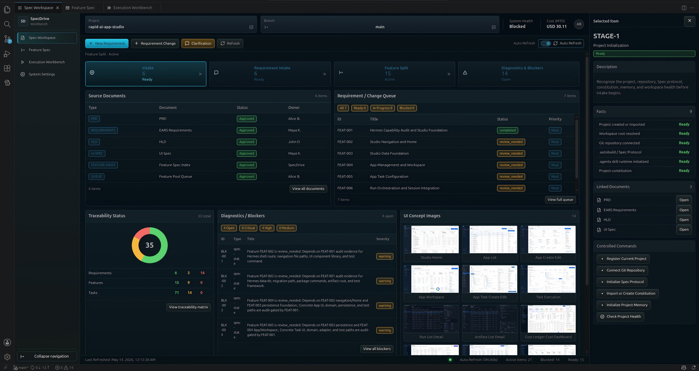
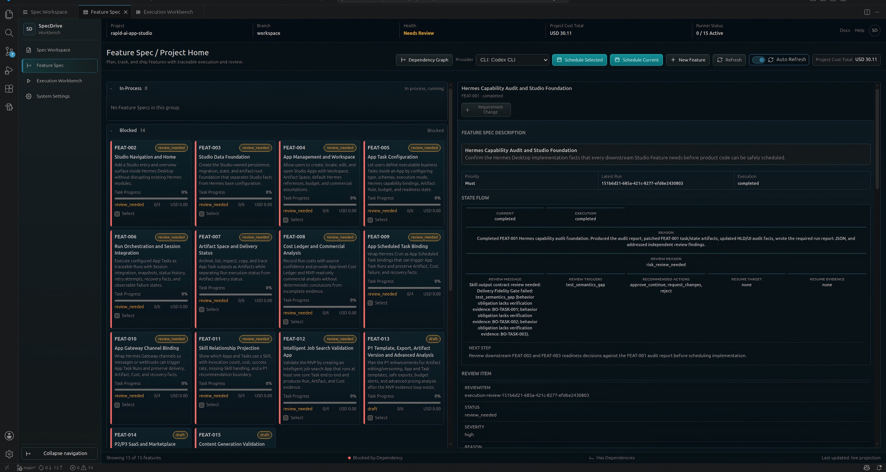
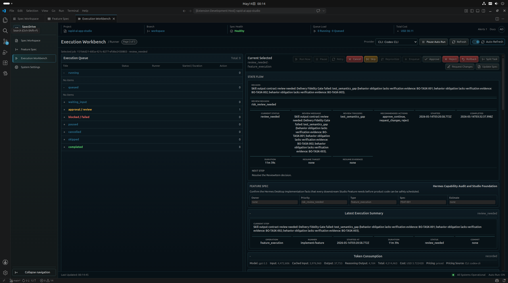
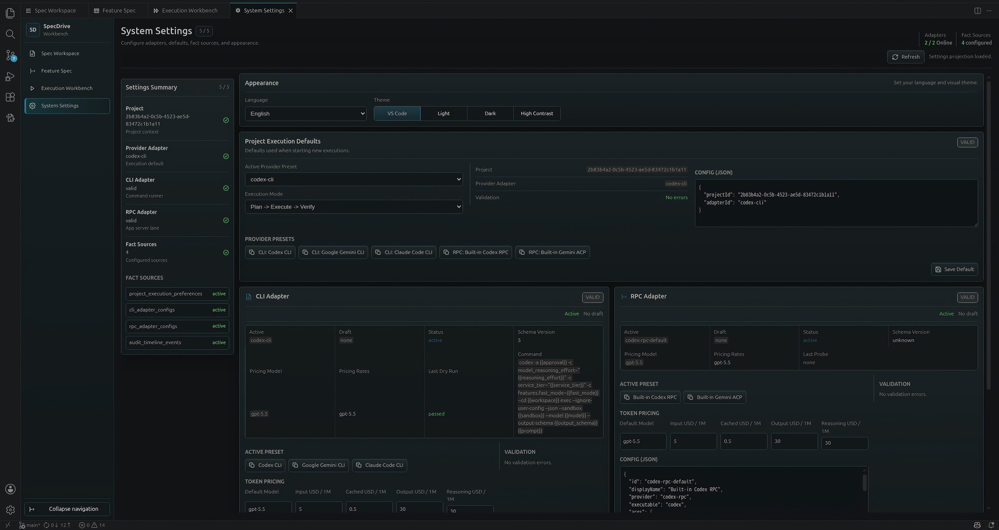
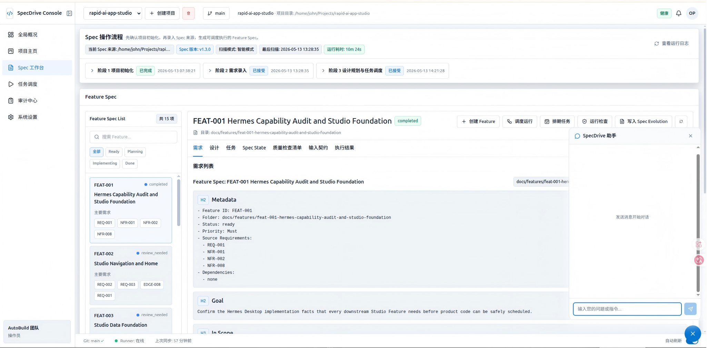

# SpecDrive AutoBuild

**長時間実行、復旧可能性、監査可能性を備えた AI ソフトウェア開発のための、Agentic Spec 駆動型 Auto-Build システム。**

SpecDrive AutoBuild は、単なる AI コーディングチャットではなく、ソフトウェアデリバリーのためのエンジニアリング制御プレーンです。Spec を事実の源泉とし、Skill によって再利用可能な開発プロセスを固定化し、Execution Adapter によって Codex CLI、Gemini CLI、Codex RPC などの実行ツールを接続し、永続化された状態、エビデンス、チェックポイント、監査台帳、人間のレビューによって安全な AI 自律開発を支えます。

言語： [English](README.md) | [中文](README.zh-CN.md) | 日本語

---

## このプロジェクトが必要な理由

AI Coding Agent はすでに強力なコード生成・修正能力を持っています。しかし、本当のソフトウェアデリバリーは、一回限りのチャットコンテキストだけでは成立しません。長時間の自律開発では、次のような問題が繰り返し発生します。

- **コンテキスト肥大化**：大規模プロジェクトは単一の Agent セッションに安定して保持できません。
- **要求ドリフト**：要求が仕様化されていないと、Agent の理解が実行中に変化します。
- **復旧不能な実行**：チェックポイントと状態の事実源がない場合、中断後に安全に再開できません。
- **弱いトレーサビリティ**：コード変更を PRD、EARS 要求、受け入れ基準、設計境界に対応付けることが困難です。
- **信頼できない完了宣言**：Agent が「完了」と言っても、それだけではデリバリー根拠になりません。
- **危険な並列実行**：複数 Agent が同時に作業すると、ファイル競合、ワークスペース汚染、状態ドリフトが起きやすくなります。

SpecDrive AutoBuild の中核目標は次の通りです。

> AI が単にコードを書くのではなく、制御可能で、復旧可能で、監査可能なエンジニアリングプロセスの中でコードを継続的にデリバリーすること。

---

## コアアイデア

```text
Spec Protocol
+ CLI Skill Directory
+ Feature Spec Pool
+ Project Memory
+ Execution Adapter Layer
+ Internal State Machine
+ Status Checker
+ Evidence Pack
+ Review / Recovery / Delivery Workflow
+ Product Console / IDE Surfaces
```

このリポジトリにおける **Agentic Spec** は次のように定義されます。

```text
Agentic Spec = Mainline Spec + Feature Spec + Execution Spec + State Ledger
```

さらに、エンジニアリング上の事実として展開すると次の通りです。

```text
PRD              プロダクト事実を定義する
EARS             受け入れ事実を定義する
HLD              アーキテクチャ事実を定義する
UI Spec          体験事実を定義する
Feature Spec     開発事実を定義する
Execution Spec   実行事実を定義する
State Ledger     復旧事実を定義する
Evidence         完了事実を定義する
```

---

## SpecDrive AutoBuild が行うこと

SpecDrive AutoBuild は、自律型ソフトウェアデリバリーのための制御プレーンです。主に次のことを行います。

1. 自然言語、プロダクト文書、PRD、PR/RP、既存リポジトリ情報を構造化 Spec に変換する。
2. Mainline Spec を、独立してデリバリー可能で、受け入れ可能で、テスト可能な Feature Spec に分解する。
3. 各 Feature に対して要求、設計、タスク、受け入れ基準、リスクルール、実装境界を生成する。
4. Feature Spec Pool から次に実行可能な Feature を自動選択する。
5. Execution Adapter Layer を通じて Codex CLI、Gemini CLI、Codex RPC、または将来の実行 Provider を呼び出す。
6. 実行状態、チェックポイント、ログ、結果、エビデンスを一時的なチャットコンテキストではなく永続化システムに保存する。
7. Agent の自己申告ではなく、Status Checker によってタスクが本当に完了したかを判定する。
8. 失敗、ブロック、高リスク、曖昧さ、仕様ドリフトを復旧フローまたは人間のレビューにルーティングする。
9. 監査可能なデリバリーレコード、PR サマリー、検証エビデンス、仕様進化ノートを生成する。
10. Product Console と VSCode IDE Workbench を通じて、プロジェクト状態、実行キュー、Feature 状態、レビュー入口を表示する。

SpecDrive は Git、CI/CD、Issue Tracker、完全なプロジェクト管理システムを置き換えるものではありません。それらの上に、Spec-first な AI 自律開発オーケストレーション層を提供します。

---

## ソフトウェアスクリーンショット

| Spec Workspace | Feature Spec |
| --- | --- |
|  |  |

| Execution Workbench | システム設定 |
| --- | --- |
|  |  |

| Feature Spec Web ビュー |
| --- |
|  |

---

## システムアーキテクチャ

```text
ユーザー / PM / 開発者
        |
        v
Product Console / IDE Workbench
        |
        v
Control Plane API
        |
        v
Spec Protocol Engine
        |
        v
Feature Spec Pool + Feature Selector
        |
        v
Scheduler + Internal State Machine
        |
        v
Execution Adapter Layer
   +----+----------------------+------------------+
   |                           |                  |
   v                           v                  v
CLI Adapter                RPC Adapter        Future Adapters
Codex CLI / Gemini CLI     Codex RPC          Provider-specific runtimes
   |                           |
   v                           v
Git Workspace / Worktree / Branch
        |
        v
Execution Record + Checkpoint + Logs + Evidence
        |
        v
Status Checker + State Aggregator
        |
        +--> Done        -> デリバリー / 次の Feature
        +--> Failed      -> 失敗復旧フロー
        +--> Blocked     -> ブロック解除フロー
        +--> Review      -> 人間の承認 / Spec 更新
        +--> Interrupted -> checkpoint ベースの再開
        |
        v
State Ledger + Project Memory Projection
```

### 中核原則

Coding Agent は実装、テスト、状態遷移の提案を行えますが、最終的な事実を所有しません。

```text
Agent の出力は提案である。
Evidence は判定の入力である。
Status Checker が判定する。
State Ledger が記録する。
Spec は常に事実の源泉である。
```

---

## コア概念

| 概念 | 説明 |
| --- | --- |
| **Mainline Spec** | プロダクトレベルの事実源。PRD、EARS requirements、HLD、UI Spec、Prototype Spec、変更ルールを含みます。 |
| **Feature Spec** | 開発レベルの事実源。独立してデリバリー可能な能力を記述し、通常は `requirements.md`、`design.md`、`tasks.md`、`spec-state.json` を含みます。 |
| **Execution Spec** | 実行レベルの事実源。具体的な実行について、invocation、checkpoint、result、evidence、logs、recovery plan を記録します。 |
| **State Ledger** | 追記型の状態台帳。監査、復旧、リプレイ、Dashboard 状態再構築に利用します。 |
| **Project Memory** | CLI / Agent セッションに注入される復旧用の投影です。事実源ではなく、再開と重複探索削減のための要約です。 |
| **Skill** | `.agents/skills/<skill-name>/SKILL.md` に格納される、プロジェクトローカルの再利用可能なエンジニアリングワークフローです。 |
| **Execution Adapter** | CLI、RPC、将来のコーディング実行ツールを接続する Provider-neutral な実行適配層です。 |
| **Evidence Pack** | 変更ファイル、実行コマンド、テスト結果、リスク、成果物、状態遷移提案を含む構造化実行エビデンスです。 |
| **Status Checker** | evidence、Spec、制約、検証結果に基づいてタスク状態を判定するコンポーネントです。 |
| **Review Center** | 高リスク変更、失敗リトライ、安全操作、曖昧さ、仕様ドリフトを人間がレビューする入口です。 |

---

## Agentic Spec ワークフロー

### 1. Mainline Spec の作成

入力には、自然言語要求、既存 PRD、プロダクト brief、Pull Request、Issue、業務文書、既存コードベースなどを使用できます。システムはまず、それらを Mainline Spec に変換します。

```text
docs/<language>/PRD.md
docs/<language>/requirements.md
docs/<language>/hld.md
docs/<language>/ui-spec.md
docs/<language>/prototype-spec.md
```

Mainline Spec は、プロダクト範囲、受け入れ動作、アーキテクチャ境界、ユーザーフロー、変更ルールを定義します。

### 2. Feature Spec の分解

システムは Mainline Spec を機能レベルのデリバリーユニットに分解します。

```text
docs/features/<feature-id>/requirements.md
docs/features/<feature-id>/design.md
docs/features/<feature-id>/tasks.md
docs/features/<feature-id>/spec-state.json
```

良い Feature Spec は「フロントエンド実装」や「バックエンド実装」ではありません。独立して実装、検証、レビュー、デリバリーできる縦割りの能力であるべきです。

### 3. スケジューリングと実行

Scheduler は Feature Spec Pool から ready 状態の Feature を選択し、Execution Record を作成し、workspace / worktree / branch を準備し、Execution Adapter を通じてコーディングツールを呼び出します。

1 回の実行では次を記録する必要があります。

```text
invocation
checkpoint
logs
result
evidence
recovery plan when needed
state transition proposal
```

### 4. 状態チェック

システムは evidence に基づいて、実行結果が本当に Spec を満たしているかを判定します。

- EARS 要求を満たしているか？
- 設計境界を守っているか？
- allowed files のみを変更したか？
- 必要なコマンドを実行したか？
- テスト結果は受け入れ可能か？
- 未解決のリスク、曖昧さ、仕様ドリフトはないか？
- 継続前に人間の承認が必要か？

### 5. 復旧、レビュー、デリバリー

実行結果は、完了、失敗、一時停止、ブロック、承認待ち、復旧要のいずれかになります。状態マシンはすべての遷移を記録し、作業を次のフローへルーティングします。

Evidence、状態チェック、レビュー結果、Spec トレーサビリティが一致して初めて、デリバリー完了と見なします。

---

## リポジトリ構成

```text
.
├── .agents/                  # プロジェクトローカルの Agent テンプレートと Skills
├── apps/
│   ├── product-console/       # React / Vite Product Console
│   └── vscode-extension/      # VSCode 拡張と IDE Workbench
├── docs/
│   ├── en/                    # 英語のプロダクト / Spec 文書
│   ├── zh-CN/                 # 中国語のプロダクト、Spec、Protocol 文書
│   ├── ja/                    # 日本語文書
│   └── features/              # Feature Spec Pool、状態、依存関係、デリバリーノート
├── scripts/                   # 開発、パッケージング、Adapter 補助スクリプト
├── src/                       # Control Plane、Scheduler、Adapter、状態、API、永続化
├── tests/                     # Node テストと統合チェック
├── package.json
└── README.md
```

主要ドキュメント：

- [Product Requirements Document](docs/ja/PRD.md)
- [Documentation Index](docs/README.md)
- [Feature Spec Index](docs/features/README.md)
- [Agentic Spec Protocol](docs/zh-CN/agentic-spec-protocol.md)
- [Project Skill Guide](docs/zh-CN/skills.md)

---

## 現在の実装状態

SpecDrive AutoBuild は現在、活発に実装中です。このリポジトリには、Control Plane Runtime、Scheduler、永続化と監査の基盤、Execution Adapter、Product Console、VSCode IDE surfaces、Feature Specs、主要ワークフローのテストが含まれています。

最も正確な実装状況は Feature Spec Index を参照してください。

```text
docs/features/README.md
```

このファイルは、MVP Feature、依存関係、後続変更、用語移行、実装メモを管理する作業用デリバリーマップです。

---

## クイックスタート

### 前提条件

- Node.js **24 以上**
- npm
- Git
- 任意：Redis / BullMQ worker-only モードを利用する場合は Docker
- 任意：実際の `codex exec` Adapter フローを実行する場合は Codex CLI
- 任意：Gemini CLI adapter preset を有効化する場合は Gemini CLI

### 依存関係のインストール

```bash
npm install
```

### Bootstrap チェックの実行

```bash
npm run bootstrap
```

### ローカル開発環境の起動

```bash
npm run dev
```

開発スクリプトは次を起動します。

```text
Backend API:      http://localhost:4317
Product Console: http://localhost:5173
Health check:    http://localhost:4317/health
```

デフォルトの開発モードでは embedded local worker を使用します。Redis / BullMQ worker-only モードを使う場合：

```bash
AUTOBUILD_WORKER_MODE=worker-only npm run dev
```

### テストの実行

```bash
npm test
```

Product Console のブラウザテスト：

```bash
npm run console:test
```

Product Console のビルド：

```bash
npm run console:build
```

VSCode 拡張のビルド：

```bash
npm run ide:build
```

VSCode 拡張のパッケージ作成：

```bash
npm run ide:package
```

---

## 設定

SpecDrive は次の 3 層から設定を読み込み、後の層が前の層を上書きします。

```text
.autobuild.config.json
環境変数
CLI 引数
```

主な設定項目：

| 設定 | 環境変数 | デフォルト |
| --- | --- | --- |
| Backend ポート | `AUTOBUILD_PORT` | 直接 backend モードでは `43117`、`npm run dev` では `4317` |
| Artifact ルート | `AUTOBUILD_ARTIFACT_ROOT` | `.autobuild` |
| データベースパス | `AUTOBUILD_DB_PATH` | `.autobuild/autobuild.db` |
| ログレベル | `AUTOBUILD_LOG_LEVEL` | `info` |
| Runner コマンド | `AUTOBUILD_RUNNER_COMMAND` | `codex` |
| Runner 引数 | `AUTOBUILD_RUNNER_ARGS` | `exec` |
| Runner sandbox mode | `AUTOBUILD_RUNNER_SANDBOX_MODE` | `danger-full-access` |
| Redis URL | `AUTOBUILD_REDIS_URL` | `redis://127.0.0.1:6379` |
| Worker mode | `AUTOBUILD_WORKER_MODE` | `embedded` |

対応する Worker mode：

| Mode | 動作 |
| --- | --- |
| `embedded` | Backend プロセスがローカルスケジューリングも実行します。開発環境向けです。 |
| `worker-only` | 専用 Worker プロセスを起動し、Redis / BullMQ キューを使用します。 |
| `off` | Worker 実行を無効化しつつ、API surface は維持します。 |

設定例：

```json
{
  "port": 43117,
  "artifactRoot": ".autobuild",
  "dbPath": ".autobuild/autobuild.db",
  "logLevel": "info",
  "runnerConfig": {
    "command": "codex",
    "args": ["exec"],
    "sandboxMode": "danger-full-access"
  },
  "schedulerConfig": {
    "redisUrl": "redis://127.0.0.1:6379",
    "workerMode": "embedded"
  }
}
```

---

## 開発原則

SpecDrive は次の Agentic Development ルールに従います。

1. **実装より先に Spec**：変更がプロダクト、受け入れ、アーキテクチャ、UI 振る舞いに影響する場合、非構造化要求から直接コーディングしません。
2. **Feature Spec は実行境界**：各 Feature は requirements、design、tasks、機械可読状態を持つ必要があります。
3. **実行は永続化されるべき**：非自明な実行では invocation、checkpoint、result、evidence、状態イベントを記録します。
4. **Agent の自己申告を信頼しない**：完了状態は evidence と Status Checker によって判定します。
5. **Project Memory は事実源ではない**：再開と重複探索削減には役立ちますが、権威ある事実は Spec、Execution Record、State Ledger にあります。
6. **並列実行は隔離が必要**：並列書き込みの前に、worktree、lock、allowed files、Feature 境界を用意します。
7. **Spec drift は Spec evolution へ**：実装中に制約や変更が見つかった場合、コードに隠さず関連 Spec を更新します。
8. **Skill は推論を固定し、コードは状態を保証する**：計画、分解、レビュー、復旧は Skill に適し、永続化、検証、状態遷移、監査はコードで保証します。

---

## 推奨読書順

プロダクトとアーキテクチャを理解する場合：

1. [docs/ja/PRD.md](docs/ja/PRD.md)
2. [docs/zh-CN/agentic-spec-protocol.md](docs/zh-CN/agentic-spec-protocol.md)
3. [docs/features/README.md](docs/features/README.md)
4. [docs/zh-CN/skills.md](docs/zh-CN/skills.md)

実装に参加する場合：

1. `docs/features/` 配下の関連 Feature Spec を読む。
2. ファイル変更前に `spec-state.json` を確認する。
3. タスク内の allowed-files と verification rules に従う。
4. まず対象テストを実行し、その後より広い回帰テストを実行する。
5. 振る舞いが変わる場合は evidence を記録し、関連 Spec を更新する。

---

## License

MIT License. See [LICENSE](LICENSE).
