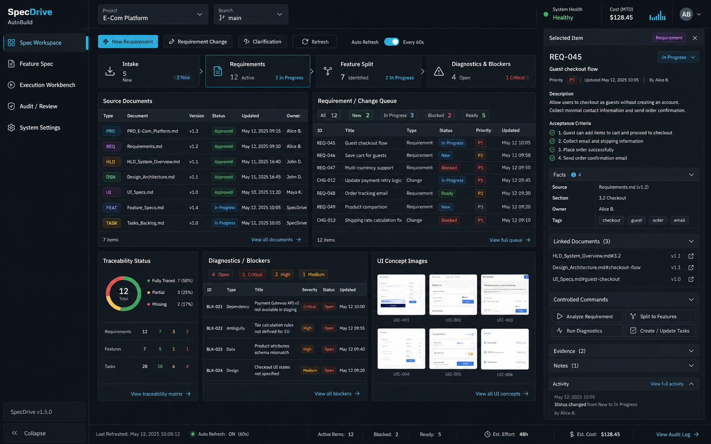
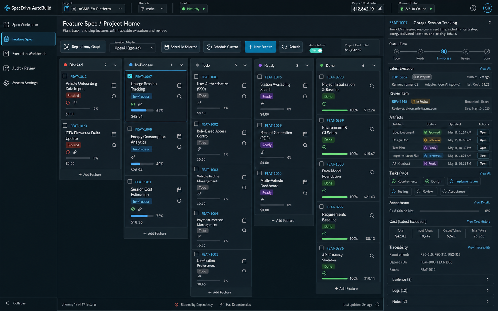
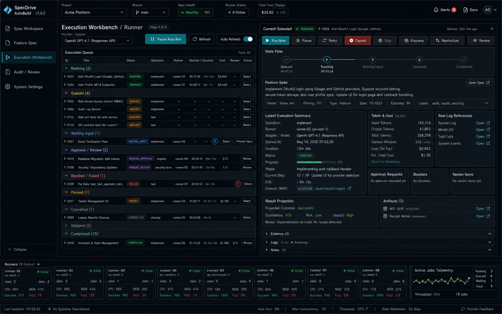
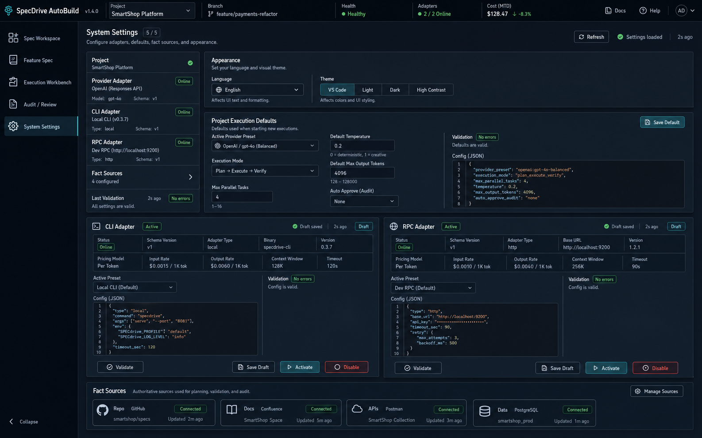
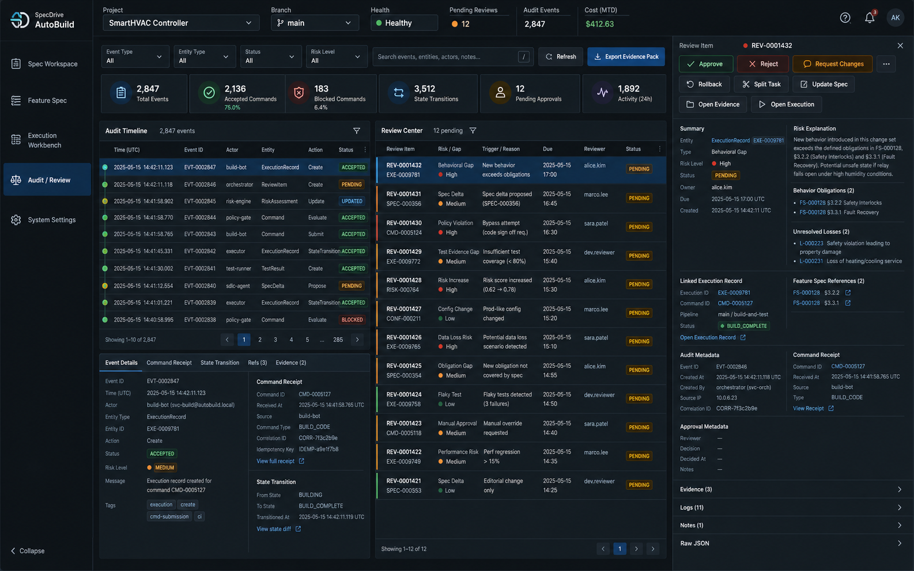

# SpecDrive AutoBuild

**一个 Agentic Spec 驱动的自动化构建系统，用于长时间运行、可恢复、可审计的 AI 软件开发。**

SpecDrive AutoBuild 不是简单的 AI 编码聊天工具，而是面向软件交付过程的工程控制平面。它以 Spec 作为事实源，以 Skill 固化可复用工程流程，以 Execution Adapter 连接 Codex CLI、Gemini CLI、Codex RPC 等执行工具，并通过持久化状态、证据、检查点、审计账本和人工评审机制支撑可控的软件自动开发。

语言： [English](README.md) | 中文 | [日本語](README.ja.md)

---

## 项目为什么存在

AI Coding Agent 已经具备很强的代码生成和修改能力，但真正的软件交付不能只依赖一次性的聊天上下文。长时间自主开发通常会遇到以下问题：

- **上下文撑爆**：大型项目无法长期稳定保存在单个 Agent 会话中。
- **需求漂移**：需求没有被规格化时，Agent 会在执行中不断改变理解。
- **中断不可恢复**：编码过程被打断后，缺少 checkpoint 和状态事实源，无法安全续跑。
- **追踪困难**：代码变更很难映射回 PRD、EARS 需求、验收标准和设计边界。
- **完成声明不可信**：Agent 说“已完成”不能作为交付依据。
- **并发冲突**：多个 Agent 同时工作时，容易出现文件写冲突、工作区污染和状态漂移。

SpecDrive AutoBuild 的核心目标是：

> 让 AI 在可控、可恢复、可审计的工程流程中持续交付代码。

---

## 核心思想

```text
Spec Protocol
+ CLI Skill Directory
+ Feature Spec Pool
+ Project Memory
+ Execution Adapter Layer
+ Internal State Machine
+ Status Checker
+ Evidence Pack
+ Review / Recovery / Delivery Workflow
+ VSCode IDE Webview
+ Product Console compatibility surface
```

在本项目中，**Agentic Spec** 定义为：

```text
Agentic Spec = Mainline Spec + Feature Spec + Execution Spec + State Ledger
```

进一步展开为工程事实：

```text
PRD              定义产品事实
EARS             定义验收事实
HLD              定义架构事实
UI Spec          定义体验事实
Feature Spec     定义开发事实
Execution Spec   定义运行事实
State Ledger     定义恢复事实
Evidence         定义完成事实
```

---

## SpecDrive AutoBuild 能做什么

SpecDrive AutoBuild 是一个面向自主软件交付的控制平面。它可以：

1. 将自然语言、产品文档、PRD、PR/RP 或已有仓库信息转换为结构化规格。
2. 将主线文档拆解为可独立交付、可验收、可测试的 Feature Spec。
3. 为每个 Feature 生成需求、设计、任务、验收标准、风险规则和实现边界。
4. 从 Feature Spec Pool 中自动选择下一项可执行 Feature。
5. 通过 Execution Adapter Layer 调度 Codex CLI、Gemini CLI、Codex RPC 或后续执行 Provider。
6. 将执行状态、checkpoint、日志、结果和 evidence 保存到持久化系统，而不是依赖临时聊天上下文。
7. 通过 Status Checker 判断任务是否真正完成，而不是信任 Agent 自报。
8. 将失败、阻塞、高风险、歧义和规格漂移路由到恢复流程或人工评审。
9. 生成可审计的交付记录、PR 摘要、验证证据和规格演进说明。
10. 通过 VSCode IDE Webview 承载日常执行、Feature Spec、质量证据和评审闭环，并保留 Product Console 作为历史兼容、系统设置、队列调试和全局状态入口。

它不替代 Git、CI/CD、Issue Tracker 或完整项目管理系统，而是在它们之上提供 Spec-first 的 AI 自主开发编排层。

---

## 当前 IDE Workbench 截图

| Spec Workspace | Feature Spec |
| --- | --- |
|  |  |

| Execution Workbench | 系统设置 |
| --- | --- |
|  |  |

| 审计与评审 |
| --- |
|  |

---

## 系统架构

```text
用户 / 产品经理 / 开发者
        |
        v
VSCode IDE Webview / Product Console 兼容面
        |
        v
Control Plane API
        |
        v
Spec Protocol Engine
        |
        v
Feature Spec Pool + Feature Selector
        |
        v
Scheduler + Internal State Machine
        |
        v
Execution Adapter Layer
   +----+----------------------+------------------+
   |                           |                  |
   v                           v                  v
CLI Adapter                RPC Adapter        Future Adapters
Codex CLI / Gemini CLI     Codex RPC          Provider-specific runtimes
   |                           |
   v                           v
Git Workspace / Worktree / Branch
        |
        v
Execution Record + Checkpoint + Logs + Evidence
        |
        v
Status Checker + State Aggregator
        |
        +--> Done        -> 交付 / 下一 Feature
        +--> Failed      -> 失败恢复流程
        +--> Blocked     -> 阻塞处理流程
        +--> Review      -> 人工审批 / 规格更新
        +--> Interrupted -> 基于 checkpoint 续跑
        |
        v
State Ledger + Project Memory Projection
```

### 核心原则

编码 Agent 可以实现、测试并提出状态迁移建议，但不能拥有最终事实。

```text
Agent 输出只是建议。
Evidence 是判断输入。
Status Checker 负责判定。
State Ledger 负责记录。
Spec 始终是事实源。
```

---

## 核心概念

| 概念 | 说明 |
| --- | --- |
| **Mainline Spec** | 产品级事实源，包括 PRD、EARS requirements、HLD、UI Spec、Prototype Spec 和变更规则。 |
| **Feature Spec** | 开发级事实源，描述一个可独立交付的能力，通常包含 `requirements.md`、`design.md`、`tasks.md`、`spec-state.json`。 |
| **Execution Spec** | 执行级事实源，描述一次真实运行，包括 invocation、checkpoint、result、evidence、logs 和 recovery plan。 |
| **State Ledger** | 追加式状态账本，用于审计、恢复、重放和 Dashboard 状态重建。 |
| **Project Memory** | 注入 CLI / Agent 会话的恢复投影。它不是事实源，只是为了帮助续跑和减少重复探索。 |
| **Skill** | 项目级可复用工程流程，存放在 `.agents/skills/<skill-name>/SKILL.md`。 |
| **Execution Adapter** | Provider-neutral 的执行适配层，用于连接 CLI、RPC 和未来更多编码执行工具。 |
| **Evidence Pack** | 结构化执行证据，包括变更文件、执行命令、测试结果、风险、产物和状态迁移建议。 |
| **Status Checker** | 基于 evidence、Spec、限制规则和验证结果判断任务状态的组件。 |
| **Review Center** | 高风险变更、失败重试、阻塞、歧义、安全操作和规格漂移的人工评审入口。 |

---

## Agentic Spec 工作流

### 1. 创建主线文档

输入可以是自然语言需求、现有 PRD、产品 brief、Pull Request、Issue、业务文档或已有代码仓库。系统首先将这些输入转换为主线文档。当前仓库的 MVP 规划事实源主要在中文主线文档，英文和日文入口用于产品级导航：

```text
docs/agentic-spec/<language>/PRD.md
docs/agentic-spec/<language>/requirements.md
docs/agentic-spec/<language>/hld.md
docs/agentic-spec/features/README.md
docs/agentic-spec/features/<feature-id>/
```

主线文档负责定义产品范围、验收行为、架构边界、用户流程和变更规则。

### 2. 拆分 Feature Spec

系统将主线文档拆分为功能级交付单元：

```text
docs/agentic-spec/features/<feature-id>/requirements.md
docs/agentic-spec/features/<feature-id>/design.md
docs/agentic-spec/features/<feature-id>/tasks.md
docs/agentic-spec/features/<feature-id>/spec-state.json
```

一个好的 Feature Spec 不应该是“实现后端”或“实现前端”，而应该是一个纵向闭环能力，可以独立实现、验证、评审和交付。

### 3. 调度与执行

Scheduler 从 Feature Spec Pool 中选择 ready 状态的 Feature，创建 Execution Record，准备 workspace / worktree / branch，并通过 Execution Adapter 调用编码工具。

一次执行必须记录：

```text
invocation
checkpoint
logs
result
evidence
recovery plan when needed
state transition proposal
```

### 4. 状态检查

系统根据 evidence 判断执行结果是否真正满足规格：

- 是否覆盖 EARS 需求？
- 是否符合设计边界？
- 是否只修改了 allowed files？
- 是否执行了必要命令？
- 测试结果是否可接受？
- 是否存在未处理的风险、歧义或规格漂移？
- 是否需要人工审批后才能继续？

### 5. 恢复、评审与交付

执行结果可能是完成、失败、暂停、阻塞、需要审批或需要恢复。状态机会记录每次迁移，并将任务路由到下一步。

只有当 evidence、状态检查、评审结论和 Spec 追踪关系一致时，才视为真正交付完成。

---

## 仓库结构

```text
.
├── .agents/                  # 项目级 Agent 模板和 Skills
├── apps/
│   ├── product-console/       # React / Vite 兼容控制台，用于设置和调试
│   └── vscode-extension/      # 主要 VSCode 插件和 IDE Webview Workbench
├── docs/agentic-spec/
│   ├── en/                    # 英文产品与规格文档
│   ├── zh-CN/                 # 中文产品、规格和协议文档
│   ├── ja/                    # 日文文档
│   └── features/              # Feature Spec Pool、状态、依赖和交付说明
├── scripts/                   # 开发、打包和适配器脚本
├── src/                       # Control Plane、Scheduler、Adapter、状态、API、持久化
├── tests/                     # Node 测试和集成检查
├── package.json
└── README.md
```

关键文档：

- [产品需求文档](docs/agentic-spec/zh-CN/PRD.md)
- [文档索引](docs/agentic-spec/README.md)
- [Feature Spec 索引](docs/agentic-spec/features/README.md)
- [项目高层设计文档](docs/agentic-spec/zh-CN/hld.md)
- [Agentic Spec Standard](docs/agentic-spec/zh-CN/agentic-spec-standard.md)
- [项目级 Skill 说明](docs/agentic-spec/zh-CN/skills.md)

---

## 当前实现状态

SpecDrive AutoBuild 处于活跃实现阶段。当前仓库已经包含 Control Plane Runtime、Scheduler、持久化与审计基础、CLI / RPC Execution Adapter、Product Console 兼容面、VSCode IDE Webview、Feature Specs 和核心工作流测试。

当前产品方向以 VSCode IDE Webview 作为日常主界面，承载执行、Feature Spec、质量证据、ReviewItem 和系统设置。Product Console 保留为历史兼容、系统设置、adapter 配置、队列调试和全局状态总览入口。

最准确的实现状态以 Feature Spec 索引为准：

```text
docs/agentic-spec/features/README.md
```

该文件记录 MVP Feature、依赖关系、后续变更、术语迁移和实现说明。

---

## 快速开始

### 前置要求

- Node.js **24 或更高版本**
- npm
- Git
- 可选：Docker，用于 Redis / BullMQ worker-only 模式
- 可选：Codex CLI，用于真实 `codex exec` 适配器流程
- 可选：Gemini CLI，用于启用 Gemini CLI adapter preset

### 安装依赖

```bash
npm install
```

### 执行 bootstrap 检查

```bash
npm run bootstrap
```

### 启动本地开发环境

```bash
npm run dev
```

开发脚本会启动：

```text
Backend API:      http://localhost:4317
Product Console: http://localhost:5173
Health check:    http://localhost:4317/health
```

默认开发模式使用 embedded local worker。若需要 Redis / BullMQ worker-only 模式：

```bash
AUTOBUILD_WORKER_MODE=worker-only npm run dev
```

### 运行测试

```bash
npm test
```

Product Console 浏览器测试：

```bash
npm run console:test
```

构建 Product Console：

```bash
npm run console:build
```

构建 VSCode 插件：

```bash
npm run ide:build
```

运行 VSCode 插件测试：

```bash
npm run ide:test
```

打包 VSCode 插件：

```bash
npm run ide:package
```

---

## 配置

SpecDrive 从三层读取配置，后面的配置会覆盖前面的配置：

```text
.autobuild.config.json
环境变量
CLI 参数
```

常用配置项：

| 配置 | 环境变量 | 默认值 |
| --- | --- | --- |
| Backend 端口 | `AUTOBUILD_PORT` | 直接后端模式为 `43117`；`npm run dev` 为 `4317` |
| Artifact 根目录 | `AUTOBUILD_ARTIFACT_ROOT` | `.autobuild` |
| 数据库路径 | `AUTOBUILD_DB_PATH` | `.autobuild/autobuild.db` |
| 日志级别 | `AUTOBUILD_LOG_LEVEL` | `info` |
| Runner 命令 | `AUTOBUILD_RUNNER_COMMAND` | `codex` |
| Runner 参数 | `AUTOBUILD_RUNNER_ARGS` | `exec` |
| Runner 沙箱模式 | `AUTOBUILD_RUNNER_SANDBOX_MODE` | `danger-full-access` |
| Redis 地址 | `AUTOBUILD_REDIS_URL` | `redis://127.0.0.1:6379` |
| Worker 模式 | `AUTOBUILD_WORKER_MODE` | `embedded` |

支持的 Worker 模式：

| 模式 | 行为 |
| --- | --- |
| `embedded` | Backend 进程同时执行本地调度任务，适合开发环境。 |
| `worker-only` | 启动独立 Worker 进程，并使用 Redis / BullMQ 队列。 |
| `off` | 关闭 Worker 执行，但保留 API 表面。 |

示例配置：

```json
{
  "port": 43117,
  "artifactRoot": ".autobuild",
  "dbPath": ".autobuild/autobuild.db",
  "logLevel": "info",
  "runnerConfig": {
    "command": "codex",
    "args": ["exec"],
    "sandboxMode": "danger-full-access"
  },
  "schedulerConfig": {
    "redisUrl": "redis://127.0.0.1:6379",
    "workerMode": "embedded"
  }
}
```

---

## 开发原则

SpecDrive 遵循以下 Agentic Development 规则：

1. **先规格，后实现**：当变更影响产品、验收、架构或 UI 行为时，不能直接从临时需求进入编码。
2. **Feature Spec 是执行边界**：每个 Feature 必须具备 requirements、design、tasks 和机器可读状态。
3. **执行必须持久化**：非平凡执行必须记录 invocation、checkpoint、result、evidence 和状态事件。
4. **Agent 自报不可信**：完成状态必须由 evidence 和 Status Checker 判定。
5. **Project Memory 不是事实源**：它只帮助续跑和减少重复探索，权威事实仍在 Spec、Execution Record 和 State Ledger 中。
6. **并行执行必须隔离**：并发写入前必须有 worktree、锁、allowed files 和 Feature 边界。
7. **规格漂移必须进入规格演进**：实现中发现约束或变化时，应更新相关规格，而不是隐藏在代码里。
8. **Skill 固化推理，代码保证状态**：规划、拆解、评审、恢复适合写成 Skill；持久化、校验、状态迁移和审计必须由代码保证。

---

## 推荐阅读顺序

理解产品与架构：

1. [docs/agentic-spec/zh-CN/PRD.md](docs/agentic-spec/zh-CN/PRD.md)
2. [docs/agentic-spec/zh-CN/hld.md](docs/agentic-spec/zh-CN/hld.md)
3. [docs/agentic-spec/features/README.md](docs/agentic-spec/features/README.md)
4. [docs/agentic-spec/zh-CN/agentic-spec-standard.md](docs/agentic-spec/zh-CN/agentic-spec-standard.md)
5. [docs/agentic-spec/zh-CN/skills.md](docs/agentic-spec/zh-CN/skills.md)

参与实现开发：

1. 阅读 `docs/agentic-spec/features/` 下相关 Feature Spec。
2. 修改文件前检查 `spec-state.json`。
3. 遵循任务中的 allowed-files 和 verification rules。
4. 先运行目标测试，再运行更大范围回归测试。
5. 行为变化时记录 evidence 并同步更新相关规格。

---

## License

MIT License. See [LICENSE](LICENSE).
