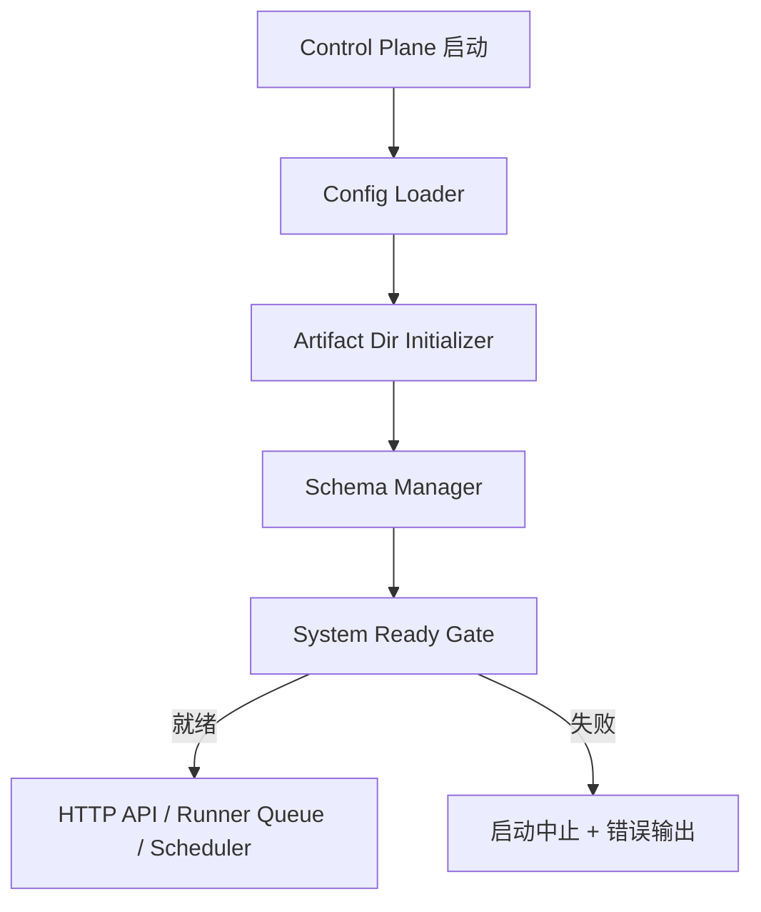
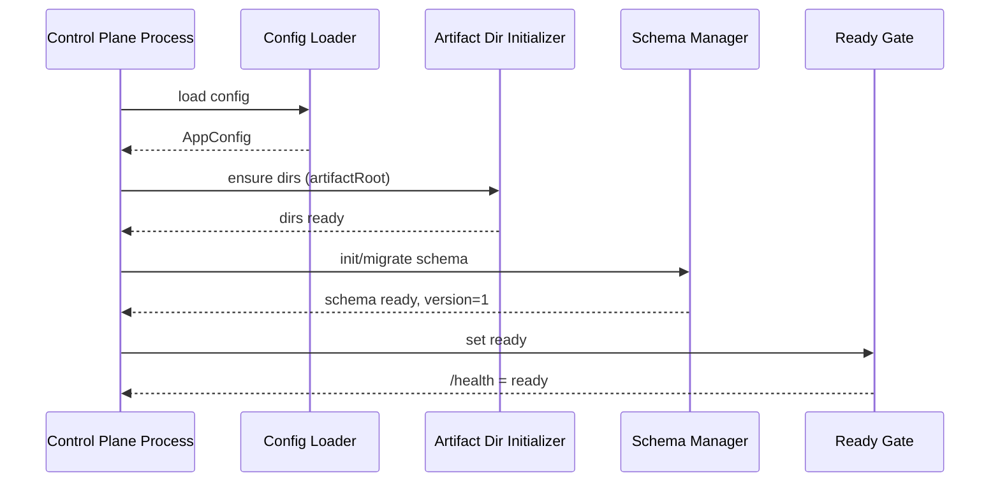
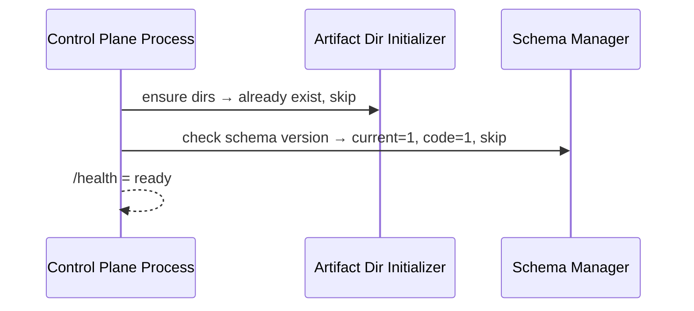

# Design: FEAT-000 AutoBuild System Bootstrap

## 1. Overview

本 Feature 是 AutoBuild 系统的启动基础层。所有 FEAT-001 至 FEAT-014 的持久化和 artifact 存储能力都依赖本 Feature 完成初始化后才可使用。Bootstrap 在 Control Plane 进程启动阶段同步执行，完成后才允许 HTTP API、Runner Queue 和 Dashboard 接受请求。

## 2. Feature Boundary

| 在边界内 | 在边界外 |
|---|---|
| `.autobuild/` 目录树创建 | Project / Feature / Task 业务实体创建（FEAT-001+） |
| SQLite schema 初始化与迁移 | Project Memory 文件初始化（FEAT-006） |
| 系统就绪状态暴露 | Skill/Subagent/Planning Pipeline 平台能力（已移除） |
| Control Plane 配置加载 | Runner Worker 进程管理（FEAT-008） |
| 系统就绪状态暴露 | Dashboard UI（FEAT-013） |

## 3. Requirement Mapping

| Requirement ID | Design Section | Coverage Notes |
|---|---|---|
| REQ-058 | 5.2 Schema Manager | schema 初始化是 Project、Feature、Task 等核心实体持久化的前置条件。 |
| NFR-004 | 5.3 Idempotency Guard | 崩溃恢复依赖 Bootstrap 幂等：重启后识别已完成状态，不重置已有数据。 |

## 4. Architecture Context

Bootstrap 运行于 Control Plane 进程的启动阶段（startup hook），在任何 HTTP 路由、队列订阅或调度器启动前同步完成。依赖关系如下：



## 5. Components

### 5.1 Config Loader

Responsibilities:
- 从环境变量、`.autobuild.config.json`（若存在）和命令行参数合并运行时配置。
- 输出规范化的 `AppConfig`：`port`、`artifactRoot`、`dbPath`、`logLevel`、`runnerConfig`。

Inputs:
- 环境变量、配置文件路径、CLI 参数。

Outputs:
- `AppConfig` 对象。

Dependencies:
- 无上游 Feature 依赖；是 Bootstrap 第一步。

### 5.2 Schema Manager

Responsibilities:
- 在 `AppConfig.dbPath` 路径创建或打开 SQLite 数据库文件。
- 检查 `schema_migrations` 表是否存在；若不存在则执行首次全量 schema 创建。
- 比对当前 schema 版本与代码内嵌版本；若有差异则按顺序执行迁移脚本。
- 幂等：同一版本不重复执行。

Inputs:
- `AppConfig.dbPath`、迁移脚本集合（内嵌于代码）。

Outputs:
- 已就绪的 SQLite 连接实例；当前 schema 版本写入 `schema_migrations`。

Dependencies:
- Config Loader 提供 `dbPath`。

MVP 核心表（由此组件创建）：

| 表 | 对应实体 |
|---|---|
| `projects` | Project |
| `features` | Feature |
| `requirements` | Requirement |
| `tasks` | Task |
| `runs` | Run |
| `evidence_packs` | EvidencePack |
| `project_memories` | ProjectMemory |
| `memory_version_records` | MemoryVersionRecord |
| `worktree_records` | WorktreeRecord |
| `review_items` | ReviewItem |
| `approval_records` | ApprovalRecord |
| `delivery_reports` | DeliveryReport |
| `audit_timeline_events` | AuditTimelineEvent |
| `metric_samples` | MetricSample |
| `schema_migrations` | 迁移版本记录 |

### 5.3 Artifact Dir Initializer

Responsibilities:
- 确保 `artifactRoot/memory/`、`specs/`、`evidence/`、`reports/`、`runs/` 目录存在。
- 使用 `mkdir -p` 或等价幂等操作；若目录已存在不报错、不覆盖已有文件。

Inputs:
- `AppConfig.artifactRoot`。

Outputs:
- 目录树已存在的确认状态。

Dependencies:
- Config Loader 提供 `artifactRoot`。

### 5.4 Ready State Publisher

Responsibilities:
- 汇总 artifact root、schema version、配置加载和初始化错误。
- 输出 `ready`、`initializing` 或 `error` 状态。
- 不包含 Skill discovery、Subagent runtime 或 Planning Pipeline readiness。

Inputs:
- SQLite 连接（来自 Schema Manager）。

Outputs:
- Ready state 可被查询。

Dependencies:
- Schema Manager 完成后才可执行。

### 5.5 System Ready Gate

Responsibilities:
- 在 Config Loader、Artifact Dir Initializer、Schema Manager 全部成功后将系统状态设置为 `ready`。
- 暴露 `GET /health` 接口，返回 `{ status: "ready" | "initializing" | "error", version, schemaVersion }`。
- 任一组件失败时输出结构化错误日志，并以非零退出码中止进程。

Inputs:
- 各组件的执行结果。

Outputs:
- 进程就绪状态；`/health` HTTP 接口。

Dependencies:
- 上述三个组件。

## 6. Data Model

```typescript
// schema_migrations 表
interface SchemaMigration {
  version: number;       // 迁移版本号，单调递增
  applied_at: string;    // ISO 8601 时间戳
  description: string;   // 可读描述
}

// AppConfig（运行时内存对象，不持久化）
interface AppConfig {
  port: number;
  artifactRoot: string;  // 默认：<target_repo_root>/.autobuild
  dbPath: string;        // 默认：<artifactRoot>/autobuild.db
  logLevel: "debug" | "info" | "warn" | "error";
  runnerConfig: RunnerConfig;
}
```

## 7. API / Interface Design

### GET /health

```json
{
  "status": "ready",
  "version": "0.1.0",
  "schemaVersion": 1,
  "artifactRoot": "/path/to/.autobuild"
}
```

失败时：

```json
{
  "status": "error",
  "error": "Schema migration failed: <reason>"
}
```

## 8. Sequence Flows

### 8.1 首次启动



### 8.2 重启（幂等路径）



## 9. State Management

Bootstrap 不维护业务状态机。系统就绪状态仅为进程内存布尔值，通过 `/health` 暴露。重启后通过重新执行幂等检查恢复就绪状态。

## 10. Error Handling and Recovery

| 失败场景 | 处理方式 |
|---|---|
| 磁盘权限不足，无法创建 `.autobuild/` | 输出结构化错误，进程以非零退出码中止。 |
| SQLite 文件损坏 | 输出错误并中止；不自动删除或覆盖已有数据库。 |
| Schema 迁移失败（如迁移脚本错误） | 回滚当前迁移事务，输出迁移版本和原因，中止进程。 |
| Config 缺少必填项 | 输出缺失字段列表，中止进程。 |

恢复原则：Bootstrap 失败后不进入部分就绪状态；修复问题后重启即可完整重试，因为所有步骤均幂等。

## 11. Security and Privacy

- `AppConfig` 中不得包含凭据、token 或密钥；凭据由 Runner 在执行时通过环境变量按需注入。
- `.autobuild/` 目录应仅对运行进程的操作系统用户可读写；建议权限为 `700`。
- `/health` 接口不暴露内部路径以外的敏感系统信息。

## 12. Observability and Auditability

- 每个 Bootstrap 步骤输出结构化日志：`{ step, status, durationMs, detail }`。
- Schema 迁移版本写入 `schema_migrations` 表，可用于审计和调试。
- `/health` 返回 `schemaVersion` 供运维人员确认数据库版本。

## 13. Testing Strategy

| 级别 | 覆盖点 |
|---|---|
| 单元 | Config Loader 合并逻辑、Schema 版本比对逻辑。 |
| 集成 | 首次启动创建目录和表结构；重启后不重复创建；迁移脚本执行后版本递增。 |
| 系统 | Bootstrap 失败时进程以非零码退出；`/health` 返回正确状态。 |

## 14. Rollout and Migration

- FEAT-000 必须在所有其他 Feature 之前实现和验收。
- schema 版本从 1 开始；后续 Feature 若需新表，通过新增迁移脚本递增版本号。
- 若 `.autobuild/` 已在 `docs/agentic-spec/zh-CN/design.md` 中以其他名称存在，需在本 Feature 实现阶段统一修正。

## 15. Risks, Tradeoffs, and Open Questions

- **迁移框架选型**：MVP 可用内嵌迁移脚本数组（轻量），或引入 `drizzle-kit` / `better-sqlite3-migrate`（更规范）。建议 MVP 使用内嵌脚本，M2 再切换正式迁移框架。
- **Skill 种子边界**：内置 Skill 的完整 schema 定义（输入输出 JSON Schema）是在 Bootstrap 种子化时写入还是由 FEAT-003 延迟注册？建议 Bootstrap 只写入元数据占位，FEAT-003 补全 schema 字段，避免 FEAT-000 过度耦合 Skill 业务细节。
- **`.autobuild/` 位置**：已按 HLD 第 9 节确认，MVP 默认使用目标仓库根目录下的 `.autobuild/`；多项目/团队化阶段如需共享全局目录，再通过后续 Spec Evolution 处理。
