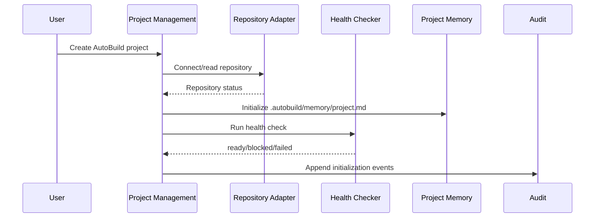
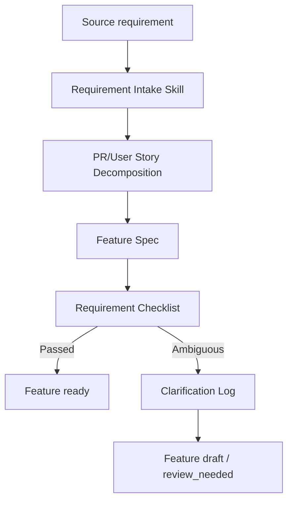
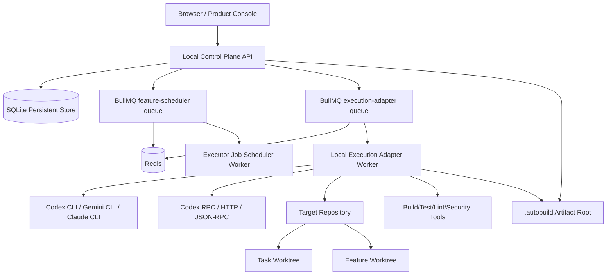

# HLD: SpecDrive AutoBuild

版本：V2.0

说明：本文来源于 `docs/agentic-spec/zh-CN/PRD.md`、`docs/agentic-spec/zh-CN/requirements.md`、`docs/agentic-spec/zh-CN/spec-ref.md`。`docs/agentic-spec/zh-CN/design.md` 已作废并仅作为历史快照保留；项目级架构规则、受控命令边界、接口边界和代码职责边界均以本文为准。

---

## 1. Overview

SpecDrive AutoBuild 是一个面向软件团队的长时间自主编程系统。系统以 Spec Protocol 管理目标、需求、验收和交付证据，以 Scheduler 选择 Feature、排期任务和记录触发，以 Project Memory 为编码 CLI 提供跨会话恢复能力，以 Execution Adapter Layer 适配本地 CLI 与远程/RPC 执行通道，采集外部执行队列、心跳、日志、证据和状态检测，以内部任务状态机维护任务、审批、恢复和交付流转，并以 VSCode IDE Webview 作为日常执行与质量审查主界面，Product Console / Dashboard 保留为历史兼容和系统设置/调试入口。

2026-04-29 边界更新：平台不再提供 Skill System、Subagent Runtime、Agent Run Contract、Context Broker、Planning Pipeline、Skill Center 或 Subagent Console。本文后续旧名称若仍出现在历史映射中，均由 Scheduler and State Maintenance、Runner observation、执行结果、Status Check、Review、Recovery 和 Audit 替代。

2026-05-01 调度队列重构：Scheduler 采用 `Feature Pool Queue -> <executor>.run Job -> Execution Record -> 执行结果`。`feature-pool-queue.json` 是 Feature 队列规划来源；平台不再创建 `feature.select` / `feature.plan`，不再维护平台 TaskGraph 表，也不再使用 `feature_planning` 阶段。Job 仅包含执行层字段，Feature/Task/Project 进入 payload context。Execution Record / 执行记录是 heartbeat、logs、session 和 execution result 的执行实例锚点；旧 Feature Scheduler、TaskGraph 和 Feature Plan 设计仅作为历史废弃说明保留。

2026-05-02 Spec 状态文件化：Spec / Feature 流程状态以当前项目 workspace 内文件为准。`docs/agentic-spec/features/feature-pool-queue.json` 保存全局 Feature 队列，`docs/agentic-spec/features/<feature-id>/spec-state.json` 保存单 Feature 的机器可读状态、执行状态、依赖、blocked reason、当前 Job、最近 Skill 输出和下一步动作。SQLite 不再作为 Spec 状态主事实源，只保存 Scheduler Job、Execution Record、heartbeat、logs、adapter config、command receipt、执行结果 和轻量活动记录。

2026-05-02 VSCode IDE 入口：新增 VSCode SpecDrive Extension 作为 IDE 原生日常入口。插件只负责工作区识别、Spec Explorer、Hover、CodeLens、Comments、Diagnostics、状态面板、受控命令提交和状态订阅；不直接写运行事实源，不直接调用 Codex turn API。Codex RPC 作为 RPC Adapter 与 CLI Adapter 并存，负责 `thread/start`、`thread/resume`、`turn/start`、`turn/interrupt`、approval response、事件流 raw logs 和 Execution Record 投影。

2026-05-03 VSCode Execution Workbench：VSCode 插件 UI 必须作为独立 Webview Web UI 开发，不复用当前 Product Console 的页面、路由、导航、App Shell 或组件实现。插件 Web UI 的首要产品目标是任务调度和自动执行，默认第一屏围绕 Job 队列、当前运行、下一步动作、阻塞原因、自动执行控制、审批待办和执行结果观察组织。

2026-05-03 Feature Selection Skill：Project Scheduler 的下一 Feature 选择由 `plan-feature-execution` 推理完成，输入为 Feature Pool Queue、Feature index、各 Feature `spec-state.json`、依赖完成情况、最近 Execution Record 和 operator resume/skip hints。Control Plane 只信任通过代码安全校验的技能决策，并负责创建 `<executor>.run` Job 与 Execution Record。`approval_needed`、`blocked`、`review_needed`、`failed` 等非可持续 CLI/app-server 状态必须投影回 Feature `spec-state.json`，阻止自动循环继续越权推进。

2026-05-10 Skill-owned Git delivery：Feature implementation 的 Git 生命周期由 `implement-feature` 和必要时的 `prepare-release` 承担。Control Plane / Scheduler / Adapter 只传递 owner workspace 与 Feature Spec source paths、记录 Execution Record、校验 `SkillOutputContractV1.result.gitDelivery`，不得直接创建 Feature worktree、提交、PR、merge 或 cleanup。项目级并发使用一个 Feature 一个 worktree / branch / PR；Feature 内 worker worktree 先合回 Feature branch，再由 owner Feature PR 交付。

2026-05-11 Delivery Fidelity：Feature execution completed 不再只由最终质量门判断。Execution Adapter 校验 `skill-contract/v2` 的 `result.deliveryFidelity`，Review Center 展示 quality loss，Orchestration 在 Done 聚合中要求 Delivery Fidelity Gate 通过。Lifecycle-first workflow 保留 00-14 Skill 编号作为内部兼容层，但用户、Skill 和调度视图优先使用 Define / Plan / Build / Verify / Review / Ship。

2026-05-12 VSCode 质量闭环：新增质量证据展示、Runtime Evidence Gate、Invocation Context Manifest 和 Run Workpad 时，主 UI 必须优先落到 VSCode Execution Workbench 与 Feature Spec Webview。Product Console 定位为历史遗留兼容面，不新增主要质量 UI，也不得作为 VSCode Webview 的 ViewModel 或组件事实源。

2026-05-03 Execution Adapter Layer 重构：平台不再使用 Runner 作为核心架构概念。执行层统一称为 Execution Adapter Layer，下分 CLI Adapter 与 RPC Adapter。CLI Adapter 适配 `codex exec`、Gemini headless CLI 或其他本机编码 CLI；RPC Adapter 适配 `codex app-server`、app-server HTTP/JSON-RPC、WebSocket、stdio 或后续远程执行服务。Scheduler 只创建 `cli.run`、`rpc.run` 等 executor job；Execution Adapter Layer 负责把统一的 `ExecutionAdapterInvocationV1` 转换为具体 provider 调用，并把 provider events 投影为 `ExecutionAdapterResultV1`、Execution Record、raw logs、approval request 和 Feature `spec-state.json`。

本 HLD 定义项目级架构边界、技术栈、核心子系统、数据域、集成方式、运行拓扑、安全治理、可观测性和 Feature Spec 拆分方向。本文不定义具体接口字段、数据库迁移、函数签名、任务实现步骤或单个 Feature 的低层设计。

MVP 采用本地优先的控制面架构：

- Control Plane 维护项目、Spec、Skill、调度、状态、审批、执行结果、审计和查询。
- Execution Layer 通过 Execution Adapter Layer 执行受约束的代码修改、测试和恢复。
- Git repository、worktree 和 branch 是写入隔离边界。
- Persistent Store 是调度和状态真实来源；Project Memory 是 CLI 恢复投影，不是调度真实来源。
- Dashboard 只展示控制面状态，并通过受控命令触发操作，不直接修改 Git 工作区。

### 1.1 Controlled Command, API, and Code Boundary

受控命令是 Product Console、Spec Workspace、Task Board、Execution Console 或系统设置发起有后果操作的唯一入口。凡是会改变持久状态、触发 Scheduler/Run、写入 执行结果/Project Memory、修改配置、推进审批或可能被安全策略阻塞的用户/系统意图，必须先转换为 schema-validated command，写入审计并返回 command receipt；不得由前端、查询接口或普通 ViewModel 直接修改 Git、worktree、artifact、数据库状态或执行 CLI。

使用受控命令的情况包括：

- 创建或导入项目后触发初始化闭环、连接仓库、初始化 Spec Protocol、创建 Project Memory 或项目宪章。
- Spec Sources 扫描、上传、用户故事生成、Feature Spec 拆分、需求质量检查、阶段 3 调度和状态检查等会产生写入或运行副作用的 Spec 操作。
- Task Board 拖拽、批量排期、批量运行、Execution Adapter 暂停/恢复、Review 审批、规则写入、Spec Evolution 写入和 CLI Adapter 配置 validate/save/activate/disable。
- 所有执行类命令必须携带当前 `project_id`，并在进入 Execution Adapter 前解析为当前项目 repository `local_path` 或 `target_repo_path`；缺失、不匹配或不可读时返回 blocked receipt。

普通接口用于读取和展示事实，不承担写入副作用。Dashboard、Project Home、Execution Console、Review Center、Spec Workspace ViewModel、项目列表、执行结果摘要、审计时间线、配置 schema、表单选项、加载态、空态、过滤、排序和语言切换应使用查询接口或前端本地状态。只读预览类接口可以扫描目录或配置并返回事实，但一旦需要落库、调度、写 artifact 或改变状态，必须切换为受控命令。

代码负责实现受控命令背后的确定性机制：持久化 Project/Feature/Task/Run/执行结果/Audit，执行状态机迁移、幂等去重、审批约束、危险命令和 forbidden files 检查、workspace root 校验、CLI Adapter dry-run、Scheduler job 入队、Execution Adapter 心跳、失败指纹、重试上限和 执行结果汇总。Skill 或 CLI prompt 负责推理、拆解、评审和生成内容；不能替代代码维护结构性不变式。

## 2. Goals and Non-Goals

### Goals

- 从自然语言、PR、RP、PRD、用户故事 或混合输入生成结构化 Feature Spec。
- 基于优先级、依赖、风险和就绪状态自动选择下一个可执行 Feature。
- 自动推进 Feature 从需求、计划、Feature Spec `tasks.md`、执行队列、检测、恢复、审批到交付。
- 用 Skill 约束不同工程阶段的输入、输出、风险等级、适用阶段和失败处理。
- 用 Agent Run Contract 控制 Subagent 的上下文切片、读写边界、禁止动作、验收标准和输出 schema。
- 用 Project Memory 支持长时间运行、断点恢复、跨会话目标恢复和失败模式记忆。
- 用 Execution Result、Status Checker、Review Center 和 Delivery Report 建立可审计交付闭环。
- 支持安全默认值、回滚、幂等重放、崩溃恢复、指标采集和运行可观测性。

### Non-Goals

- MVP 不自研大模型。
- MVP 不自研完整 IDE。
- MVP 不实现企业级复杂权限矩阵。
- MVP 不自动发布到生产环境。
- MVP 不处理多大型仓库复杂微服务自动迁移。
- MVP 不完整替代 Jira、GitHub Issues 或 Linear。
- MVP 不接入 Issue Tracker，仅保留外部链接和追踪字段。
- MVP 不以看板加载、状态刷新和 执行结果记录性能阈值作为阻塞验收条件。

## 3. Requirement Coverage

| Requirement ID | HLD Section | Coverage Notes |
|---|---|---|
| REQ-001, REQ-002, REQ-003, REQ-059, REQ-063 | 4, 5, 7.1, 8, 12, 13 | Project、Repository、Project Constitution、Project Selection、Health Check 属于项目管理和仓库适配边界。 |
| REQ-004, REQ-005, REQ-006, REQ-007, REQ-008, REQ-009, REQ-064 | 7.2, 8, 9, 10, 14, 15 | Spec Protocol Engine 负责 Feature Spec、用户故事、Spec Sources 扫描、切片、澄清、Checklist 和版本化。 |
| REQ-010, REQ-011, REQ-012, REQ-013 | 7.3, 8, 9, 11, 14, 15 | Skill System 管理注册、内置 Skill、schema 校验、版本治理和项目级覆盖。 |
| REQ-014, REQ-015, REQ-016, REQ-017, REQ-018 | 7.5, 7.7, 8, 9, 10, 11, 13 | Subagent Runtime、Context Broker、Workspace Manager 和 Result Merger 保证边界、并行隔离和结果合并。 |
| REQ-019, REQ-020, REQ-021, REQ-022, REQ-023 | 7.6, 8, 9, 10, 11, 12, 13 | Project Memory Service 负责初始化、注入、更新、压缩、版本和回滚。 |
| REQ-024, REQ-025, REQ-026, REQ-027 | 7.4, 7.11, 8, 10, 14, 15 | Feature Spec `tasks.md`、兼容 Kanban Board 和状态机支撑任务可追踪执行。 |
| REQ-028, REQ-029, REQ-030, REQ-031, REQ-032 | 7.4, 7.7, 10, 13, 14, 15 | Feature 状态机、选择器、计划流水线、聚合和并行策略由 Orchestration 负责。 |
| REQ-033, REQ-034, REQ-035, REQ-036, REQ-060 | 7.4, 7.7, 10, 12, 13, 14 | Project Scheduler、executor job 调度、触发模式、worktree 生命周期和恢复启动是调度运行时核心。 |
| REQ-037, REQ-038, REQ-039, REQ-065, REQ-066 | 5, 7.8, 9, 11, 12, 13 | CLI Adapter 受 Execution Policy、Safety Gate、workspace root、JSON 配置和审批策略约束。 |
| REQ-040, REQ-041, REQ-042 | 7.9, 9, 10, 12, 14 | Status Checker 执行 diff、测试、安全、Spec Alignment 和状态判断。 |
| REQ-043, REQ-044, REQ-045 | 7.10, 10, 11, 12, 14 | Recovery Manager 管理恢复任务、回滚、拆分、重试退避和失败指纹。 |
| REQ-046, REQ-047, REQ-057 | 7.12, 9, 10, 11, 12, 15 | Review Center 是高风险、阻塞、澄清和审批动作的统一入口。 |
| REQ-048, REQ-049, REQ-050 | 7.13, 8, 9, 10, 12, 14, 15 | Delivery Manager 生成 PR、交付报告和 Spec Evolution 建议。 |
| REQ-051 | 7.9, 8, 9, 10, 12, 14 | Execution Result 是状态判断、恢复、审批和交付报告的共享证据格式。 |
| REQ-052, REQ-053, REQ-054, REQ-055, REQ-056, REQ-061, REQ-062, REQ-063, REQ-064, REQ-066, REQ-067 | 7.11, 9, 12, 14, 15 | Product Console 展示 Dashboard、Dashboard Board、Spec、Skill、Subagent 和 Execution Adapter 状态，并提供项目创建、项目切换、Spec Sources 扫描状态、系统设置、CLI Adapter JSON 表单配置、默认中文的界面语言切换和默认浅色的主题偏好。 |
| REQ-058 | 8, 12, 13 | MVP 核心实体必须持久化并支持恢复。 |
| REQ-069, REQ-070, REQ-071, REQ-072, REQ-073 | 7.14, 8, 9 | Chat Interface 提供悬浮面板、意图分类、受控命令派发、高风险二次确认和会话/消息持久化。 |
| REQ-074, REQ-075, REQ-076, REQ-077, REQ-078, REQ-079 | 7.15, 8, 9, 10, 15 | VSCode Extension 提供工作区识别、Spec Explorer、文档交互、SpecChangeRequest、IDE command receipt 和 Task Queue 管理。 |
| REQ-080, REQ-081, REQ-082, REQ-083, REQ-084, REQ-085, REQ-093 | 7.8, 7.15, 8, 9, 10, 11, 13, 15 | RPC Adapter、Execution Projection、Codex RPC approval、VSCode Diagnostics、独立 Execution Workbench Webview、质量证据投影和 IDE System Settings 属于 Execution Adapter + IDE 联合边界。 |
| REQ-087, REQ-088, REQ-089, REQ-090, REQ-091, REQ-092, REQ-093, REQ-094 | 7.8, 7.9, 7.12, 10, 14, 15 | Delivery Lifecycle OS、Delivery Fidelity Ledger、skill-contract/v2、Runtime Evidence、agent persona routing、Review Center loss 投影、Spec Artifact Granularity Gate、VSCode 质量闭环和 Spec 文档质量修复循环。 |
| NFR-001, NFR-002, NFR-003, NFR-004 | 5, 10, 11, 12, 13, 14 | 默认沙箱、回滚、幂等和崩溃恢复是平台级质量属性。 |
| NFR-005, NFR-006, NFR-010, NFR-012 | 11, 12, 14 | 审计时间线、成本、成功率、心跳和成功指标进入可观测性体系。 |
| NFR-007, NFR-008, NFR-009, NFR-011 | 11, 12, 13, 14 | 性能指标作为基线记录，只读 Subagent 并发作为受控并行能力。 |

## 4. System Context

```mermaid
flowchart LR
  User[用户 / PM / Developer / Approver] --> Console[Product Console]
  Console --> Control[Control Plane API]

  Control --> Spec[Spec Protocol Engine]
  Control --> Skill[Skill System]
  Control --> Orchestration[Schedulers + State Machine]
  Control --> Review[Review Center]
  Control --> Dashboard[Dashboard Query]

  Orchestration --> ExecAdapter[Execution Adapter Layer]
  ExecAdapter --> CliAdapter[CLI Adapter]
  ExecAdapter --> RpcAdapter[RPC Adapter]
  CliAdapter --> Git[Git Repository / Worktree / Branch]
  CliAdapter --> Checks[Build / Test / Lint / Security]
  RpcAdapter --> Remote[App Server / HTTP / JSON-RPC / WebSocket]

  Orchestration --> Memory[Project Memory Service]
  ExecAdapter --> 执行结果[Execution Result]
  Checks --> 执行结果
  Review --> 执行结果
  execution result --> Delivery[PR + Delivery Report]
  Delivery --> GitPlatform[GitHub via gh CLI]

  Control --> Store[(Persistent Store)]
  Memory --> Artifact[.autobuild Artifact Store]
  execution result --> Artifact
```

外部边界：

- Codex CLI / Google Gemini CLI / Claude Code CLI：通过 CLI Adapter 执行代码修改、测试、修复和结构化结果输出。
- Codex RPC / HTTP / JSON-RPC / WebSocket 服务：通过 RPC Adapter 远程或进程内调用执行 turn、approval、event stream 和结构化结果输出。
- Git CLI：读取状态、管理 branch/worktree、采集 diff 和支持回滚。
- GitHub `gh` CLI：MVP 用于读取必要 PR 状态和创建 PR。
- 目标代码仓库：系统修改的实际代码来源和 Git 事实来源。
- 本地文件系统：承载 worktree、Project Memory、Spec artifact、执行结果 artifact 和交付报告。
- 项目自身构建与测试工具：由健康检查发现，由 Execution Adapter/Status Checker 调用。

## 5. Technology Stack

| Layer / Concern | Decision | Rationale | Constraints / Notes |
|---|---|---|---|
| Frontend | TypeScript + React + Next.js 或 Vite React，MVP 优先单页 Product Console | Dashboard、Spec Workspace、Skill Center、Subagent Console、Execution Console 和 Review Center 都是状态密集型工作台，React 生态适合看板、表格、日志、实时状态 UI 和界面多语言切换。 | 当前仓库没有既有实现栈；若实现阶段已有宿主框架，以宿主框架优先；Product Console 首次打开默认中文，语言选择应可持久化。 |
| IDE Extension | TypeScript + VSCode Extension API + 独立 Webview Web UI | VSCode 已提供文件树、编辑器、Markdown 预览、CodeLens、Hover、Comments、Diagnostics、Terminal、Output Channel、Webview、Status Bar 和 Git 集成，适合作为 SpecDrive 的日常操作入口；独立 Webview 承载任务调度和自动执行工作台。 | 插件只调用 Control Plane query/command API；不依赖 Codex VS 插件私有 Webview 协议，不模拟其输入框；Execution Workbench 不复用 Product Console 页面、路由、导航、App Shell 或组件实现。 |
| UI Component System | shadcn/ui + Tailwind CSS + Radix UI primitives | Product Console 需要稳定、可组合、可审计的工作台组件体系；shadcn/ui 以源码方式进入项目，便于定制表格、表单、弹窗、标签页、命令菜单、状态徽标和 Review 操作面板，同时保留无障碍基础能力。 | 不引入重型封闭组件库；组件主题、设计 token、暗色模式和状态语义应在 Product Console Feature Spec 中细化。 |
| Backend / Runtime | TypeScript + Node.js Control Plane API + Execution Adapter Worker | 产品需要调用本机 `codex`、`git`、`gh`、构建测试命令、文件系统和远程/RPC 执行服务；Node.js 对 CLI 编排、JSON-RPC、HTTP、JSON schema、前后端类型共享和本地开发友好。 | 若后续接入 Python Skill，可通过独立进程、CLI Adapter 或 RPC Adapter 执行，不改变控制面事实源。 |
| Database / Storage | MVP 使用嵌入式 SQLite 作为 Persistent Store；`.autobuild/` 保存人类可读 artifact | 本地优先、多项目目录、长时间恢复和审计需要持久化，但 MVP 不需要外部数据库运维复杂度。SQLite 足够承载项目、项目选择、Feature、Task、Run、执行结果、审计、通用指标和 token 消费明细。 | 团队协作阶段可迁移 PostgreSQL；Project Memory 是文件投影，不替代数据库。 |
| Authentication / Authorization | MVP 本地单用户/可信环境，关键动作用 Review Center 和 Safety Gate 审批；不建复杂 RBAC | PRD 明确 MVP 不做企业级复杂权限矩阵；当前风险重点是自动执行权限、敏感文件和高风险操作。 | 远程部署或团队协作阶段需要补充身份认证、角色、项目权限和审计主体。 |
| API / Integration | Control Plane 暴露本地 HTTP API；内部命令使用 schema-validated command/event；外部集成通过 CLI Adapter 和 RPC Adapter | UI、IDE、调度器、Execution Adapter 和审批动作需要统一入口；Codex/Gemini/Claude/Git/GitHub/app-server/HTTP 服务先走稳定 adapter 边界，减少平台权限建模。 | CLI/RPC Adapter 配置统一使用 JSON + JSON Schema，并可投影为 Console JSON 表单；RPC Adapter 负责 protocol/capability/schema detection。 |
| Background Jobs / Scheduler | BullMQ + Redis queue + Worker；SQLite 保存 scheduler job record、Run、心跳、状态和 execution result | 长时间任务不能只存在内存；延迟/周期/Worker 执行交给成熟队列，业务事实仍可恢复。 | Redis 不可用时 scheduler health 为 blocked；写任务默认串行，写入型并行必须绑定 worktree。 |
| Testing | Vitest/Jest 覆盖服务与状态机；Playwright 覆盖 Console；CLI adapter 使用 fixture 和本地集成测试 | 核心风险在状态机、schema、Execution Policy、工作区隔离和 UI 状态展示，测试应围绕这些边界。 | 目标仓库的测试命令由项目健康检查发现，不由本系统固定。 |
| Deployment / Operations | MVP 本地进程：Control Plane + Execution Adapter Worker + Browser Console；artifact root 使用 `.autobuild/` | 本地优先符合编码 CLI、Git worktree、app-server 和目标仓库操作模型，降低 MVP 部署成本。 | 生产/团队化阶段需要服务化部署、队列、数据库、密钥管理和 Adapter Worker 池。 |

Rejected / deferred alternatives:

- 不采用自研大模型；模型能力由 Codex CLI、Google Gemini CLI、Claude Code CLI、Codex RPC 或后续 Execution Adapter 提供。
- 不在 MVP 中引入复杂微服务；控制面和 Execution Adapter Worker 可先在同一主机运行。
- 不以 Project Memory 作为调度数据库；Memory 只为 CLI 恢复提供压缩上下文。
- `docs/agentic-spec/zh-CN/design.md` 已作废；若历史内容与本文、PRD 或 requirements 冲突，以本文和当前 Feature Spec 为准。

## 6. Architecture Overview

系统分为六个运行层：

| Layer | Responsibility | Key Decision |
|---|---|---|
| Product Console | Dashboard、Spec Workspace、Skill Center、Subagent Console、Execution Console、Review Center、System Settings | 只通过 Control Plane 查询和发起命令，不直接写 Git 工作区；保留系统设置、adapter 配置、队列调试和全局状态总览，并与 VSCode System Settings 共享同一配置事实源。 |
| VSCode SpecDrive Extension | Spec Explorer、文档 Hover/CodeLens/Comments/Diagnostics、Execution Workbench Webview、System Settings Webview、Task Queue、Execution Record 面板、approval pending 面板 | IDE 原生入口；只提交受控命令和订阅状态，不直接写运行事实源或调用 Codex turn API；Execution Workbench 核心关注任务调度和自动执行，System Settings 管理共享 CLI/RPC Adapter 配置。 |
| Control Plane | 项目、Spec、Skill、调度、状态、审批、证据和查询 API | 是状态与调度决策的协调层。 |
| Orchestration | Project Scheduler、Executor Job Scheduler、Planning Pipeline、State Machine、Recovery Bootstrap | 所有状态变化先持久化，再触发副作用。 |
| Execution | Execution Adapter Layer、CLI Adapter、RPC Adapter、Status Checker、Recovery Manager | 每次执行都受 Invocation Contract、Execution Policy 和 SkillOutput/Execution Result schema 约束。 |
| Workspace | Git repository、worktree、branch、merge readiness、rollback | 写任务以独立 worktree 和分支隔离。 |
| Execution Results and Governance | Execution Result、Audit Timeline、Metrics、Token Consumption、Review、Delivery Report、Spec Evolution | 支撑审计、审批、恢复、成本追踪和交付闭环。 |

核心事实源：

| Data | Source of Truth | Projection / Consumer |
|---|---|---|
| Feature 候选集 | Feature Spec Pool | Project Memory 只保存最近选择快照。 |
| Feature / Execution 状态 | Persistent Store 中的内部状态机与 Execution Record | Dashboard、Project Memory、Delivery Report。 |
| Git 事实 | 目标仓库与 worktree 的实时 Git 状态 | Repository Adapter、Workspace Manager、Status Checker。 |
| 当前项目上下文 | Project Management 持久层和用户选择状态 | Product Console、Scheduler、Project Memory Injector、Control Plane 命令网关。 |
| 项目身份 | 规范化绝对项目目录，持久层唯一约束覆盖 Project 记录和 Repository Connection | 项目创建、导入、切换、调度和所有项目级查询；空数据库启动时不得注入示例项目，Demo 只能显式导入为普通项目数据且不自动切换。 |
| Project Memory | `.autobuild/memory/project.md` + 版本元数据 | 编码 CLI 会话恢复上下文。 |
| Skill 列表 | Skill Registry，内置 Skill 以 PRD 第 6.3 节为事实源 | Orchestrator、Skill Center、Review Center。 |
| Project Constitution | Project Management 持久层与版本记录 | Project Memory、Scheduler、Review Center、Feature Spec 流程。 |
| execution result | Status Checker | Status Checker、Review Center、Recovery Manager、Delivery Manager。 |

## 7. Capability and Subsystem Boundaries

### 7.1 Project Management

Responsibilities:

- 创建 AutoBuild 项目并保存项目目标、技术偏好、仓库、默认分支、信任级别、运行环境和自动化开关。
- 维护项目目录、项目生命周期状态和当前项目选择上下文，支持导入现有项目、在统一 `workspace/` 目录下创建新项目，并支持用户在多个项目之间切换。
- 连接目标 Git 仓库并读取分支、commit、未提交变更、PR、CI 和 worktree 状态。
- 导入、创建和版本化项目宪章，并向 Memory、调度、审批和 Feature Spec 流程提供项目级规则。
- 执行项目健康检查，输出 `ready`、`blocked` 或 `failed`。

Owns:

- Project、ProjectSelectionContext、RepositoryConnection、ProjectConstitution、ProjectHealthCheck。

Collaborates With:

- Repository Adapter、Project Memory Service、Dashboard Query、Audit Timeline。

### 7.2 Spec Protocol Engine

Responsibilities:

- 从自然语言、PR、RP、PRD、用户故事 或混合输入创建 Feature Spec。
- 拆解原子化、可测试、可追踪的 User Story。
- 自动扫描 PRD、用户故事、requirements、HLD、design、已有 Feature Spec、tasks 和 README / 索引等 Spec Sources，并识别已有规格产物、来源追踪、缺失项和冲突。
- 拆分 Feature Spec 时固化通用规格约束：如果拆分结果包含项目初始化作为第一个 Feature Spec，必须在该 Feature Spec 的 requirements/design/tasks 中包含项目根目录 `.gitignore` 创建或安全更新要求。
- 维护 Clarification Log、Requirement Checklist、Spec Version、Spec Slice 和来源追踪。
- 为计划流水线提供 Feature Spec、需求、验收、数据域、契约和 `tasks.md` 输入。

Spec Sources 扫描只读取和归类已有事实源，不在阶段 2 生成 HLD、拆分 Feature Spec 或启动规划流水线；这些写入性规划动作由选中 Feature 在阶段 3 通过受控操作触发。

Owns:

- Feature、Requirement、AcceptanceCriteria、TestScenario、ClarificationLog、RequirementChecklist、SpecVersion、SpecSlice。

Collaborates With:

- Skill Executor、Feature Spec Pool、Context Broker、Status Checker、Delivery Manager。

### 7.3 Skill System

Responsibilities:

- 注册 Skill 元数据、触发条件、输入输出 schema、允许上下文、所需工具、风险等级、阶段和失败处理。
- 初始化 MVP 内置 Skill，并保持内置清单与 PRD 第 6.3 节一致。
- 在执行前校验 input schema，在执行后校验 output schema。
- 支持 Skill 版本、项目级覆盖、启用/禁用、团队共享和回滚。

Owns:

- Skill、SkillVersion、SkillRun、SchemaValidationResult。

Collaborates With:

- Orchestration Layer、Subagent Runtime、Status Checker、Review Center。

### 7.4 Orchestration and State Machine

Responsibilities:

- Scheduler Trigger 从 `feature-pool-queue.json` 读取已规划 Feature 队列，并接收立即执行、指定时间、周期巡检、依赖完成、CI 失败和审批通过等触发模式。
- Auto Run Controller 调用 `plan-feature-execution` 执行 `select_next_feature`，由技能推理候选 Feature、依赖、状态和执行历史；代码随后校验返回 Feature 是否属于队列、三件套完整、依赖满足、已显式 resume 且同项目没有 active `feature_execution`。
- Scheduler Trigger 创建 `<executor>.run` Job；当前为 `cli.run`，后续可扩展 `native.run`。
- Feature/Task/Project 不作为 Job 顶层属性，只进入 payload context。
- 平台不维护 Feature 内 TaskGraph / tasks 执行表；Feature 内任务排序、并行和完成状态由执行 LLM 读取 Feature Spec 目录中的 `requirements.md`、`design.md` 和 `tasks.md` 后自行管理。
- Feature 执行的唯一受控输入是当前项目 workspace 中的 Feature Spec 目录；`feature_execution` 不依赖 `task_graph_tasks` / `tasks` 表是否存在。
- Feature Aggregator 根据 Execution Record、执行结果、Feature 验收、Spec Alignment 和测试结果判断 Feature 状态。
- Execution Adapter 将 `completed`、`approval_needed`、`blocked`、`review_needed`、`failed` 和 SkillOutput contract validation failure 投影为 Feature `spec-state.json.lastResult`、blockedReasons 和 nextAction；approval pending 不写入 `SkillOutputContractV1.status`，只作为 Execution Record / app-server projection 状态。
- 维护 Feature、Execution Record 与受控命令的状态；Task Board 仅作为兼容展示或手动状态入口，不是编码执行的必需事实源。

Owns:

- ScheduleTrigger、SchedulerJobRecord、ExecutionRecord、StateTransition。

Collaborates With:

- Spec Protocol Engine、Workspace Manager、BullMQ Scheduler Worker、Execution Adapter Layer、Project Memory Service、Review Center。

### 7.5 Subagent Runtime and Context Broker

Responsibilities:

- 按 Spec、Clarification、Repo Probe、Architecture、Task、Coding、Test、Review、Recovery 或 State 类型创建 Subagent Run。
- 生成 Agent Run Contract，冻结目标、上下文切片、允许文件、只读文件、禁止动作、验收标准和输出 schema。
- 保证 Subagent 默认不继承完整主上下文，只接收当前任务所需上下文。
- 将写入型任务交给执行 Skill 管理隔离 worktree，平台只提供冲突判定、记录和审计。

Owns:

- Run、AgentRunContract、ContextSliceRef、SubagentEvent。

Collaborates With:

- Project Memory Service、Execution Adapter Layer、Workspace Manager、Status Checker、Execution Adapter Queue。

### 7.6 Project Memory Service

Responsibilities:

- 初始化 `.autobuild/memory/project.md`。
- 在编码 CLI 会话启动前注入 `[PROJECT MEMORY]` 上下文块。
- 根据 Execution Result、Status Checker 和状态转移幂等更新 Memory。
- 在超出 token 预算时压缩旧 执行结果摘要、历史决策和已完成任务列表。
- 维护版本记录、回滚索引和压缩审计。

Owns:

- ProjectMemory、MemoryVersionRecord、MemoryCompactionEvent。

Collaborates With:

- Orchestration Layer、Subagent Runtime、Execution Adapter Layer、Status Checker、Audit Timeline。

### 7.7 Workspace Manager

Responsibilities:

- 记录执行 Skill 返回的 worktree 路径、分支名、base commit、目标分支、关联 Feature/Task、执行通道、PR、merge 和清理状态。
- 提供冲突分类、并发适配性和 merge-readiness 判断；不作为默认 Feature 执行路径直接创建 worktree、commit、PR 或 merge。
- 判断同文件、锁文件、数据库 schema、公共配置和共享运行时资源是否必须串行。
- 合并前执行冲突检测、Spec Alignment Check 和必要测试。

Owns:

- WorktreeRecord、ConflictCheckResult、MergeReadinessResult。

Collaborates With:

- Repository Adapter、Executor Job Scheduler、Execution Adapter Layer、Status Checker、Recovery Manager。

### 7.8 Execution Adapter Layer

Responsibilities:

- 提供统一的执行适配接口，不再以 Runner 作为核心抽象。
- 按 executor kind 分发 `cli.run`、`rpc.run` 等 job；Scheduler 只认识 job kind、payload context 和 Execution Record，不硬编码 Codex、Gemini、Claude、app-server 或 HTTP 细节。
- CLI Adapter 调用 Codex CLI、Google Gemini CLI、Claude Code CLI 或后续等价 CLI 执行代码修改、测试或修复。
- RPC Adapter 调用 Codex RPC、HTTP/JSON-RPC/WebSocket app-server 或后续远程执行服务，并处理 thread/turn、approval、event stream 和 interrupt/cancel。
- 读取 active adapter JSON 配置，并将 executable、argument template、endpoint、transport、capabilities、workspace policy、output mode、执行结果映射和 session resume/thread resume 映射转换为实际执行计划。
- 按任务风险解析 sandbox、approval policy、model、reasoning effort、profile、provider-specific speed / service tier、workspace root、session/thread resume 和 output schema。
- 采集命令输出、RPC event stream、provider session/thread、心跳和原始日志。
- 生成或转交 Execution Result。
- 对 `feature_execution` completed 输出校验 `skill-contract/v2`、Delivery Fidelity Ledger、Journey Closure、Runtime Evidence、Git delivery 和 evidence artifact refs；失败时投影为 `review_needed`。
- 生成 `InvocationContextManifest`，只向 Adapter Prompt 注入执行 ID、项目/Feature/Task、边界、阻塞、审批、验证要求、输出契约和 AGENTS / memory / constitution 引用，不注入全文上下文。
- 为每次运行创建 `.autobuild/runs/<executionId>/WORKPAD.md` 与 `workpad.json`，记录执行过程、覆盖关系、验收、旅程、runtime 验证和证据索引。
- 对 PRD、requirements、HLD、UI Spec 和 Feature Spec 的规格颗粒度执行 `review-delivery-evidence` 语义审查；粗颗粒度文档只能进入 `review_needed`，不得推进到 `ready` 或 `feature_execution`。

Owns:

- ExecutionPolicy、ExecutionAdapterConfig、ExecutionHeartbeat、ExecutionSessionRecord、RawExecutionLog。

Collaborates With:

- Project Memory Injector、Workspace Manager、Safety Gate、Status Checker、Review Center、VSCode Extension。

#### 7.8.1 Unified Adapter Interface

所有执行适配器必须实现同一组平台接口：

TypeScript 契约定义集中在 `src/execution-adapter-contracts.ts`；该文件只定义共享 contract、provider session、event 和 result shape，不承载 CLI/RPC provider 的运行实现。

| Interface | Purpose | Required Fields |
|---|---|---|
| `ExecutionAdapterConfigV1` | 适配器机器可查询配置。 | `id`、`kind` (`cli`/`rpc`)、`displayName`、`provider`、`schemaVersion`、`transport`、`capabilities`、`defaults`、`inputMapping`、`outputMapping`、`security`、`status`、`updatedAt`。 |
| `ExecutionAdapterInvocationV1` | Control Plane 传给适配器的唯一执行输入。 | `executionId`、`jobId`、`projectId`、`workspaceRoot`、`operation`、`featureId`、`specState`、`traceability`、`constraints`、`outputSchema`、`resume`、`skillInstruction`。 |
| `ExecutionAdapterEventV1` | 适配器运行中回传的事件。 | `executionId`、`provider`、`sequence`、`timestamp`、`type`、`severity`、`message`、`payloadRef`、`approvalRequest`、`tokenUsage`。 |
| `ExecutionAdapterResultV1` | 适配器完成后回传的结构化结果。 | `executionId`、`status` (`completed`/`failed`/`blocked`/`review_needed`/`approval_needed`/`cancelled`)、`providerSession`、`summary`、`skillOutput`、`producedArtifacts`、`traceability`、`nextAction`、`rawLogRefs`、`error`。 |

`ExecutionAdapterInvocationV1.skillInstruction` 是面向 Skill / agent 的任务指令片段，包含 `skillName`、`requestedAction`、`sourcePaths`、`imagePaths`、`expectedArtifacts` 和可选 `operatorInput`。平台不再生成独立 `SkillInvocationContractV1`，也不把完整 invocation 或 workspace 文件内容序列化进 provider prompt。Provider prompt 只说明本次要执行什么 Feature 级任务、需要读取哪些 workspace 路径、以及必须返回 Skill output contract。`SkillOutputContractV1` / `SkillOutputContractV2` 的通用机器契约由调用端 schema 定义和校验，要求输出 `status`、`summary`、`nextAction`、`producedArtifacts`、Feature 级 `traceability` 和 `result`；项目级 Skill 文档只声明本技能在 `result` 中写入的专用字段语义，不作为调用端硬编码专用 schema。`feature_execution` completed 必须使用 V2，并在 `result.deliveryFidelity` 记录 source intent、journey、behavior obligation、handoff、loss、evidence、agent review 和 completion decision。

#### 7.8.2 CLI Adapter

CLI Adapter 只负责把 `ExecutionAdapterInvocationV1` 映射为本机进程调用：

- `codex-cli`：默认内置 preset，provider 专用配置位于 `src/codex-cli-adapter.ts`；默认启用 Codex CLI Fast mode，并通过 `service_tier` 与 `features.fast_mode` 配置覆盖传递；通用 CLI 执行、policy、contract validation、raw log、token usage 和 session record 逻辑位于 `src/cli-adapter.ts`。
- `gemini-cli`：内置可选 preset，使用 headless `--output-format stream-json`、`--skip-trust`、`--approval-mode` 和 `-p` 运行；通用 CLI Adapter 从 `init`、`message`、`tool_use`、`tool_result`、`error`、`result` 事件中提取 session、日志、token usage 和事后 `SkillOutputContractV1` 校验结果。
- `claude-cli`：内置可选 preset，使用 `claude -p`、`--output-format json` 和 `--json-schema` 运行；默认模型 alias 为 `sonnet`，`approval=never` 映射为 `--permission-mode acceptEdits` 与受控 `--allowedTools`，不使用 `bypassPermissions`；通用 CLI Adapter 从完整 stdout JSON 的 `session_id`、`structured_output`、`result` 和 usage 字段投影 session、日志、token usage 和事后 `SkillOutputContractV1` 校验结果。
- 后续 CLI：通过 adapter JSON 增加 executable、argument template、resume template、environment allowlist、output mapping 和 dry-run，不修改 Scheduler 或状态机。

CLI Adapter 必须在目标项目 workspace root 中启动进程。workspace root 不得回退到 SpecDrive Control Plane 进程 cwd。路径缺失、不可读、不是可用 workspace，或缺少执行所需 `.agents/skills/*` / `AGENTS.md` 时，新 Execution Record 必须 blocked。

#### 7.8.3 RPC Adapter

RPC Adapter 只负责把 `ExecutionAdapterInvocationV1` 映射为远程或进程内协议调用：

- 通用 RPC 配置、JSON-RPC request/notification、transport interface 和 provider-neutral config 投影位于 `src/rpc-adapter.ts`。
- `codex-rpc`：Codex RPC provider 实现位于 `src/codex-rpc-adapter.ts`，负责 stdio JSON-RPC、initialize、thread/start、thread/resume、turn/start、turn/interrupt、approval response、event stream 和 output schema。
- `gemini-acp`：Gemini RPC provider 实现位于 `src/gemini-rpc-adapter.ts`，负责 `gemini --acp` stdio JSON-RPC、initialize、newSession/loadSession、prompt、cancel、permission request、session update、prompt response 和 SkillOutputContractV1 事后校验。
- `http-app-server`：后续通用 HTTP/JSON-RPC adapter，可通过 endpoint、headers allowlist、auth ref、capability detection、request/response mapping 和 event stream mapping 接入。
- `websocket-app-server`：后续长连接 adapter，用于需要双向 event stream、approval 和 cancel/interrupt 的远程执行服务。

RPC Adapter 的远程 provider 不得直接写入 SpecDrive SQLite、Feature `spec-state.json` 或 Git 工作区事实源。所有 provider 输出必须先投影为 `ExecutionAdapterEventV1` / `ExecutionAdapterResultV1`，再由 Control Plane 按状态机、审计和 Safety Gate 规则落库或写文件。

#### 7.8.4 Terminology Migration

旧实现和历史文档中的 Runner、Codex Runner、Runner Policy、Runner Heartbeat、CodexSessionRecord 迁移为：

| Legacy Term | New Term |
|---|---|
| Runner / Codex Runner | Execution Adapter Layer |
| Runner CLI Adapter | CLI Adapter |
| Codex RPC Adapter | RPC Adapter: `codex-rpc` provider |
| RunnerPolicy | ExecutionPolicy |
| RunnerHeartbeat | ExecutionHeartbeat |
| CodexSessionRecord / CliSessionRecord | ExecutionSessionRecord with provider-specific details |
| Runner Console | Execution Console |

迁移顺序必须先落接口，再迁移 Codex CLI provider，再迁移 Codex RPC provider，最后清理 UI、数据库兼容字段和历史命名。兼容期间可以保留旧文件名或数据库表名作为实现过渡，但对外设计、Feature Spec、API view model 和新任务不得继续引入 Runner 概念。

### 7.9 Status Checker and Status Checker

Responsibilities:

- 在每次 Run 后检查 Git diff、构建、单元测试、集成测试、类型检查、lint、安全扫描、敏感信息扫描、Spec Alignment、任务完成度、风险文件和未授权文件。
- 在每次 Feature 完成判断中检查 requirement coverage、acceptance evidence、journey evidence、runtime evidence、Delivery Fidelity 和 Git delivery，证据不足时投影为 `review_needed` 并创建可读 ReviewItem trigger。
- 输出 Done、Ready、Scheduled、Review Needed、Blocked 或 Failed 的状态判断。
- 捕获 Execution Result 并供审批、恢复、状态聚合和交付报告复用。

Owns:

- StatusCheckResult、SpecAlignmentResult、ExecutionResult。

Collaborates With:

- Execution Adapter Layer、Workspace Manager、Review Center、Recovery Manager、Delivery Manager。

### 7.10 Recovery Manager

Responsibilities:

- 对可恢复失败生成恢复任务并调用 `recover-execution`。
- 支持自动修复、回滚当前任务修改、拆分任务、降级只读分析、请求审批、更新 Spec 或更新任务依赖。
- 记录失败模式指纹、禁止重复策略、失败次数和指数退避计划。

Owns:

- RecoveryTask、FailureFingerprint、ForbiddenRetryRecord、RetrySchedule。

Collaborates With:

- Status Checker、Skill System、Workspace Manager、Review Center、State Machine。

### 7.11 Product Console and Dashboard

Responsibilities:

- Dashboard 展示项目健康度、活跃 Feature、看板数量、运行中 Subagent、失败任务、待审批任务、成本、最近 PR 和风险提醒。
- Product Console 是历史兼容面，不承载新增主质量 UI；新增质量证据展示优先进入 VSCode Execution Workbench 与 Feature Spec Webview。
- 提供项目创建入口、项目列表和当前项目切换控件，并将所有页面查询限定在当前项目。
- Dashboard Board 支持受状态机约束的拖拽、批量排期、批量运行，以及依赖、diff、测试结果、审批状态和失败恢复历史入口。
- Spec Workspace 展示 Feature、Spec、澄清、Checklist、计划、数据模型、契约、Feature Spec `tasks.md` 覆盖情况和版本 diff。
- Skill Center 展示 Skill 列表、详情、版本、schema、启用状态、执行日志、成功率、阶段和风险等级。
- Subagent Console 展示 Run Contract、上下文切片、执行结果、token 使用、运行状态，并支持终止和重试。
- Execution Console 展示 Execution Adapter 在线状态、active CLI adapter、当前模型、sandbox、approval policy、queue、日志、心跳和 CLI Adapter 配置健康摘要。
- System Settings 提供 CLI Adapter 配置管理，支持 Codex/Gemini/Claude preset、原始 JSON、JSON Schema 表单、dry-run 校验、保存草稿、启用/禁用和字段级错误展示；Execution Console 仅提供状态摘要和跳转入口。

Owns:

- UI View Model、Dashboard Query Model、Console Action Command、System Settings View Model、CLI Adapter Form View Model。

Collaborates With:

- Control Plane API、Audit and Metrics Store、Review Center、Execution Adapter Queue。

### 7.12 Review Center

Responsibilities:

- 接收因权限、安全、预算、高风险、diff 过大、forbidden files、多次失败、需求歧义、权限提升、AGENTS.md / 项目宪章人工授权规则、Project Memory / 项目健康检查冲突、constitution 或架构变更触发的 Review Needed。
- 接收 Delivery Fidelity 失败触发的 Review Needed，包括 `quality_evidence_gap`、`test_semantics_gap` 和 `journey_bypassed_by_fixture`；Delivery Fidelity、behavior obligation 或 unresolved loss 触发时优先归类为 `risk_review_needed`，不得因同一运行 metadata 中出现 PR / approval / permission 字样而归类为 `approval_needed`。
- 展示任务目标、关联 Spec、Run Contract、diff、测试结果、风险说明、执行结果 和推荐动作。
- 展示质量损失发生 lifecycle handoff、损失类型、责任 agent、缺失证据和关闭建议。
- 处理批准继续、拒绝、要求修改、回滚、拆分任务、更新 Spec 和标记完成。

Owns:

- ReviewItem、ApprovalRecord、ReviewDecision。

Collaborates With:

- State Machine、Status Checker、Spec Protocol Engine、Workspace Manager、Recovery Manager。

### 7.13 Delivery Manager

Responsibilities:

- 在 Feature 达到交付条件后通过本机 `gh` CLI 创建 PR。
- 生成 Delivery Report，包含完成内容、变更文件、验收结果、测试摘要、失败和恢复记录、风险项、下一步建议和 Spec 演进建议。
- 当实现暴露需求、验收、架构或测试约束变化时生成 Spec Evolution 建议。

Owns:

- PullRequestRecord、DeliveryReport、SpecEvolutionSuggestion。

Collaborates With:

- Repository Adapter、Status Checker、Spec Protocol Engine、Review Center。

### 7.14 Chat Interface

Responsibilities:

- 在 Product Console 所有页面提供悬浮对话面板，接收用户自然语言输入。
- 通过 Codex CLI 对消息进行意图分类（classifyIntent），Codex 不可用时退回规则关键词分类。
- 将低/中风险意图立即转换为受控命令（submitConsoleCommand）执行，返回自然语言摘要。
- 将高风险意图存储为待确认命令（pending_command_json），展示操作预览，等待用户 confirm 或 cancel。
- 将会话、消息、意图类型、命令回执和状态持久化到 SQLite chat_sessions 和 chat_messages 表。

Owns:

- ChatSession、ChatMessage。

Collaborates With:

- Product Console（UI 挂载）、submitConsoleCommand（命令派发）、Execution Adapter Layer（意图分类调用）、Status Checker（查询上下文构建）。

### 7.15 VSCode SpecDrive Extension

Responsibilities:

- 识别 VSCode workspace 中的 SpecDrive 文档结构、Feature 队列、`spec-state.json` 和 `.autobuild` 运行状态。
- 提供 Spec Explorer，展示 PRD、requirements、HLD、Feature Specs、Task Queue、Execution Record 和最近 Codex 会话。
- 提供独立 Execution Workbench Webview，默认聚焦 Job 队列、自动执行控制、当前运行、阻塞/审批、Execution Record 和运行结果投影。
- 提供质量证据面板，在 Execution Workbench 与 Feature Spec 详情中展示 requirement coverage、acceptance evidence、journey evidence、runtime evidence、Delivery Fidelity losses、Git delivery、Workpad、raw logs、截图/trace、PR/check 和 ReviewItem 状态。
- 提供独立 System Settings Webview，展示并管理 CLI Adapter 与 RPC Adapter active/draft/preset、校验结果、dry-run/probe 和 JSON 配置。
- 在独立 Webview 共享壳提供左侧导航栏，覆盖 Execution Workbench、Spec Workspace、Feature Spec 和 System Settings；导航点击由 VSCode extension host 打开对应 Webview，折叠状态只保存在工作台级 localStorage，不在各页面 Webview state 中保存副本。
- 提供项目级执行偏好设置，保存默认 run mode (`cli` / `rpc`) 与对应 Execution Adapter provider；Execution Workbench 在新建 Job 前可提交 Job 级执行偏好覆盖项目默认。
- 提供 Feature Spec Webview 的 New Feature 受控输入、Feature index 与 Feature 文件夹同步刷新、Feature 详情 `tasks.md` 解析和任务状态展示。
- Feature Spec Webview 对 need review / review_needed Feature 提供与 Product Console 一致的 ReviewItem 审批入口，审批通过后由 Review Center 恢复继续执行；`Pass` 仅作为隐藏的临时状态重置命令保留，由 Control Plane 同步 Feature `spec-state.json`、Execution Record 和 Scheduler Job 完成状态；Webview 不直接写运行事实源。
- 在 Spec 文档中提供 Hover、CodeLens、Comments 和 Diagnostics，支持行级/段落级澄清、需求新增、需求变更、用户故事生成、设计更新和 Feature 拆分意图。
- 将所有有副作用的 IDE action 转换为 Control Plane command API 请求，接收 `IdeCommandReceiptV1` 并刷新 UI。
- 展示 app-server 事件流、diff 摘要、raw logs、approval pending 和 `SkillOutputContractV1/V2` 校验结果。
- 展示结构化 Skill 输出的摘要视图：状态、summary、nextAction、traceability、产物表格、常见 result 分组和完整 JSON 审计视图。
- 从 Control Plane 投影的 Execution Record 时间字段展示 Job 开始时间、完成时间和单次执行耗时；耗时由 `started_at` / `completed_at` 派生，Webview 不直接读取 SQLite。
- 在独立 Webview 共享层提供语言切换入口，支持中文、英语和日语，并用 Webview state / localStorage 保持选择；只翻译 UI chrome、按钮、字段标签、空态和提示，不翻译执行结果、diff、日志、文件路径、命令输出、JSON 配置、用户输入或 Feature 文档内容。
- 在插件重载后恢复 Spec Explorer、Task Queue、pending approval 和最近执行状态。

Owns:

- VSCode UI state、Execution Workbench Webview state、Feature Spec Webview state、System Settings Webview state、SpecDriveWorkspaceContextV1、SpecTreeNodeV1、SpecChangeRequestV1、IdeCommandReceiptV1 view model、Diagnostics projection。

Collaborates With:

- Control Plane query/command API、Scheduler、RPC Adapter、Execution Record Store、Workspace Files、Product Console、CLI/RPC Adapter 配置事实源。

Boundary:

- 插件不得直接写 `spec-state.json`、`execution_records` 或 `scheduler_job_records`。
- 插件不得直接调用 `thread/start`、`thread/resume`、`turn/start` 或 `turn/interrupt`。
- 查询类动作可以读取 workspace 文件或调用 query API；落盘、调度、取消、重试、审批和配置修改必须走受控命令。
- Execution Workbench 不复用 Product Console 页面、路由、导航、App Shell、组件实现或 ViewModel；只允许复用 shared contract/type 和 Control Plane query/command API。
- VSCode 质量证据 view model 只从 durable runtime fields 投影，不读取 Product Console 状态，也不把 Product Console 页面作为事实源。
- VSCode System Settings 与 Product Console System Settings 是两个 UI 入口，不得创建第二套配置状态；CLI/RPC Adapter 配置事实源仍为 Control Plane 持久层。
- 执行偏好事实源为项目级 SQLite 配置与新建 Job payload；`cli` provider 必须解析到 `cli_adapter_configs`，`rpc` provider 必须解析到 `rpc_adapter_configs`。

## 8. Data Domains and Ownership

| Data Domain | Primary Owner | Key Entities | Persistence Strategy |
|---|---|---|---|
| Project and Repository | Project Management | Project、ProjectSelectionContext、RepositoryConnection、ProjectHealthCheck | SQLite + project artifact projection。 |
| Spec Protocol | Spec Protocol Engine | Feature、Requirement、ClarificationLog、Checklist、SpecVersion、SpecSlice | SQLite + Markdown/JSON artifact。 |
| Skill Governance | Skill System | Skill、SkillVersion、SkillRun、SchemaValidationResult | SQLite + skill artifact。 |
| Orchestration State | Orchestration and State Machine | Feature、StateTransition、ScheduleTrigger、SchedulerJobRecord、ExecutionRecord | SQLite source of truth；BullMQ/Redis 只负责调度和 Worker 投递。 |
| Runtime Execution | Execution Adapter Layer | ExecutionRecord、ExecutionAdapterConfig、ExecutionHeartbeat、ExecutionSessionRecord、RawExecutionLog、TokenConsumptionRecord、InvocationContextManifest、RunWorkpad、RuntimeEvidence | SQLite + JSON adapter config + execution logs + `.autobuild/runs/<executionId>/` Workpad；`cli.run` / `rpc.run` 由 BullMQ Worker 触发；token/cost 只从 adapter event/raw log 提取消费事实。 |
| IDE Integration | VSCode SpecDrive Extension / Control Plane | SpecDriveWorkspaceContextV1、SpecTreeNodeV1、SpecChangeRequestV1、IdeCommandReceiptV1、AppServerExecutionProjectionV1、IdeSystemSettingsProjectionV1 | Workspace 文件 + Control Plane query/command API；IDE 本地只缓存 UI 状态。 |
| Workspace Isolation | Workspace Manager | WorktreeRecord、ConflictCheckResult、MergeReadinessResult | SQLite + Git/worktree facts。 |
| Project Memory | Project Memory Service | ProjectMemory、MemoryVersionRecord | `.autobuild/memory/project.md` for CLI injection + SQLite version index。 |
| Execution Results and Audit | Status Checker | ExecutionResult、AuditTimelineEvent、MetricSample | SQLite + `.autobuild/reports/` artifact。 |
| Review and Delivery | Review Center / Delivery Manager | ReviewItem、ApprovalRecord、DeliveryReport、PullRequestRecord | SQLite + Markdown artifact。 |
| Chat Interface | Chat Interface | ChatSession、ChatMessage | SQLite chat_sessions + chat_messages；pending_command_json 为会话级临时状态。 |

Data ownership rules:

- Feature / Execution 状态只由内部状态机写入；兼容 Task Board 状态不得成为编码执行前置条件。
- Project Memory 是恢复投影，不能覆盖 Feature Spec Pool、Persistent Store 或 Git 事实。
- SchedulerJobRecord 必须记录 BullMQ job id、queue、job type、target、payload、attempts、status 和 error；Redis 队列不是业务事实源。
- Execution Result 必须能追踪到 Execution Record、Feature、scheduler job 和状态判断。
- 仓库凭据、密钥和连接串不得写入 Project Memory、执行结果 或普通日志。

## 9. Integration and Interface Strategy

### Internal Collaboration Style

- Control Plane 通过同步命令处理用户动作、调度触发、审批动作和查询。
- Scheduler、Execution Adapter、Status Checker、Recovery 和 Delivery 之间通过 SQLite 状态、BullMQ job 和 execution result 解耦。
- Planning 类 Skill 仍由编码 CLI 工作流执行；平台在 planning bridge 未实现前不得伪造 Skill 输出或 Feature Spec `tasks.md` 覆盖结果。

### External Integrations

| Integration | MVP Strategy | Constraint |
|---|---|---|
| BullMQ + Redis | `specdrive:feature-scheduler` 和 Execution Adapter queue 承担 delayed、repeatable 和 Worker job 执行。 | Redis 不保存业务事实；断连时 scheduler health 为 blocked，SQLite 保留 trigger/job/audit。 |
| Codex CLI / Google Gemini CLI / Claude Code CLI | 由 CLI Adapter 调用 `codex exec`、Gemini headless `stream-json`、Claude `-p` structured JSON 或等价执行入口，并要求结构化输出。 | 高风险任务不得自动高权限执行；命令模板和输出映射来自 active JSON adapter 配置。 |
| Codex RPC / HTTP / JSON-RPC / WebSocket | 由 RPC Adapter 连接或启动 provider，执行 initialize/capability detection、thread/session start/resume、turn/request、interrupt/cancel、approval response 和 event stream 消费。 | RPC provider 不直接写事实源；VSCode 插件只能提交受控命令和订阅状态。 |
| Git CLI | 由 Repository Adapter / Workspace Manager 读取状态；Feature 写入生命周期中的 worktree、branch、commit 和 cleanup 由执行 Skill 调用。 | Git 状态是代码事实来源；平台代码不替技能执行 Feature Git 生命周期。 |
| GitHub `gh` CLI | 由执行 Skill 或补交付 Skill 创建 PR、读取 PR 状态、merge 和清理远程分支。 | MVP 不单独建模 Git 平台权限矩阵。 |
| Local filesystem | 保存 Project Memory、Spec artifact、执行结果 artifact 和 Delivery Report。 | Artifact root 统一为 `.autobuild/`。 |
| Build/test tools | 由 Status Checker 和 Execution Adapter 根据项目健康检查发现并执行。 | 命令结果必须进入 执行结果。 |

### Execution Adapter Configuration

Execution Adapter 配置是执行适配层的机器可查询事实源，使用 JSON 持久化并由 JSON Schema 校验。配置变更流程为 draft -> dry-run validated -> active；启用失败时保留上一份 active 配置。Product Console 系统设置中的 JSON 表单只编辑该 JSON，不创建第二套配置事实源。模型 token 价格表属于 CLI / RPC adapter defaults，用于将 TokenConsumptionRecord 的 token usage 转换为成本；成本计算必须使用该次执行最终 adapter 的费率快照，而不是当前 active adapter；缺失价格时记录 token 且成本为 0。

### CLI Adapter

CLI Adapter 的 job type 为 `cli.run`。它读取 active `kind=cli` adapter config，合并 Execution Policy，构建 `ExecutionAdapterInvocationV1`，在目标 workspace root 中启动 CLI 进程，并把 stdout/stderr、JSON/JSONL events、session id 和结构化输出投影为 `ExecutionAdapterEventV1` / `ExecutionAdapterResultV1`。CLI Adapter 必须实时观察 stdout 中最后一个有效 `SkillOutputContractV1`；一旦出现终态 contract，即使 provider 进程随后停留在 stdin 读取或未自然退出，也必须在短暂日志排空窗口后终止孤立进程，按该终态 contract 回写 Execution Record / Scheduler Job / Feature `spec-state.json` / ReviewItem，并把 `stdin_wait_after_terminal_contract` 或等价终止原因写入 raw log、Run Report 和 Execution Record metadata。

### RPC Adapter

RPC Adapter 的 job type 为 `rpc.run`，`codex.rpc.run` 是迁移期兼容别名。它读取 active `kind=rpc` adapter config，连接已有 app-server、启动本地 app-server 或启动 ACP agent，完成 protocol initialize/capability detection，再根据 Execution Record / payload context 选择 session/thread start/resume，随后发起 turn/request/prompt。

Adapter 输入至少包含 `workspaceRoot`、`featureId`、`specState`、`traceability`、`constraints`、`outputSchema` 和 `skillInstruction`。Feature 内部 `tasks.md` 由 agent 读取并执行，Scheduler / Execution Adapter 不再把 Feature 内 task 作为 adapter 调度边界。Codex RPC provider 的输出投影为 `ExecutionAdapterResultV1.providerSession`，其中包含 `threadId`、`turnId`、`transport`、`model`、`cwd` 和 event refs；Gemini ACP provider 的输出投影包含 `sessionId`、`transport`、`model`、`cwd`、event refs 和 approval state。

RPC 事件流持续写入 raw logs，并投影到 Execution Record progress。`SkillOutputContractV1` 校验通过后，Control Plane 更新 `docs/agentic-spec/features/<feature-id>/spec-state.json.lastResult`、next action 和 history；校验失败时保留 raw output 并将 Execution Record 标记为 failed。Codex RPC approval request 和 Gemini ACP permission request 必须写入 pending approval，等待 VSCode 插件或其他 UI 通过 Control Plane approval command 返回决策。

### Artifact Root Decision

MVP 项目级 artifact root 使用 `.autobuild/`：

- 默认位置为目标仓库根目录下的 `.autobuild/`；Control Plane `AppConfig.artifactRoot` 以启动时的目标仓库根目录解析相对路径。
- `.autobuild/memory/project.md`：Project Memory 当前版本。
- `.autobuild/specs/`：Feature Spec、Requirement、Checklist、Plan 和 Feature Spec `tasks.md` 的文件投影。
- `.autobuild/reports/`：Execution Result 和检查结果附件。
- `.autobuild/reports/`：Delivery Report 和 Spec Evolution 建议。
- `.autobuild/runs/`：Run 元数据、日志摘要和恢复索引。

`docs/agentic-spec/zh-CN/design.md` 已作废；不得继续把其中的历史字段、目录命名或旧平台边界作为新实现依据。

## 10. Cross-Feature Workflows

### 10.1 Project Initialization



### 10.2 Requirement Intake to Ready Feature



### 10.3 Autonomous Execution Loop

```mermaid
flowchart TD
  Pool[Feature Pool Queue<br/>feature-pool-queue.json] --> SchedulerJob["<executor>.run Job"]
  SchedulerJob --> ExecRecord[Execution Record]
  ExecRecord --> AdapterJob[cli.run / rpc.run]
  AdapterJob --> Memory[Project Memory Injection]
  Memory --> ExecAdapter[Execution Adapter Layer]
  ExecAdapter --> 执行结果[Execution Result]
  execution result --> Check[Status Checker]
  Check -->|Done| Merge[Result Merger]
  Check -->|Review Needed| Review[Review Center]
  Check -->|Failed| Recovery[Recovery Manager]
  Check -->|Blocked| Blocked[Blocker Record]
  Merge --> Aggregate[Feature Aggregator]
  Review --> Board
  Recovery --> Board
  Aggregate -->|Feature done| Delivery[PR + Delivery Report]
  Aggregate -->|Continue| Schedule
  Delivery --> Pool
```

> 各阶段输入/输出产物与 Code/Skill 归因见 [10.5](#105-spec-protocol-pipeline-完整流程)；Feature Spec 内部六阶段见 [10.6](#106-feature-spec-内部执行阶段)。

### 10.4 Review and Recovery Workflow

- Review Needed 必须带 `approval_needed`、`clarification_needed` 或 `risk_review_needed`，并在 UI 投影中保留 Execution Record summary / ReviewItem message、trigger、推荐动作、风险说明和 reference refs；枚举 reason 只用于分类和推荐动作，不得替代用户可读的缺口说明。
- Request changes、update spec、reject、rollback 和 split task 等非通过决策必须要求操作者输入澄清/修改说明，并随受控命令写入 approval record metadata，作为后续 Spec Evolution 或恢复执行的输入。
- 审批缺失时，受影响任务不得进入 Done 或 Delivered。
- 同一失败模式最多自动重试 3 次，并按 2 分钟、4 分钟、8 分钟退避。
- 重复失败或危险操作必须进入人工 Review Center。
- 回滚优先利用任务分支、worktree 和 diff 反向操作，合并后回滚必须由人工批准。

### 10.5 Spec Protocol Pipeline 完整流程

本节给出从 PRD 到 Feature 交付的端到端流程总图，标注每个节点的实现归因（Code / Skill）。HLD 和 UI Specs 是**产品级**产物（全项目一份），Feature Spec 拆分之后进入 N 个并行候选 Feature，后续阶段 per-Feature 独立推进。

```mermaid
flowchart TD
  PRD[PRD / 自然语言需求源] --> 用户故事["[Skill] generate-user-stories\n用户故事拆解"]
  用户故事 --> HLD["[Skill] design-architecture\nHLD：系统架构 + 一级页面清单"]
  HLD --> UISpec["[Skill] design-ui-spec\nUI System Design + HTML prototype"]
  UISpec --> Split["[Skill] decompose-feature-specs（Feature 级）\n+ [Code] Feature 记录写入 SQLite\nFeature Spec 拆分"]
  Split --> Pool[Feature Spec Pool\nN 个 Feature 候选]
  Pool --> Checklist["[Skill] validate-requirements\n+ manage-spec-change\n需求质量检查 / 澄清"]
  Checklist -->|通过| Ready["[Code] Feature 状态 → ready"]
  Checklist -->|歧义| Draft["[Code] Feature → draft / review_needed\n写入 ClarificationLog"]
  Draft -->|澄清完成| Ready
  Ready --> QueueJob["[Code] <executor>.run Job\noperation=feature_execution\nFeature Spec 目录作为执行输入"]
  QueueJob --> ExecRecord["[Code] Execution Record\npayload context + Feature Spec sourcePaths"]
  ExecRecord --> MemInject["[Code] Project Memory 注入\n+ CLI/native executor 执行"]
  MemInject --> 执行结果["[Code] Execution Result 生成"]
  execution result --> StatusCheck["[Code] Status Checker\ndiff / build / test / lint / security\n+ [Skill] Spec Alignment 语义比对"]
  StatusCheck -->|Done| Merge["[Code] Result Merger\n→ Feature Aggregator"]
  StatusCheck -->|Review Needed| ReviewC["[Code] ReviewItem 写入\n+ [Skill] review-code-spec"]
  StatusCheck -->|Failed| Recover["[Code] 失败指纹 / 退避\n+ [Skill] recover-execution"]
  StatusCheck -->|Blocked| BlockedTask["[Code] Blocker Record"]
  ReviewC --> Seq
  Recover --> Seq
  Merge -->|Feature done| Delivery["[Code] gh CLI 创建 PR\n+ [Skill] prepare-release\n+ [Skill] manage-spec-change"]
  Merge -->|Continue| Seq
  Delivery --> Pool
```

**阶段-产出物对照表**

| 阶段 | 触发方式 | 实现归因 | 输入产物 | 输出产物 | 关联 Skill |
|---|---|---|---|---|---|
| 用户故事拆解 | 用户上传 PRD / Spec Sources 扫描 | **Skill** | PRD / 自然语言需求 | User Stories（`requirements.md`） | `generate-user-stories` |
| HLD 生成 | 用户故事完成后手动或受控命令触发 | **Skill**（内容）+ **Code**（artifact 落地） | PRD + User Stories | HLD 文档（`docs/agentic-spec/zh-CN/hld.md`）+ **一级页面清单** | `design-architecture` |
| UI System Design + 高保真静态 HTML | HLD 完成后触发（含 UI 的产品） | **Skill** | PRD + User Stories + HLD + 一级页面清单 | UI System Design 文档（兼容路径 `docs/agentic-spec/ui/ui-spec.md` 或 Feature 级 `ui-spec.md`）+ WYSIWYG 静态 HTML 原型（`docs/agentic-spec/ui/prototype/index.html`、`docs/agentic-spec/ui/prototype/<page-id>.html` 或 Feature 级 `prototype/*.html`）；概念图仅在显式请求或 legacy 兼容时生成 | `design-ui-spec` |
| Spec Artifact Granularity Gate | 每个主线产物生成或变更后、进入下游前触发 | **Skill** | PRD + User Stories + HLD + UI System Design + 目标 Feature Spec | `specGranularity` 决策；通过 → 允许生成 design/tasks 或 ready；失败 → `review_needed` 并列出 required refinements | `review-delivery-evidence` |
| Spec 文档质量修复循环 | 每个 Spec 文档生成或更新 Skill 返回 completed 前触发 | **调用方 Skill + Subagent** | 生成产物、source artifacts、调用方选择的 `qualityReviewSkill` / `repairOwner`、`qualityLoopPlan`、质量门结果 | `qualityRepairLoop`；通过 → completed；无可修复/超范围/10 轮上限 → clarification/review/risk/block 路由 | 调用方生成 Skill + `skill-local references/quality-loop.md` + 由调用方选择的 Quality Review Subagent / Repair Subagent |
| Feature Spec 拆分 | UI System Design 完成（或 HLD 完成）后触发 | **Skill** | HLD + UI System Design | Feature Spec 候选集（`docs/agentic-spec/features/<feat-id>/`） | `decompose-feature-specs`（Feature 级） |
| 启动项目级任务调度 | `schedule_run(project)` 或 `start_auto_run` 触发 | **Code + Skill** | 已生成的 `docs/agentic-spec/features/*` + Skill 产出的 `docs/agentic-spec/features/feature-pool-queue.json` + Feature `spec-state.json` | SQLite Feature 候选记录 + BullMQ `<executor>.run` Job + Execution Record；Job payload 指向 Feature Spec 目录 | `plan-feature-execution` |
| 需求质量检查 | Feature Spec 创建后 | **Skill** | Feature Spec requirements.md | 通过 → `ready`；歧义 → ClarificationLog + `draft` | `validate-requirements`、`manage-spec-change` |
| Feature 执行 | `<executor>.run` Job Worker 消费 | **Code**（Execution Adapter / Memory）+ **CLI/RPC** | Job payload + Project Memory + Feature Spec `requirements.md` / `design.md` / `tasks.md` | 代码/测试/配置/文档变更、Execution Record、心跳、RawLog、Execution Result、Delivery Fidelity Ledger | `implement-feature` |
| Status 检查 | Execution Record 结束 | **Code**（确定性检查）+ **Skill**（Spec Alignment） | Execution Result + Delivery Fidelity Ledger | StatusCheckResult（Done / Review Needed / Failed / Blocked） | `verify-behavior`、`review-delivery-evidence`、`review-delivery-evidence` |
| Review / Recovery | Status 触发 | **Code**（状态）+ **Skill**（内容） | StatusCheckResult + execution result + quality loss | ReviewItem / RecoveryTask | `review-code-spec`、`review-delivery-evidence`、`recover-execution` |
| Feature 交付 | Feature Aggregator 判断 done | **Code**（PR / Delivery）+ **Skill**（内容） | execution result + Task 结果 | PR、Delivery Report、Spec Evolution 建议 | `prepare-release`、`manage-spec-change` |

### 10.6 Feature Spec 内部执行阶段

每个 Feature Spec 在进入 Feature Spec Pool 后，按以下六个阶段线性推进（除非被阻塞或进入恢复）。每个阶段均由状态机强制迁移，迁移记录写入审计时间线。

| 阶段 | 触发 | 实现归因 | 状态迁移 | 产出物 |
|---|---|---|---|---|
| **intake** | Feature Spec 创建（手动 / Skill 拆分） | Skill（用户故事 内容 + Checklist + 澄清）+ Code（Feature 记录写入、状态迁移） | `draft` → `ready`（或 `review_needed`） | User Stories、ClarificationLog、RequirementChecklist |
| **execution** | `<executor>.run` job 被 Worker 消费 | Code（BullMQ Worker、Project Memory 注入、CLI/native executor、心跳、Execution Record、`gitDelivery` / `deliveryFidelity` 校验）+ Skill（按 Feature Spec 执行并管理 worktree/branch/commit/PR/merge/cleanup） | `ready` → `implementing`；Execution Record：`running` → `completed/review_needed/failed/blocked` | 代码/测试/配置/文档变更、Execution Record、ExecutionHeartbeat、RawExecutionLog、Execution Result、`result.deliveryFidelity`、`result.gitDelivery` |
| **checking** | 每次 Execution Record 结束后 Status Checker 触发 | Code（diff/build/test/lint/security 命令执行）+ Skill（Spec Alignment / Test Coverage / Evidence Completeness 语义比对） | `running` → `done` / `review_needed` / `blocked` / `failed` | StatusCheckResult、SpecAlignmentResult、DeliveryFidelityResult、ExecutionResult（更新） |
| **closing** | Feature Aggregator 判断所有任务完成且验收通过 | Code（Delivery Record、状态投影）+ Skill（PR 内容、PR merge/cleanup、Spec Evolution 建议） | `in-progress` → `done` → `delivered`；未通过 → `review_needed` / `approval_needed` / `blocked` | PullRequestRecord、Delivery Report、SpecEvolutionSuggestion、Git delivery lifecycle evidence、Delivery Fidelity completion decision |

**状态机约束**：
- `blocked`：任意阶段均可发生；恢复后回退到前一阶段的入口并重新入队 `<executor>.run` Job。
- `review_needed`：任意阶段均可触发；审批通过后恢复到原阶段入口；拒绝或要求修改则回退到 `intake` 或 `planning`。
- Feature 的 `done` 不能仅凭任务卡片状态判断，必须满足 Feature Spec `tasks.md` 覆盖、Feature 验收标准、Spec Alignment 检查和必要测试覆盖。
- 每次状态迁移都必须记录 from、to、触发事件、事实源、证据引用、允许副作用、恢复入口和终态条件；`waiting_input`、`approval_needed`、`review_needed`、`blocked`、`failed`、`paused` 必须写入可恢复的 `resumeTarget`。
- `feature-pool-queue.json` 只负责 Feature 依赖、优先级和队列顺序；Feature `spec-state.json` 负责文件化生命周期、currentJob、lastResult、resumeTarget、blocked reasons、nextAction 和 history；SQLite 的 `scheduler_job_records`、`execution_records`、`review_items` 和 `approval_records` 负责运行事实；Product Console / VSCode Webview 只消费查询投影并提交受控命令。
- Scheduler Job 状态必须完整保留 `queued`、`running`、`waiting_input`、`approval_needed`、`review_needed`、`blocked`、`failed`、`cancelled`、`paused`、`skipped` 和 `completed`，不得把 `review_needed`、`failed` 或 `cancelled` 投影成 `completed`。

## 11. Security, Privacy, and Governance

Security posture:

- 开发阶段自动执行默认使用 `danger-full-access` 和 `approval=never`，避免编码 CLI 人工确认阻塞开发流。
- 自动执行默认不使用 bypass approvals；需要无确认执行时使用 `approval=never`。
- 高风险任务在开发阶段默认不触发编码 CLI 人工确认；敏感文件、危险命令和 forbidden files 仍进入 Review Needed 或 blocked。
- 危险任务禁止自动执行。
- `.env`、密钥、支付、认证配置、权限策略、迁移脚本和 forbidden files 受 Safety Gate 保护。
- Subagent 只能访问 Agent Run Contract 声明的上下文和文件范围。
- 任意权限提升、架构变更、constitution 变更、AGENTS.md / 项目宪章要求人工授权的操作、Project Memory / 项目健康检查与持久状态或 Git 事实产生高风险冲突，或高影响歧义必须进入 Review Needed。

Privacy and sensitive data:

- 仓库凭据不写入 Project Memory、Execution Result 或普通日志。
- 命令日志需要脱敏 token、password、secret、key 和 connection string。
- execution result 默认保存 diff 摘要和文件路径；完整 diff 是否保存由项目策略决定。
- Memory 压缩不得删除当前任务、当前阻塞、禁止操作和待审批事项。

Governance:

- 内置 Skill 清单以 PRD 第 6.3 节为事实源。
- 所有 Skill 执行必须校验输入输出 schema。
- 所有状态变化、审批、恢复、Memory 压缩、worktree 生命周期和交付事件必须写审计时间线。
- Project Scheduler 不以 Project Memory 静态候选队列作为真实调度来源。

## 12. Observability and Operability

Observability:

- 每个 Run、Task、Feature、Execution Result、Review Item 和 State Transition 必须有可追踪 ID。
- Execution Adapter 每 10 至 30 秒更新心跳，Execution Console 展示最近心跳时间。
- Audit Timeline 记录状态变化、触发原因、执行者、来源证据和时间。
- Token Consumption 记录每次 CLI / RPC run 的 token、成本、模型、价格快照和运行 artifact 来源路径，并以 `run_id` 唯一约束防止重复计数。`pricing_json` 必须保存 `adapterId`、`adapterKind`、`model`、费率快照或 `missing_rate` 原因；已存在记录是审计事实，不因 adapter 费率后续修改自动重算。
- Metrics 记录成功率、失败率、看板加载耗时、状态刷新耗时和 执行结果记录耗时；不承载 token 或成本消费事实。
- Dashboard 展示项目健康、任务状态、Subagent 状态、失败、审批、来自 token 消费明细的成本、最近 PR 和风险。

Operability:

- Project Health Checker 发现 Git、包管理器、测试命令、构建命令、Codex 配置、AGENTS.md、Spec 目录、未提交变更和敏感文件风险。
- Recovery Bootstrap 在重启后恢复 Run、任务、Execution Adapter 心跳、worktree、CLI session、执行结果 和 Project Memory。
- 状态冲突时先核查 Persistent Store、Git/worktree 和文件系统，再修正 Dashboard 或 Project Memory 投影。
- 执行结果记录失败时任务进入 blocked 或 failed，并保留诊断错误。

## 13. Deployment and Runtime Topology

MVP 拓扑采用单项目、本地优先部署：



Runtime decisions:

- 默认一次只推进一个 Feature；项目级 Feature 并行必须显式开启。
- 只读 Subagent 可并发共享只读上下文，不写共享工作区。
- 写入型并行必须使用独立 worktree 和隔离分支。
- 同一文件、锁文件、数据库 schema、公共配置和不可隔离共享运行时资源默认串行。
- Execution Adapter 与 Control Plane 通过队列、持久状态和 execution result 协同，避免长时间任务只存在于内存。
- Worker 拓扑默认为 backend embedded；`--worker-only` 可只启动 Worker，`--no-worker` 可关闭内嵌 Worker。
- Persistent Store 是恢复和状态真实来源；artifact 文件用于 CLI 注入、审计附件和人类阅读。

## 14. Testing and Quality Strategy

Testing strategy:

- Requirement-level：每条 User Story 应可映射到验收标准和测试场景。
- Skill-level：校验每个 Skill 的 input/output schema、失败处理和 execution result 生成。
- State-machine-level：覆盖 Feature 与 Task 的合法状态迁移、Review Needed reason、Blocked/Failed 路径。
- Execution Adapter-level：覆盖 Execution Policy、sandbox/approval、心跳、CLI session、输出 schema 和命令失败。
- Workspace-level：覆盖 worktree 创建、冲突检测、合并前检查、回滚和清理状态。
- Status-level：覆盖 diff、构建、测试、lint、安全、敏感信息、Spec Alignment 和完成度判断。
- Recovery-level：覆盖失败指纹、禁止重复策略、最大重试、退避和人工 Review 路由。
- Delivery-level：覆盖 PR 内容、Delivery Report、执行结果 汇总、回滚方案和 Spec Evolution 建议。
- UI-level：覆盖 Dashboard、Spec Workspace、Skill Center、Subagent Console、Execution Console 和 Review Center 的关键状态展示。

Quality gates:

- Feature 进入 `ready` 前必须通过 Requirement Checklist。
- Feature `done` 不能只依赖任务卡片，必须满足 Feature 验收、Spec Alignment 和必要测试。
- 任务 `done` 必须有 StatusCheckResult 和 Execution Result。
- 高风险、权限提升、forbidden files、架构变更和重复失败必须经过 Review Center。
- Delivery 前必须完成合并前冲突检测、必要测试、交付报告和 PR 证据汇总。

## 15. Feature Spec Decomposition Guidance

建议将 MVP 拆分为以下 Feature Spec。每个 Feature Spec 应拥有独立 `requirements.md`、`design.md` 和 `tasks.md`，并追踪到本 HLD 与项目级 requirements。

| Feature Spec | Scope | Primary Requirements |
|---|---|---|
| AutoBuild System Bootstrap | Control Plane 进程引導配置、`.autobuild/` artifact root 目录创建、SQLite schema 初始化与迁移、内置 Skill 种子化触发、系统就绪状态暴露。 | REQ-058（schema 创建是持久化的前置条件）、REQ-011（内置 Skill 种子化在系统初始化完成后触发，联动 feat-003）、NFR-004（崩溃恢复依赖应用正确完成初始化）；是 feat-001 至 feat-014 所有 Feature Spec 的基础先决条件。 |
| Project and Repository Foundation | 项目创建、项目目录与切换上下文、仓库连接、项目宪章、健康检查、项目配置。 | REQ-001 至 REQ-003、REQ-059、REQ-063 |
| Spec Protocol Foundation | Feature Spec、用户故事拆解、Spec Sources 扫描、澄清、Checklist、版本和切片。 | REQ-004 至 REQ-009、REQ-064 |
| Skill Center and Schema Governance | Skill 注册、内置 Skill、schema 校验、版本管理。 | REQ-010 至 REQ-013 |
| Orchestration and State Machine | Feature/Execution 状态机、Feature Spec `tasks.md` 覆盖、Feature 选择、计划流水线、调度触发模式、兼容看板列。 | REQ-024 至 REQ-034、REQ-060 |
| Subagent Runtime and Context Broker | Agent 类型、Run Contract、最小上下文、Subagent Console 后端数据层。 | REQ-014 至 REQ-018（REQ-017 写入隔离实现于 feat-007，feat-005 依赖其结果）、REQ-055（后端数据层主导实现于此，UI 由 feat-013 交付）。 |
| Project Memory and Recovery Projection | Memory 初始化、注入、更新、压缩、版本和状态冲突修复。 | REQ-019 至 REQ-023、REQ-036 |
| Workspace Isolation | worktree、分支、并行写入隔离、冲突检测、Git delivery 证据记录和回滚边界；Feature worktree 生命周期由执行 Skill 执行，平台负责记录与校验。 | REQ-017（主导实现）、REQ-032、REQ-035；REQ-017 同时被 Subagent Runtime and Context Broker 依赖。 |
| Execution Adapter Layer | CLI Adapter 调用、Execution Policy、JSON 配置、心跳、session resume、结构化输出。 | REQ-037 至 REQ-039、REQ-056、REQ-065、REQ-066 |
| Status Checker | 检测项、Spec Alignment、状态判断、Execution Result。 | REQ-040 至 REQ-042、REQ-051 |
| Failure Recovery | 恢复任务、恢复策略、失败指纹、重试退避和禁止重复。 | REQ-043 至 REQ-045 |
| Review Center | Review Needed 触发、审批页面、审批动作和状态回流。 | REQ-046、REQ-047、REQ-057 |
| Delivery and Spec Evolution | PR 创建、交付报告、Spec Evolution 建议。 | REQ-048 至 REQ-050 |
| Product Console | 项目创建入口、项目列表、项目切换、Dashboard、Dashboard Board、Spec Workspace、Spec Sources 扫描状态、Skill Center、Subagent Console UI、Execution Console、系统设置、CLI Adapter JSON 表单、语言切换、shadcn/ui 基础组件与主题规范。 | REQ-052 至 REQ-056、REQ-061 至 REQ-064、REQ-066、REQ-067（REQ-055 Subagent Console UI 消费 feat-005 后端数据层）。 |
| Persistence and Auditability | 核心实体持久化、审计时间线、指标和恢复能力。 | REQ-058、NFR-001 至 NFR-012 |
| SpecDrive IDE Foundation | VSCode 插件骨架、Control Plane client、workspace 识别、Spec Explorer 只读树、文件导航和 Task Queue 只读展示。 | REQ-074、REQ-075 |
| IDE Spec Interaction | Hover、CodeLens、Comments 草稿与提交、`SpecChangeRequestV1`、textHash 校验、stale source 处理和 IDE command receipt。 | REQ-076、REQ-077、REQ-078 |
| RPC Adapter: `codex-rpc` provider | `rpc.run` adapter、app-server lifecycle、initialize、thread/turn、capability/schema 检测和事件流 raw logs；`codex.rpc.run` 仅作为迁移期兼容别名。 | REQ-080、REQ-081 |
| IDE Execution Loop | Feature/Task 执行闭环、Execution Record 状态面板、approval pending 恢复、取消/重试/恢复、输出校验和状态投影。 | REQ-079、REQ-081、REQ-082 |
| IDE Diagnostics and UX Refinement | Diagnostics、日志增量渲染、diff 摘要、状态过滤、Product Console 跳转、插件重载恢复、性能优化和多语言 UI 预留。 | REQ-083 |
| IDE Execution Webview | 独立 VSCode Webview Web UI、任务调度第一屏、自动执行控制、审批/中断、阻塞恢复、Execution Record / raw log / diff / spec-state 投影展示。 | REQ-084 |
| IDE System Settings Webview | VSCode 内系统设置入口、CLI/RPC Adapter JSON 配置查看与编辑、validate/save/activate/disable 受控命令、共享配置事实源。 | REQ-085 |

Decomposition rules:

- System Bootstrap 是所有其他 Feature Spec 的先决条件，必须优先实现、独立验证和出货。
- 优先拆出可独立验证的控制面能力，再接 Execution Adapter 写入能力。
- 当目标项目的拆分结果包含“项目初始化 / Project Initialization”作为第一个 Feature Spec 时，该 Feature Spec 必须要求创建或安全更新项目根目录 `.gitignore`，缺失时创建，已存在时只追加缺失的本地运行产物忽略规则，并保留用户已有内容。
- 任何 Feature Spec 都必须声明对应数据域、状态机影响、执行结果输出和 Review 触发条件。
- 涉及写代码、测试执行或 Git 修改的 Feature Spec 必须明确 Workspace Manager 与 Execution Policy。
- UI Feature Spec 只消费控制面状态，不重新定义调度真实来源。
- Project Memory 相关 Feature Spec 必须处理压缩、版本、冲突修复和投影与真实状态的边界。
- 每个 Feature Spec 的上游 PRD、requirements、HLD 和 UI System Design 必须达到 `REQ-092` 的颗粒度要求；只包含模块名、页面名、组件名、happy path、只读截图或缺少静态 HTML prototype 的规格不得进入 `ready`。
- UI / 配置型 Feature 必须包含 interaction matrix，覆盖入口、字段/控件、用户动作、保存/取消/校验、状态反馈、reload 后断言和浏览器验收；缺失时由 `review-delivery-evidence` 标记 `interaction_gap` 或 `state_data_gap`。

## 16. Skill-vs-Code Implementation Boundaries

本节记录对 PRD 第 5 节用户流程每一步骤的 Skill-vs-Code 归因，作为实现决策的参考基准。

**判断准则（来自 AGENTS.md）：**
- **用 Skill**：CLI 已有机制（文件发现、subagent 委托、session 上下文）、提示驱动工作流（推理、规划、评审、分解）。
- **用 Code**：需要跨 session 持久化状态、强制结构不变式（状态机迁移、去重、退避）、机器可查询输出（审计日志、执行结果、状态检查）。
- **默认原则**：CLI 能做的写 Skill；只有持久化、结构强制、机器查询才写代码。

### 阶段 1：项目初始化

| 用户流程步骤 | 实现方式 | 理由 |
|---|---|---|
| 创建项目 | **Code** | 配置需跨 session 持久化，被 Scheduler / Dashboard / Memory 机器查询 |
| 连接 Git 仓库 | **Code** | `git` 命令输出需结构化存储，健康检查结果需机器可查 |
| 初始化 Spec Protocol | **Code** | 一次性目录与 schema 建立，是结构不变式；目标项目 `AGENTS.md` 必须从 agent runtime 模板生成，并与 `.agents/skills/` 一起作为 Spec Protocol 操作规范落地，代码不得内嵌完整 AGENTS 文案。 |
| 导入或创建项目宪章 | **Skill** | `collect-project-context`；提示驱动生成，文件落地即持久化 |
| 初始化 Project Memory | **Code**（创建文件）+ **Skill**（初始内容摘要） | 文件创建是结构副作用；初始摘要内容是 LLM 推理 |

### 阶段 2：需求录入

| 用户流程步骤 | 实现方式 | 理由 |
|---|---|---|
| Spec 来源扫描与上传 | **Skill** | `collect-project-context`；CLI 已提供文件读取机制。Product Console 在同一个阶段内步骤中显示“扫描”和“上传”两个动作。 |
| 识别需求格式 | **Skill** | LLM 分类推理，是 `generate-user-stories` 前置步骤 |
| 生成用户故事 | **Skill** | `generate-user-stories` 只生成用户故事文档，不拆分 Feature Spec、不启动调度 |
| Feature Spec 拆分 | **Skill** | `decompose-feature-specs` 只负责生成或更新 `docs/agentic-spec/features/*` Feature Spec 文档和 `feature-pool-queue.json`，不负责启动调度 |
| 启动项目级任务调度 | **Code + Skill** | Product Console / VSCode 通过 `schedule_run(project)` 或 `start_auto_run` 触发；Control Plane 调用 `plan-feature-execution`，校验后创建 `<executor>.run` Job 和 Execution Record |
| 完成关键澄清 | **Skill** | `manage-spec-change` |
| 需求质量检查 | **Skill** | `validate-requirements` |
| Feature 状态 → `ready` | **Code** | 状态迁移必须强制、持久化、可审计；CLI 无法保证 |

### 阶段 3：自主执行循环

| 用户流程步骤 | 实现方式 | 理由 |
|---|---|---|
| Project Scheduler 选择 ready Feature | **Code**（BullMQ job + SQLite 事实源） | 优先级算法 + 去重 + 崩溃恢复，不能靠 LLM 推理替代 |
| Feature 状态 → `planning` | **Code** | 状态机迁移 |
| 生成技术计划、研究结论、数据模型、接口契约 | **Skill**（bridge 未实现时 blocked） | 规划流水线应通过编码 CLI 执行 `implement-feature` → `plan-feature-execution` → `design-architecture` → `design-architecture` → `design-architecture` → `plan-feature-execution` → `review-code-spec`；未接 bridge 前不得伪造输出 |
| 维护 Feature Spec `tasks.md` | **Skill**（任务分解） | `decompose-feature-specs` 生成或更新 `tasks.md`；平台不再写入 Feature 内 TaskGraph / tasks 执行表 |
| Feature 状态 → `tasked`，兼容看板展示 | **Code** | 状态机迁移 + 兼容看板投影持久化 |
| 调度 Feature 执行 | **Code**（状态迁移 + `cli.run` 入队） | 完整 Feature Spec 目录校验、去重、重试限制和 Job/Execution Record 创建，是结构不变式 |
| Project Memory 注入 CLI 上下文 | **Code** | 会话启动前注入文件，是触发侧副作用 |
| Execution Adapter Layer 执行编码、测试、修复 | **CLI 原生**（执行）+ **Code**（BullMQ Worker / Execution Record / 心跳 / 日志 / 执行结果） | CLI 读取 Feature Spec 目录并执行；Code 记录并回写 Execution Record / Feature 状态 |
| Project Memory 更新 | **Code** | Execution Result 驱动的结构化文件更新，含 token 预算压缩逻辑 |
| Status Checker 判断任务状态 | **Code**（diff / build / test / lint / security 命令执行）+ **Skill**（Spec Alignment 语义比对） | 确定性检查是 Code；语义对齐是 LLM 推理 |
| Done → 更新 Feature / Execution 状态 | **Code** | 状态机迁移 |
| Review Needed → 审批流 | **Code**（状态记录 + 通知）+ **Skill**（`review-code-spec` 生成 review 内容） | 状态和入口是 Code；review 分析内容是 Skill |
| Blocked → 记录阻塞 | **Code** | 阻塞持久化；无法解除时任务回退是状态机 |
| Failed → 生成恢复任务 | **Code**（指纹 / 去重 / 退避）+ **Skill**（`recover-execution` 恢复策略推理） | 重试不变式是 Code；恢复推理是 Skill |
| Paused / Cancelled / Skipped → 恢复或重规划 | **Code** | 暂停保留 resumeTarget；取消记录操作者和原因；跳过不删除历史，只触发下一 Feature 选择 |
| Feature done → PR / Delivery Report | **Code**（`gh` CLI 调用 + 交付记录）+ **Skill**（`prepare-release` 生成 PR 内容） | — |
| Spec Evolution | **Skill** | `manage-spec-change` |
| 回到 Feature Selector | **Code** | 调度器循环闭合 |

### CLI Skill Invocation Bridge

Console command 到 CLI Skill 的执行链路为：Console command → scheduler job → Run → active CLI Adapter → project workspace → skill prompt → execution result / Status。Control Plane 只生成可审计 invocation contract 和运行事实，不注册、不发现、不校验 Skill schema，也不恢复平台级 SkillRun 表。

invocation contract 至少包含 `projectId`、`workspaceRoot`、`skillName`、`sourcePaths`、`expectedArtifacts`、`traceability` 和 `requestedAction`。workspace root 必须来自当前项目 repository `local_path`，其次使用项目 `target_repo_path`；不得回退到 SpecDrive Control Plane 进程 cwd。项目路径缺失、不可读、不是可用 Git workspace，或缺少执行所需 `.agents/skills/*` / `AGENTS.md` 时，Run 必须 blocked 并把原因写入 执行结果、Execution Console 和 Spec Workspace 回执。

### 汇总：Code 与 Skill 的职责边界

**Code 负责（7 类）：**

1. 项目 / 仓库 / Spec Protocol 初始化存储
2. 所有状态机迁移（`ready` / `planning` / `tasked` / `done` / `review_needed` / `blocked` / `failed`）
3. Project Scheduler / Executor Job Scheduler（优先级、依赖、去重、退避）
4. Run 记录、心跳、执行结果 捕获
5. Project Memory 文件读写（注入 + 更新）
6. Status Checker 命令执行（diff / build / test / lint / security）
7. 失败指纹、重试限制、交付记录

**Skill 负责（10 类）：**

1. 项目宪章生成 → `collect-project-context`
2. PRD 扫描 / 格式识别 → `collect-project-context`
3. 用户故事生成 → `generate-user-stories`
4. Feature Spec 拆分 → `decompose-feature-specs`
5. 澄清 → `manage-spec-change`
6. 需求质量检查 → `validate-requirements`
7. 全规划流水线 → `implement-feature` / `plan-feature-execution` / `design-architecture` / `design-architecture` / `design-architecture` / `plan-feature-execution` / `review-code-spec`
8. 任务分解 → `decompose-feature-specs`
9. Spec Alignment 语义比对（Status Checker 子步骤）
10. Review 内容 / 恢复策略 / PR 内容 / Spec 演进 → `review-code-spec` / `recover-execution` / `prepare-release` / `manage-spec-change`

**现有代码中可削减的部分：**

- Skill 注册表硬编码 → 改为读取 `.agents/skills/` 目录文件元数据
- Agent Run Contract 生成逻辑 → CLI 已处理，只保留 run event 记录
- Spec Protocol 中任何 LLM 推理部分 → 委托给对应 Skill

## 17. Risks, Tradeoffs, and Open Questions

### Risks

| Risk | Architectural Response |
|---|---|
| CLI 长时间运行后上下文丢失 | Project Memory 注入当前目标、任务状态、阻塞、待审批和失败模式。 |
| Project Memory 过期或失真 | Memory 只作为恢复投影，调度与状态以 Persistent Store、Feature Spec Pool 和 Git 事实为准。 |
| Feature 选择器选错或候选滞后 | 每次调度从 Feature Spec Pool 动态计算候选，选择原因写入 Memory 和审计。 |
| Subagent 并行写入冲突 | 写入并行必须使用独立 worktree，高冲突范围默认串行。 |
| 共享运行时资源污染 | 数据库、缓存、队列、外部 API 等必须 mock、命名空间隔离、临时实例或串行。 |
| Agent 偏离需求 | Status Checker 执行 Spec Alignment，无法映射需求的 diff 不得 Done。 |
| 自动恢复反复失败 | 使用失败指纹、禁止重复策略、最大 3 次重试和人工 Review 路由。 |
| 编码 CLI 权限过高 | 开发阶段默认最大 CLI 权限，通过 Safety Gate、审计日志和回滚约束兜底。 |
| CLI workspace 错误 | CLI Adapter 必须使用当前项目 repository `local_path` / `target_repo_path` 作为 workspace root；缺失、不可读或缺少所需 Skill 文件时 blocked。 |
| execution result 不完整导致不可审计 | Run、Status、Review、Recovery 和 Delivery 都必须引用 Execution Result。 |

### Tradeoffs

- 本地优先拓扑降低 MVP 复杂度，但多项目能力先限定为本地项目目录和当前项目切换；团队级多项目协作、多 Execution Adapter 和云端协作仍需后续架构扩展。
- TypeScript/Node.js 能简化 Console、schema 和 CLI 编排的一体化实现，但 Python Skill 需要通过进程 adapter 或 Execution Adapter 接入。
- SQLite 降低本地运维成本，但团队协作、远程 Execution Adapter 和高并发场景需要迁移 PostgreSQL 或等价外部数据库。
- Project Memory 作为文件注入适配 CLI 恢复，但需要额外机制避免与持久状态漂移。
- worktree 隔离适合代码写入并行，但对数据库、缓存和外部服务仍需额外运行时隔离。
- MVP 使用本机 `gh` CLI 简化 GitHub 集成，但暂不提供完整 Git 平台权限模型。
- Dashboard 作为投影能降低调度耦合，但所有操作都必须回到 Control Plane 以保持审计闭环。

### Open Questions

- Review Center 中“大 diff”的默认阈值是什么？
- 哪些风险等级、文件模式和命令必须强制触发人工审批？
- Project Memory 默认 8000 tokens 预算是否需要按项目规模配置？
- MVP 是否允许用户在本地单用户模式之外启用多用户访问？
- 多 CLI/RPC Adapter 抽象属于 MVP 内还是 M2 扩展？
- 完整 diff 是否默认进入 执行结果 artifact，还是只保存摘要并按需引用 Git commit？
