# Design: SpecDrive AutoBuild

版本：V1.0

说明：本文件已作废。自 2026-04-30 起，项目级架构边界、受控命令规则、接口与代码职责边界以 `docs/zh-CN/hld.md` 为准；本文件仅作为历史设计快照保留，不再作为实现、评审或变更同步的来源。

## 1. Overview

本设计覆盖 SpecDrive AutoBuild MVP 的产品级系统边界，对应 `docs/zh-CN/PRD.md` 和 `docs/zh-CN/requirements.md`。系统目标是把自然语言、PRD、EARS 或混合需求输入转化为可执行 Feature Spec，并通过 Scheduler、Project Memory、Codex Runner 外部运行观测、内部状态机、Evidence Pack、Review Center 和 Dashboard 形成可控、可恢复、可审计的长时间自主编程闭环。

2026-04-29 边界更新：平台不再提供 Skill System、Subagent Runtime、Agent Run Contract、Context Broker、Planning Pipeline、Skill Center 或 Subagent Console。控制面只维护调度、任务图、状态机、状态聚合、审计、证据和 Console 状态展示；Runner 仅展示外部执行队列、心跳、日志、证据和状态检测。

MVP 采用本地优先的控制面架构：

- 控制面服务负责项目、Spec、Skill、任务图、状态机、审批、Evidence 和审计。
- Runner 工作进程负责调用 Codex CLI、执行检测命令、采集 diff 和生成 Evidence Pack。
- Git 仓库、worktree 和分支是代码修改隔离边界。
- `.autobuild/` 目录保存项目级 Spec、Project Memory、Evidence 摘要和运行元数据。
- Dashboard 只展示控制面状态，不作为调度真实来源。

设计明确不覆盖自研大模型、完整 IDE、企业级复杂权限矩阵、生产发布、多大型仓库迁移和 Issue Tracker 深度集成。

## 2. Requirement Mapping

| Requirement ID | Design Section | Coverage Notes |
|---|---|---|
| REQ-001 | 3, 4.1, 5, 6.1 | Project Service 创建项目、保存配置并初始化状态。 |
| REQ-002 | 3, 4.2, 5, 6.1 | Repository Adapter 连接 Git，并读取分支、commit、PR、CI、worktree 状态。 |
| REQ-003 | 4.3, 7.1, 9 | Project Health Checker 生成 ready、blocked、failed 和原因。 |
| REQ-004 | 4.4, 5, 6.2, 7.2 | Spec Protocol Engine 创建 Feature Spec 并保留来源追踪。 |
| REQ-005 | 4.4, 6.2, 7.2, 12 | EARS Decomposer 生成原子需求、验收和测试场景。 |
| REQ-006 | 4.4, 4.9, 6.7 | Spec Slicer 为任务和 Subagent 提供最小上下文。 |
| REQ-007 | 4.4, 5, 6.2, 9 | Clarification Log 记录歧义、答案和影响范围。 |
| REQ-008 | 4.4, 6.2, 12 | Requirement Checklist 阻止不合格 Feature 进入 ready。 |
| REQ-009 | 4.4, 5, 8 | Spec Version Manager 按 MAJOR、MINOR、PATCH 版本化。 |
| REQ-010 | 4.5, 5, 6.3 | Skill Registry 保存 Skill 元数据并支持查询匹配。 |
| REQ-011 | 4.5, 6.3, 13 | MVP Skill Seed 以 PRD 第 6.3 节为唯一事实源。 |
| REQ-012 | 4.5, 6.3, 9, 12 | Skill Executor 执行前后校验 schema，失败转 Evidence。 |
| REQ-013 | 4.5, 5, 13 | Skill Version Manager 支持版本、启停、覆盖和回滚。 |
| REQ-014 | 4.8, 5, 6.4 | Subagent Runtime 按职责创建 agent_type。 |
| REQ-015 | 4.8, 5, 6.4 | Agent Run Contract 定义边界、验收和输出 schema。 |
| REQ-016 | 4.4, 4.8, 6.4, 10 | Context Builder 只注入任务所需 Spec、Memory 和文件片段。 |
| REQ-017 | 4.10, 7.4, 9, 10 | Workspace Manager 记录并校验执行 Skill 返回的独立 worktree、分支和 Git delivery evidence。 |
| REQ-018 | 4.11, 7.6, 8, 11 | Result Merger 合并结果并同步看板和 Project Memory。 |
| REQ-019 | 4.7, 5, 6.5 | Memory Service 初始化 `.autobuild/memory/project.md`。 |
| REQ-020 | 4.7, 6.5, 7.5 | Memory Injector 在 Codex CLI 会话前注入 Project Memory。 |
| REQ-021 | 4.7, 7.6, 8, 11 | Memory Updater 基于 Evidence 和状态检测幂等更新。 |
| REQ-022 | 4.7, 9, 11 | Memory Compactor 在预算超限时压缩旧内容并写审计。 |
| REQ-023 | 4.7, 5, 13 | Memory Version Manager 生成版本并支持回滚。 |
| REQ-024 | 4.6, 5, 6.6 | Task Graph Builder 生成可追踪任务图。 |
| REQ-025 | 4.6, 8, 6.6 | Board State Machine 限定看板列。 |
| REQ-026 | 4.6, 8, 7.7 | State Transition Engine 自动流转任务状态。 |
| REQ-027 | 4.16, 6.1, 6.6 | Dashboard Board 展示任务卡片和证据摘要。 |
| REQ-028 | 4.6, 8 | Feature State Machine 维护 Feature 生命周期和 review_needed_reason。 |
| REQ-029 | 4.6, 7.3, 11 | Feature Selector 从 Feature Spec Pool 动态选择 ready Feature。 |
| REQ-030 | 4.6, 7.3, 9 | Planning Pipeline 自动调用计划阶段 Skill。 |
| REQ-031 | 4.6, 8, 12 | Feature Aggregator 聚合任务状态并执行完成判定。 |
| REQ-032 | 4.6, 4.10, 7.4 | Feature 并行开关控制多 Feature 并行和 worktree 隔离。 |
| REQ-033 | 4.6, 7.3, 8 | Project Scheduler 动态读取候选、推进 Feature。 |
| REQ-034 | 4.6, 7.4, 8 | Feature Scheduler 根据依赖、风险和资源推进任务。 |
| REQ-035 | 4.10, 5, 11 | Workspace Manager 记录 worktree 生命周期、合并前检查和 Skill-owned cleanup 状态。 |
| REQ-036 | 4.6, 4.7, 4.10, 9 | Recovery Bootstrap 恢复 Run、任务、心跳、worktree 和 Memory。 |
| REQ-037 | 4.9, 6.4, 7.5 | Runner CLI Adapter 调用 Codex CLI 并产出 Evidence Pack。 |
| REQ-038 | 4.9, 6.4, 10 | Runner Policy Resolver 设置 sandbox、approval、model 和 profile。 |
| REQ-039 | 4.9, 4.15, 9, 10 | Safety Gate 阻止高风险操作或路由人工审批。 |
| REQ-040 | 4.12, 7.6, 12 | Status Checker 检测 diff、构建、测试、安全和完成度。 |
| REQ-041 | 4.12, 7.6, 12 | Spec Alignment Checker 检查 diff 与需求、验收、文件边界一致性。 |
| REQ-042 | 4.12, 8, 9 | Status Decision Engine 输出 Done、Ready、Review Needed、Blocked 或 Failed。 |
| REQ-043 | 4.13, 7.8, 9 | Recovery Manager 生成恢复任务并调用 recover-execution。 |
| REQ-044 | 4.13, 7.8, 9 | Recovery Agent 执行修复、回滚、拆分、降级、审批或 Spec 更新。 |
| REQ-045 | 4.13, 5, 9 | Failure Fingerprint Registry 控制最多 3 次指数退避重试。 |
| REQ-046 | 4.15, 9, 10 | Review Router 根据风险、权限、diff 和失败触发 Review Needed。 |
| REQ-047 | 4.15, 6.1, 7.9 | Review Center 展示上下文并执行审批操作。 |
| REQ-048 | 4.14, 6.6, 7.10 | Delivery Manager 通过本机 `gh` CLI 创建 PR。 |
| REQ-049 | 4.14, 7.10, 11 | Delivery Reporter 生成交付报告。 |
| REQ-050 | 4.14, 7.10, 13 | Spec Evolution Advisor 依据实现证据建议更新 Spec。 |
| REQ-051 | 4.11, 5, 6.4, 11 | Evidence Store 捕获结构化 Evidence Pack 并供各模块复用。 |
| REQ-052 | 4.16, 6.1, 11 | Dashboard 聚合项目健康、Feature、任务、Runner、成本和风险。 |
| REQ-053 | 4.16, 6.1, 6.2 | Spec Workspace 展示 Spec、Checklist、计划、任务图和版本 diff。 |
| REQ-054 | 4.16, 6.1, 6.3 | Skill Center 展示 Skill 元数据、版本、日志和成功率。 |
| REQ-055 | 4.16, 6.1, 6.4 | Subagent Console 展示 Run Contract、上下文、Evidence 和运行状态。 |
| REQ-056 | 4.16, 6.1, 6.4 | Runner Console 展示 Runner 在线、队列、日志和心跳。 |
| REQ-057 | 4.15, 4.16, 6.1, 7.9 | Review Center 管理待审批、高风险、阻塞和需澄清任务。 |
| REQ-058 | 5, 6, 9 | Persistence Layer 持久化 MVP 核心实体必填字段。 |
| REQ-062 | 4.16, 6.1, 11 | Product Console 默认中文，并支持界面语言切换。 |
| REQ-063 | 3, 4.1, 4.16, 5, 6.1, 8, 11 | Project Service 维护项目目录和当前项目上下文，并自动完成阶段 1 初始化闭环；Product Console 提供创建和切换入口，所有查询和命令按 `project_id` 隔离。 |
| REQ-064 | 4.4, 4.16, 6.2, 11, 12 | Spec Protocol Engine 自动扫描 Spec Sources；Spec Workspace 展示扫描状态、缺失项、冲突和阶段 2 / 阶段 3 边界。 |
| REQ-065 | 4.9, 5, 6.4, 7.5, 11 | Runner CLI Adapter 以 JSON 配置解析 CLI 命令、输出映射、session resume 和安全能力。 |
| REQ-066 | 4.9, 4.16, 6.1, 6.4, 11, 12 | 系统设置用同一份 JSON 配置驱动 CLI Adapter 原始 JSON 编辑和 JSON Schema 表单编辑，并提供 dry-run 校验与审计反馈。 |
| REQ-067 | 4.16, 6.1, 11 | Product Console 提供系统设置入口，并将 CLI 配置放到系统设置下。 |
| NFR-001 | 4.9, 10 | 开发阶段 Runner 默认使用 danger-full-access 和 approval=never，并禁止 bypass approvals。 |
| NFR-002 | 4.10, 4.13, 9 | worktree、diff 快照和恢复策略提供回滚路径。 |
| NFR-003 | 5, 8, 9 | Run、状态、Memory 和 Evidence 更新使用幂等键。 |
| NFR-004 | 4.6, 4.7, 4.10, 9 | 持久化任务、Run、Evidence、Memory 和心跳，支持崩溃恢复。 |
| NFR-005 | 4.11, 11 | Audit Timeline 记录状态、Run、审批和恢复事件。 |
| NFR-006 | 4.11, 11 | Metrics Collector 统计 token、成本、成功率和失败率。 |
| NFR-007 | 4.16, 11 | 看板加载记录耗时作为性能基线。 |
| NFR-008 | 4.16, 11 | 状态刷新记录耗时作为性能基线。 |
| NFR-009 | 4.11, 11 | Evidence 写入记录耗时作为性能基线。 |
| NFR-010 | 4.9, 11 | Runner 每 10 至 30 秒更新心跳。 |
| NFR-011 | 4.8, 7.4, 10 | 只读 Subagent 并发共享只读上下文，不写共享工作区。 |
| NFR-012 | 4.11, 11, 12 | 成功指标作为 Metrics 和验收报告输出。 |

## 3. Architecture

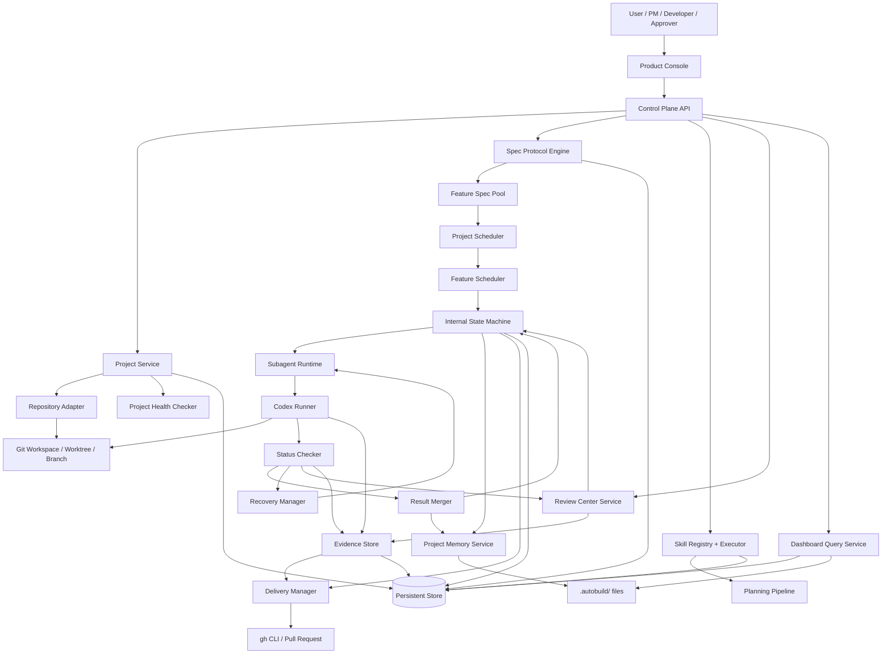

### 3.1 Runtime Layers

| Layer | Responsibility | MVP Decision |
|---|---|---|
| Product Console | Dashboard、Spec Workspace、Skill Center、Subagent Console、Runner Console、Review Center、System Settings | 只消费控制面 API，不直接修改 Git 工作区。 |
| Control Plane API | 项目、Spec、Skill、调度、审批、状态和查询接口 | 是调度和状态真实来源。 |
| Orchestration Layer | Project Scheduler、Feature Scheduler、状态机和恢复启动 | 所有状态变化先写持久层，再触发副作用。 |
| Execution Layer | Subagent Runtime、Codex Runner、Status Checker、Recovery Agent | 通过 Run Contract 和 Runner Policy 限制行为。 |
| Workspace Layer | Git 仓库、worktree、分支、目标分支、冲突检测 | 写任务以 worktree 为隔离边界。 |
| Evidence Layer | Evidence Pack、Audit Timeline、Metrics、Delivery Report | 支撑状态判断、审批、恢复和交付。 |

### 3.2 Source of Truth

| Data | Source of Truth | Notes |
|---|---|---|
| Feature 候选集 | Feature Spec Pool | Project Memory 只保存最近选择结果和候选快照。 |
| Task / Feature 状态 | Persistent Store 中的内部状态机 | Dashboard 和 Project Memory 都是投影。 |
| Git 事实 | 目标仓库和 worktree 的实时 Git 状态 | Project Memory 冲突时以 Git 和文件系统核查为准。 |
| 当前项目上下文 | Project Service 和用户选择状态 | Console、Scheduler、Project Memory Injector 和命令网关都必须携带 `project_id`。 |
| Project Memory | `.autobuild/memory/project.md` + 版本记录 | CLI 上下文恢复来源，但不是调度候选真实来源。 |
| Evidence | Evidence Store | Status Checker、Review Center、Delivery Report 复用。 |
| Skill 列表 | Skill Registry，内置 Skill 以 PRD 第 6.3 节为事实源 | 新增、删除、重命名前必须更新 PRD。 |

## 4. Components

### 4.1 Project Service

Responsibilities:

- 创建和查询 AutoBuild 项目。
- 维护项目目录、项目生命周期状态和当前项目选择上下文；导入现有项目时保留用户目录，新建项目时统一创建到 `workspace/<project-slug>`。
- 保存项目名称、目标、类型、技术偏好、目标仓库、默认分支、运行环境和自动化开关。
- 自动初始化项目状态、仓库探测或连接、Spec Protocol 目录、默认或导入项目宪章、Project Memory、健康检查和当前项目上下文。

Inputs:

- 项目创建请求。
- 项目切换请求。
- 仓库连接配置。
- 自动化开关和默认运行环境。

Outputs:

- Project 实体。
- ProjectSelectionContext。
- 初始化状态事件。
- `.autobuild/` 目录结构。

Dependencies:

- Repository Adapter。
- Project Memory Service。
- Persistent Store。
- Audit Timeline。

### 4.2 Repository Adapter

Responsibilities:

- 支持 GitHub、GitLab、本地 Git 和私有 Git 的仓库连接抽象。
- MVP 对 GitHub 仓库状态和 PR 创建使用本机 `gh` CLI。
- 读取当前分支、最新 commit、未提交变更、当前 PR、CI 状态、任务分支和 worktree 状态。

Inputs:

- repo_url、本地路径、默认分支、访问方式。

Outputs:

- RepositoryStatus。
- PullRequestStatus。
- WorktreeStatus。

Dependencies:

- Git CLI。
- `gh` CLI。
- Workspace Manager。

### 4.3 Project Health Checker

Responsibilities:

- 检查是否是 Git 仓库、包管理器、测试命令、构建命令、Codex 配置、AGENTS.md、Spec Protocol 目录、未提交变更和敏感文件风险。
- 将结果归类为 `ready`、`blocked` 或 `failed`。
- 为 Dashboard、Scheduler 和 Review Center 提供阻塞原因。

Inputs:

- Project。
- RepositoryStatus。
- 项目根目录。

Outputs:

- HealthCheckResult。
- 风险项和修复建议。

Dependencies:

- Repository Adapter。
- Safety Gate。
- Audit Timeline。

### 4.4 Spec Protocol Engine

Responsibilities:

- 创建 Feature Spec。
- 拆解 PR、RP、PRD、EARS 或混合输入为原子 EARS 需求。
- 扫描 PRD、EARS、requirements、HLD、design、已有 Feature Spec、tasks 和 README / 索引等 Spec Sources，识别已有规格产物、来源追踪、缺失项和冲突。
- 维护 Clarification Log、Requirement Checklist、Spec Version 和 Spec 切片。
- 生成和读取 Technical Plan、Research Decision、Data Model、Contract、Quickstart、Task Graph。

Inputs:

- 自然语言、PRD、EARS 或混合格式需求。
- PRD、requirements、HLD、design、Feature Spec、tasks 和 README / 索引等 Spec Sources。
- 已有 Feature Spec。
- 用户澄清答案。

Outputs:

- FeatureSpec。
- Requirement。
- AcceptanceCriteria。
- TestScenario。
- ClarificationLog。
- RequirementChecklist。
- SpecSlice。
- SpecVersionRecord。
- SpecSourceScanResult。

Dependencies:

- Skill Executor。
- Feature Spec Pool。
- Persistent Store。
- File Artifact Store。

### 4.5 Skill Registry and Executor

Responsibilities:

- 注册 Skill 名称、描述、触发条件、输入输出 schema、允许上下文、所需工具、风险等级、适用阶段、成功标准和失败处理规则。
- 初始化 PRD 第 6.3 节列出的 MVP 内置 Skill。
- 执行前校验 input schema，执行后校验 output schema。
- 支持 Skill 版本、启用/禁用、项目级覆盖、团队共享和回滚。

Inputs:

- SkillRegistration。
- SkillInvocation。
- ContextSlice。

Outputs:

- SkillRunResult。
- SchemaValidationError。
- Evidence Pack。

Dependencies:

- JSON Schema Validator。
- Skill Artifact Store。
- Evidence Store。
- Review Router。

### 4.6 Orchestration and State Machine

Responsibilities:

- Project Scheduler 从 Feature Spec Pool 动态读取 `ready` Feature 并选择下一个 Feature。
- Feature Scheduler 在 Feature 内部根据任务依赖、风险、文件范围、Runner 可用性、成本预算、执行窗口和审批要求推进任务。
- BullMQ + Redis 承担 `feature.select`、`feature.plan` 和 `cli.run` job 的延迟、周期和 Worker 执行；SQLite 记录调度事实和审计。
- Planning Skill bridge 未实现或项目 workspace 不可用时，`feature.plan` 必须 blocked；bridge 可用时只入队 planning CLI run，不生成假任务图或伪造 Skill 输出。
- Task Graph Builder 生成可追踪任务图。
- Feature Aggregator 根据任务状态、验收、Spec Alignment 和测试结果判断 Feature 状态。

Inputs:

- FeatureSpec。
- TaskGraph。
- SchedulerTrigger。
- StatusCheckResult。
- ApprovalDecision。

Outputs:

- FeatureSelectionDecision。
- StateTransition。
- TaskSchedule。
- SchedulerJobRecord。
- RunRequest。

Dependencies:

- Persistent Store。
- BullMQ / Redis。
- Workspace Manager。
- Runner Queue。
- Audit Timeline。

### 4.7 Project Memory Service

Responsibilities:

- 初始化 `.autobuild/memory/project.md`。
- 在 Codex CLI 会话启动前注入 `[PROJECT MEMORY]` 块。
- Run 结束后根据 Evidence Pack 和 Status Checker 幂等更新 Memory。
- 超过默认 8000 tokens 预算时压缩旧 Evidence、历史决策和已完成任务列表。
- 生成 Memory 版本记录并支持回滚。

Inputs:

- Project。
- StateSnapshot。
- EvidencePack。
- StatusCheckResult。
- FeatureSelectionDecision。

Outputs:

- ProjectMemoryFile。
- MemoryVersionRecord。
- MemoryCompactionEvent。

Dependencies:

- File Artifact Store。
- Persistent Store。
- Audit Timeline。

### 4.8 Subagent Runtime

Responsibilities:

- 按 Spec、Clarification、Repo Probe、Architecture、Task、Coding、Test、Review、Recovery 或 State 类型创建 Subagent Run。
- 生成 Agent Run Contract。
- 通过 Context Builder 提供最小上下文切片。
- 对只读 Subagent 支持并发执行，对写入 Subagent 依赖 Workspace Manager 隔离。

Inputs:

- RunRequest。
- Agent Run Contract。
- ContextSlice。

Outputs:

- Run。
- SubagentEvent。
- Evidence Pack。

Dependencies:

- Spec Slicer。
- Project Memory Service。
- Codex Runner。
- Runner Queue。

### 4.9 Codex Runner

Responsibilities:

- 通过 Runner CLI Adapter 调用 Codex CLI 或后续等价 CLI 执行代码修改、测试或修复。
- 读取 active CLI Adapter JSON 配置，解析 executable、argument template、workspace policy、output mode、Evidence 映射和 session resume 映射。
- 根据任务风险设置 sandbox mode、approval policy、model、profile、output schema、JSON event stream、workspace root 和 session resume。
- 采集 stdout、stderr、JSON event stream、命令结果和 Codex session 信息。
- 每 10 至 30 秒写 Runner 心跳。

Inputs:

- Agent Run Contract。
- RunnerPolicy。
- CliAdapterConfig。
- Prompt。
- Workspace path。

Outputs:

- RunEvent。
- CodexSessionRecord。
- RawExecutionLog。
- Evidence Pack。

Dependencies:

- Codex CLI。
- CLI Adapter JSON Schema。
- Project Memory Injector。
- Workspace Manager。
- Evidence Store。
- Safety Gate。

### 4.10 Workspace Manager

Responsibilities:

- 为项目级并行 Feature 或 Feature 内并行写任务创建独立 Git worktree 和隔离分支。
- 记录 worktree 路径、分支名、base commit、目标分支、关联 Feature/Task、Runner 和清理状态。
- 判断同一文件、锁文件、数据库 schema、公共配置、共享运行时资源等冲突范围是否必须串行。
- 合并前执行冲突检测、Spec Alignment Check 和必要测试。

Inputs:

- WorktreeRequest。
- Task file scope。
- Parallelism policy。

Outputs:

- WorktreeRecord。
- ConflictCheckResult。
- MergeReadinessResult。

Dependencies:

- Git CLI。
- Repository Adapter。
- Status Checker。
- Safety Gate。

### 4.11 Evidence, Audit, and Metrics Store

Responsibilities:

- 捕获结构化 Evidence Pack。
- 记录状态变化、Run、审批、恢复、Memory 压缩、worktree 生命周期和命令审计。
- 统计 token、成本、成功率、失败率、看板加载耗时、状态刷新耗时和 Evidence 写入耗时。

Inputs:

- RunEvent。
- StatusCheckResult。
- ApprovalDecision。
- StateTransition。
- DeliveryEvent。

Outputs:

- EvidencePack。
- AuditTimelineEvent。
- MetricSample。

Dependencies:

- Persistent Store。
- File Artifact Store。
- Dashboard Query Service。

### 4.12 Status Checker

Responsibilities:

- Run 结束后检测 Git diff、构建、单元测试、集成测试、类型检查、lint、安全扫描、敏感信息扫描、Spec Alignment、任务完成度、风险文件和未授权文件。
- 将任务判断为 Done、Ready、Scheduled、Review Needed、Blocked 或 Failed。
- 连续失败超过阈值后进入 Failed。

Inputs:

- Run。
- Task。
- Agent Run Contract。
- Git diff。
- Test/build command results。
- Evidence Pack。

Outputs:

- StatusCheckResult。
- SpecAlignmentResult。
- StateDecision。

Dependencies:

- Repository Adapter。
- Safety Gate。
- Evidence Store。
- Review Router。
- Recovery Manager。

### 4.13 Recovery Manager

Responsibilities:

- 为可恢复失败生成恢复任务并调用 `recover-execution`。
- 支持自动修复、回滚当前任务修改、拆分任务、降级只读分析、请求人工审批、更新 Spec 或更新任务依赖。
- 记录失败模式指纹、禁止重复策略、失败次数和指数退避计划。

Inputs:

- Failed StatusCheckResult。
- Previous attempts。
- Task and Run context。

Outputs:

- RecoveryTask。
- RetrySchedule。
- ForbiddenRetryRecord。
- RecoveryEvidencePack。

Dependencies:

- Skill Executor。
- Workspace Manager。
- Review Router。
- State Machine。

### 4.14 Delivery Manager

Responsibilities:

- Feature 达到交付条件后通过本机 `gh` CLI 创建 PR。
- 生成交付报告，包含完成内容、变更文件、验收结果、测试摘要、失败和恢复记录、风险项、下一步建议和 Spec 演进建议。
- 根据实现约束生成 Spec Evolution 建议。

Inputs:

- Feature done event。
- TaskGraph。
- Evidence Packs。
- Approval records。
- Merge readiness result。

Outputs:

- PullRequestRecord。
- DeliveryReport。
- SpecEvolutionSuggestion。

Dependencies:

- Repository Adapter。
- `gh` CLI。
- Evidence Store。
- Spec Protocol Engine。

### 4.15 Review Center Service

Responsibilities:

- 按风险、权限、diff 阈值、forbidden files、多次失败、测试未通过、需求歧义、权限提升、constitution 或架构变更触发 Review Needed。
- 展示任务目标、关联 Spec、Agent Run Contract、diff 摘要、测试结果、风险说明、推荐动作和可选操作。
- 处理批准继续、拒绝、要求修改、回滚、拆分任务、更新 Spec 或标记完成。

Inputs:

- ReviewNeededEvent。
- ApprovalDecision。
- Evidence Pack。
- Risk record。

Outputs:

- ApprovalRecord。
- StateTransition。
- RecoveryRequest。
- SpecUpdateRequest。

Dependencies:

- State Machine。
- Evidence Store。
- Spec Protocol Engine。
- Workspace Manager。

### 4.16 Product Console and Dashboard Query Service

Responsibilities:

- Dashboard 展示项目健康度、活跃 Feature、看板数量、运行中 Subagent、今日自动执行次数、失败任务、待审批任务、成本消耗、最近 PR 和风险提醒。
- 提供项目创建入口、项目列表、当前项目切换控件，并在页面切换和刷新后保留当前项目上下文。
- Spec Workspace 展示 Feature、Spec、澄清记录、Checklist、技术计划、数据模型、契约、任务图和 Spec 版本 diff。
- Skill Center 展示 Skill 列表、详情、版本、schema、启用状态、执行日志、成功率、阶段和风险等级。
- Subagent Console 展示 Subagent、Run Contract、上下文切片、Evidence、token 使用和运行状态，并支持终止和重试。
- Runner Console 展示 Runner 在线状态、Codex 版本、sandbox、approval policy、queue、最近日志、心跳和 CLI Adapter 配置健康摘要，并支持暂停或恢复 Runner。
- System Settings 提供 CLI Adapter 配置管理：原始 JSON 编辑、JSON Schema 表单编辑、dry-run 校验、保存草稿、启用/禁用、字段级错误和审计反馈。
- Review Center UI 展示待审批列表、风险筛选、diff、Evidence 和审批操作。
- Product Console 默认使用中文界面，并提供语言切换入口；界面文案随所选语言变化，Evidence、diff、日志、文件路径和命令输出等事实数据保持原文。

Inputs:

- Query request。
- Project create/switch action。
- Approval action。
- Runner pause/resume action。
- CLI Adapter config edit/validate/activate action。
- Subagent terminate/retry action。

Outputs:

- UI view models。
- Action commands。
- Locale preference。

Dependencies:

- Control Plane API。
- Dashboard Query Service。
- Audit and Metrics Store。

## 5. Data Model

### 5.1 Entity Ownership

| Entity | Owner Component | Persistence | Lifecycle Notes |
|---|---|---|---|
| Project | Project Service | Database + `.autobuild/project.json` projection | 创建后长期存在，可更新配置。 |
| ProjectSelectionContext | Project Service | Database + local UI preference projection | 记录当前项目、可用项目列表和最近切换来源。 |
| RepositoryConnection | Repository Adapter | Database | 保存连接元数据，不保存明文密钥。 |
| ProjectHealthCheck | Project Health Checker | Database | 每次检查生成不可变记录，项目保存最新摘要。 |
| Feature | Spec Protocol Engine | Database + Markdown/JSON artifact | 从 draft 到 delivered，状态由 State Machine 管理。 |
| Requirement | Spec Protocol Engine | Database + Spec artifact | 追踪来源、验收和测试场景。 |
| ClarificationLog | Spec Protocol Engine | Database + Spec artifact | 追加式记录，回答后保持历史。 |
| RequirementChecklist | Spec Protocol Engine | Database | 未通过时阻止 Feature ready。 |
| SpecVersion | Spec Version Manager | Database + artifact snapshot | MAJOR、MINOR、PATCH 版本记录。 |
| Skill | Skill Registry | Database + skill artifact | 内置 Skill 与 PRD 第 6.3 节保持一致。 |
| SkillRun | Skill Executor | Database + Evidence | 保存输入输出摘要、schema 结果和风险。 |
| Task | Task Graph Builder | Database | 状态由任务状态机管理。 |
| Run | Subagent Runtime | Database | 一个 Subagent/Codex 执行单元。 |
| AgentRunContract | Subagent Runtime | Database + artifact | 启动前冻结，供审计和重放。 |
| WorktreeRecord | Workspace Manager | Database | 创建、使用、合并、清理全生命周期。 |
| ProjectMemory | Project Memory Service | `.autobuild/memory/project.md` + Database metadata | 文件供 CLI 注入，数据库保存版本索引。 |
| EvidencePack | Evidence Store | Database + artifact | 结构化证据供状态、审批、恢复和交付复用。 |
| ApprovalRecord | Review Center | Database | 审批操作不可变追加。 |
| DeliveryReport | Delivery Manager | Database + Markdown artifact | 与 PR 关联。 |
| AuditTimelineEvent | Audit Store | Database | 追加式审计。 |
| MetricSample | Metrics Store | Time-series table | 支撑成功指标和性能基线。 |

### 5.2 Core Schemas

#### Project

| Field | Type | Required | Description |
|---|---|---|---|
| id | string | yes | 项目 ID。 |
| name | string | yes | 项目名称。 |
| product_goal | string | yes | 产品目标。 |
| project_type | string | yes | 项目类型。 |
| tech_preferences | string[] | no | 技术偏好。 |
| default_branch | string | yes | 默认分支。 |
| default_environment | object | no | 默认运行环境。 |
| automation_settings | object | yes | Runner、定时任务、自动 PR 等开关。 |
| status | enum | yes | ready、blocked、failed、archived。 |
| created_at | datetime | yes | 创建时间。 |
| updated_at | datetime | yes | 更新时间。 |

#### Feature

| Field | Type | Required | Description |
|---|---|---|---|
| id | string | yes | Feature ID。 |
| project_id | string | yes | 所属项目。 |
| title | string | yes | Feature 名称。 |
| goal | string | yes | Feature 目标。 |
| priority | enum | yes | P1、P2、P3。 |
| status | enum | yes | draft、ready、planning、tasked、implementing、done、delivered、review_needed、blocked、failed。 |
| review_needed_reason | enum/null | no | approval_needed、clarification_needed、risk_review_needed。 |
| dependencies | string[] | no | 前置 Feature。 |
| spec_version | string | yes | 当前 Spec 版本。 |
| source_trace | object[] | yes | 输入来源追踪。 |
| acceptance_criteria | object[] | yes | Feature 级验收。 |
| selected_at | datetime/null | no | 被选择时间。 |

#### Requirement

| Field | Type | Required | Description |
|---|---|---|---|
| id | string | yes | REQ、NFR 或约束 ID。 |
| feature_id | string | yes | 所属 Feature。 |
| type | enum | yes | functional、non_functional、constraint。 |
| condition | string | yes | EARS 触发条件。 |
| expected_behavior | string | yes | EARS 行为。 |
| acceptance_criteria | object[] | yes | 验收标准。 |
| test_scenarios | object[] | no | 测试场景。 |
| source_trace | object[] | yes | 源文本和位置。 |
| priority | enum | yes | Must、Should、Could。 |

#### Task

| Field | Type | Required | Description |
|---|---|---|---|
| id | string | yes | 任务 ID。 |
| feature_id | string | yes | 所属 Feature。 |
| title | string | yes | 标题。 |
| description | string | yes | 描述。 |
| source_requirements | string[] | yes | 来源需求。 |
| user_story_id | string/null | no | 用户故事。 |
| acceptance_criteria | object[] | yes | 任务验收。 |
| allowed_files | string[] | yes | 允许修改文件。 |
| read_only_files | string[] | no | 只读文件。 |
| forbidden_files | string[] | no | 禁止文件。 |
| dependencies | string[] | no | 前置任务。 |
| parallelizable | boolean | yes | 是否可并行。 |
| risk_level | enum | yes | low、medium、high、dangerous。 |
| required_skill | string | yes | 所需 Skill。 |
| required_subagent | enum | yes | 所需 Subagent。 |
| estimated_effort | string | no | 预估工作量。 |
| status | enum | yes | backlog、ready、scheduled、running、checking、review_needed、blocked、failed、done、delivered。 |
| review_needed_reason | enum/null | no | 审批细分原因。 |

#### Run

| Field | Type | Required | Description |
|---|---|---|---|
| id | string | yes | Run ID。 |
| task_id | string | yes | 所属任务。 |
| agent_type | enum | yes | Subagent 类型。 |
| skill | string | yes | 执行 Skill。 |
| status | enum | yes | queued、running、success、failed、blocked、cancelled。 |
| workspace_path | string | yes | 执行工作区。 |
| codex_session_id | string/null | no | Codex session。 |
| started_at | datetime | yes | 开始时间。 |
| ended_at | datetime/null | no | 结束时间。 |
| evidence_pack_id | string/null | no | Evidence Pack。 |
| idempotency_key | string | yes | 重放幂等键。 |

#### AgentRunContract

| Field | Type | Required | Description |
|---|---|---|---|
| run_id | string | yes | 绑定 Run。 |
| agent_type | enum | yes | Subagent 类型。 |
| task_id | string | yes | 任务。 |
| goal | string | yes | 执行目标。 |
| context_slices | object[] | yes | 注入上下文切片索引。 |
| allowed_files | string[] | yes | 允许写入。 |
| read_only_files | string[] | no | 只读上下文。 |
| forbidden_actions | string[] | yes | 禁止动作。 |
| acceptance_criteria | object[] | yes | 验收标准。 |
| required_output_schema | string | yes | 输出 schema。 |
| runner_policy | object | yes | sandbox、approval、model、profile。 |
| environment_policy | object | no | 测试环境、容器、命名空间和清理策略。 |

#### WorktreeRecord

| Field | Type | Required | Description |
|---|---|---|---|
| id | string | yes | worktree ID。 |
| project_id | string | yes | 项目。 |
| feature_id | string/null | no | 关联 Feature。 |
| task_id | string/null | no | 关联任务。 |
| path | string | yes | 本地路径。 |
| branch | string | yes | 隔离分支。 |
| base_commit | string | yes | base commit。 |
| target_branch | string | yes | 合并目标分支。 |
| runner_id | string/null | no | 占用 Runner。 |
| status | enum | yes | created、in_use、merge_ready、merged、cleanup_pending、cleaned、failed。 |
| cleanup_status | enum | yes | pending、done、failed。 |

#### ProjectMemory

| Field | Type | Required | Description |
|---|---|---|---|
| version | string | yes | Memory 版本。 |
| project_id | string | yes | 项目。 |
| updated_at | datetime | yes | 更新时间。 |
| updated_by_run | string/null | no | 来源 Run。 |
| current_feature | string/null | no | 当前 Feature。 |
| current_feature_status | enum/null | no | Feature 状态。 |
| current_task | string/null | no | 当前任务。 |
| current_run | object/null | no | 当前 Run 摘要。 |
| task_state_snapshot | object[] | yes | 看板状态快照。 |
| active_blockers | object[] | yes | 当前阻塞。 |
| pending_approvals | object[] | yes | 待审批。 |
| recent_decisions | object[] | yes | 最近决策。 |
| failure_fingerprints | object[] | yes | 失败模式。 |
| forbidden_retries | object[] | yes | 禁止重复策略。 |
| token_budget_used | number | yes | 估算 token 使用。 |

#### EvidencePack

| Field | Type | Required | Description |
|---|---|---|---|
| id | string | yes | Evidence ID。 |
| run_id | string | yes | 来源 Run。 |
| agent_type | enum | yes | Agent 类型。 |
| task_id | string | yes | 任务。 |
| status | enum | yes | success、failed、blocked、review_needed。 |
| summary | string | yes | 摘要。 |
| commands | object[] | no | 命令和结果。 |
| changed_files | string[] | no | 修改文件。 |
| diff_summary | string | no | diff 摘要。 |
| test_result | object | no | 测试结果。 |
| risk | enum | yes | low、medium、high、dangerous。 |
| recommendation | object | yes | 下一步建议。 |
| created_at | datetime | yes | 生成时间。 |

### 5.3 Idempotency Rules

- Project 创建使用 `project_id` 或外部幂等键去重。
- SkillRun 使用 `skill_name + input_hash + spec_version + run_id` 去重。
- Run 使用 `run_id` 和 `idempotency_key` 去重，重放时不得重复创建 worktree 或重复更新状态。
- Evidence Pack 使用 `run_id + evidence_schema_version` 保证同一 Run 只有一个当前结果，可保留修订版本。
- Project Memory 更新使用 `updated_by_run + state_transition_id` 去重。
- 审批操作使用 `review_item_id + approver_id + decision_version` 防止重复提交。

## 6. API / Interface Design

### 6.1 Control Plane API

#### POST /api/projects

Request:

```json
{
  "name": "SpecDrive Demo",
  "product_goal": "long-running autonomous coding",
  "project_type": "web-app",
  "tech_preferences": ["typescript"],
  "repo": {
    "type": "github",
    "url": "https://github.com/org/repo",
    "default_branch": "main"
  },
  "automation_settings": {
    "codex_runner_enabled": true,
    "scheduler_enabled": true,
    "auto_pr_enabled": false
  }
}
```

Response:

```json
{
  "project_id": "PRJ-001",
  "status": "ready",
  "memory_path": ".autobuild/memory/project.md"
}
```

#### POST /api/projects/{project_id}/health-checks

Response:

```json
{
  "status": "blocked",
  "checks": [
    {
      "name": "git_repository",
      "status": "passed"
    },
    {
      "name": "test_command",
      "status": "blocked",
      "reason": "No test command detected"
    }
  ]
}
```

#### GET /api/projects/{project_id}/dashboard

Response:

```json
{
  "health": "ready",
  "active_feature": "FEAT-001",
  "task_counts": {
    "ready": 3,
    "running": 1,
    "review_needed": 2
  },
  "runner": {
    "online": true,
    "last_heartbeat_at": "2026-04-28T00:00:00Z"
  },
  "risk_alerts": []
}
```

### 6.2 Spec Protocol API

#### POST /api/projects/{project_id}/features

Request:

```json
{
  "source_type": "prd",
  "source_text": "WHEN ... THE SYSTEM SHALL ...",
  "priority": "P1"
}
```

Response:

```json
{
  "feature_id": "FEAT-001",
  "status": "draft",
  "requirements": ["REQ-001"],
  "ambiguities": []
}
```

#### POST /api/features/{feature_id}/checklist

Response:

```json
{
  "status": "failed",
  "failed_items": [
    {
      "item": "acceptance_criteria_measurable",
      "reason": "Acceptance criteria is not observable"
    }
  ],
  "next_status": "draft"
}
```

#### POST /api/features/{feature_id}/clarifications

Request:

```json
{
  "question": "默认审批阈值是多少？",
  "recommended_answer": "MVP 使用内置阈值，后续再配置化。",
  "affected_spec_section": "Review Center"
}
```

### 6.3 Skill Interface

Skill 注册最小接口：

```json
{
  "name": "decompose-feature-specs",
  "description": "Convert feature plan into dependency-aware executable task graph",
  "trigger": "feature_planning.task_slicing",
  "phase": "tasking",
  "risk_level": "medium",
  "input_schema_ref": "schemas/task-slicing.input.schema.json",
  "output_schema_ref": "schemas/task-graph.output.schema.json",
  "allowed_context": ["feature_spec", "technical_plan", "contracts"],
  "required_tools": [],
  "success_criteria": ["task graph has traceability"],
  "failure_handling": "review_needed"
}
```

Skill 执行接口：

```json
{
  "skill_name": "design-architecture",
  "skill_version": "1.0.0",
  "input": {
    "schema_version": "1.0.0",
    "feature_id": "FEAT-001",
    "requirements": []
  },
  "context_refs": [
    {
      "type": "spec_slice",
      "id": "SLICE-001"
    }
  ]
}
```

### 6.4 Runner and Subagent Interface

Agent Run Contract:

```json
{
  "run_id": "RUN-001",
  "agent_type": "coding-agent",
  "task_id": "T-021",
  "goal": "实现登录表单校验",
  "allowed_files": ["src/features/auth/LoginForm.tsx"],
  "read_only_files": ["specs/auth/spec.md"],
  "forbidden_actions": ["modify payment module", "delete tests"],
  "acceptance_criteria": ["邮箱格式校验", "密码不能为空"],
  "required_output_schema": "EvidencePack",
  "runner_policy": {
    "sandbox": "danger-full-access",
    "approval": "never",
    "model": "default",
    "profile": "development-coding"
  }
}
```

Codex CLI command template:

```bash
codex exec --cd <workspace> --json --output-schema evidence.schema.json "<prompt>"
```

`<workspace>` 必须解析为当前项目 repository `local_path`，其次为项目 `target_repo_path`。Runner 不允许使用 SpecDrive Control Plane 进程 cwd 作为兜底 workspace。Spec Workspace 和 Task Board 的受控命令在进入 Runner 前转换为 CLI skill invocation contract，最小字段为 `projectId`、`workspaceRoot`、`skillName`、`sourcePaths`、`expectedArtifacts`、`traceability` 和 `requestedAction`；Codex 在该 workspace 内自行读取 `.agents/skills/*/SKILL.md` 和 `AGENTS.md`。

Runner policy resolution:

| Risk | sandbox | approval | Execution |
|---|---|---|---|
| readonly | read-only | never | 只读分析。 |
| low | danger-full-access | never | 开发阶段默认最大操作权限。 |
| medium | danger-full-access | never | 开发阶段默认最大操作权限，不触发 Codex CLI 人工确认。 |
| high | danger-full-access | never | 开发阶段默认最大操作权限；敏感文件和破坏性命令仍由 Safety Gate 阻断。 |
| dangerous | blocked | manual | 不自动执行。 |

### 6.5 Project Memory File Interface

Project Memory 注入格式：

```text
[PROJECT MEMORY]
<.autobuild/memory/project.md>
[/PROJECT MEMORY]
```

Memory 文件必须包含：

- 当前活跃 Feature 和任务。
- 任务看板状态快照。
- 当前 Run 状态。
- 最近关键决策。
- 已知阻塞。
- 最近 Evidence Pack 摘要。
- 待审批事项。
- 当前 Spec 版本。
- 禁止重复的失败模式。

### 6.6 Delivery Interface

PR 创建、checks、merge 和 cleanup 由 `implement-feature` 或补交付 `prepare-release` 执行；Delivery Manager 只记录、校验和汇总 `result.gitDelivery`。受控命令示例：

```bash
gh pr create --title "<feature title>" --body-file "<delivery-report.md>" --base "<target_branch>" --head "<branch>"
```

PR body 必须包含：

- Feature 摘要。
- 完成任务。
- 关联 requirements。
- 测试结果。
- 风险说明。
- 审批记录。
- 回滚方案。
- 未完成事项。

## 7. Sequence Flows

### 7.1 Project Initialization

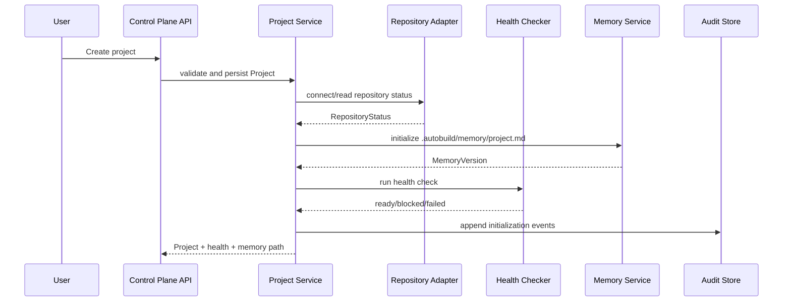

### 7.2 Requirement Intake to Ready Feature

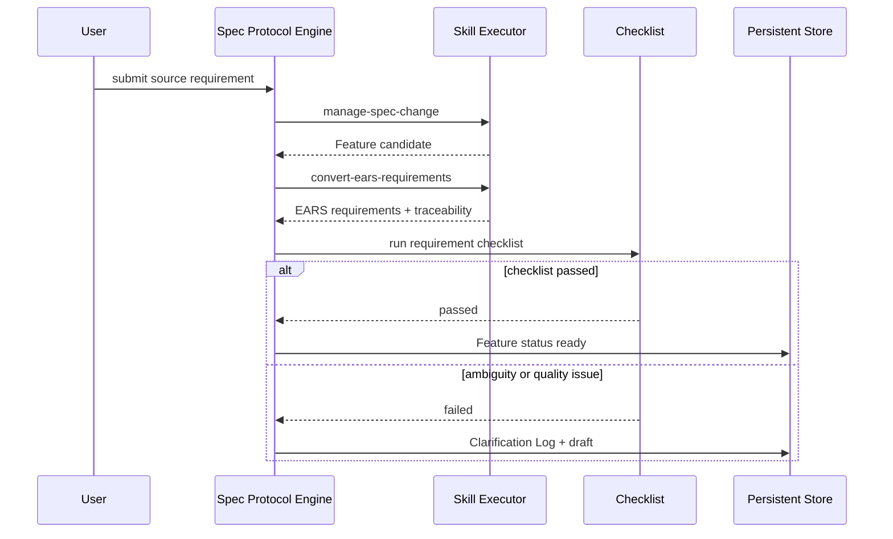

### 7.3 Feature Selection and Planning

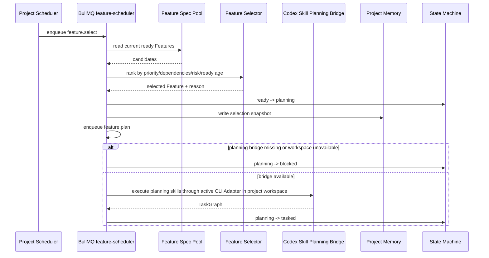

### 7.4 Task Scheduling and Worktree Isolation

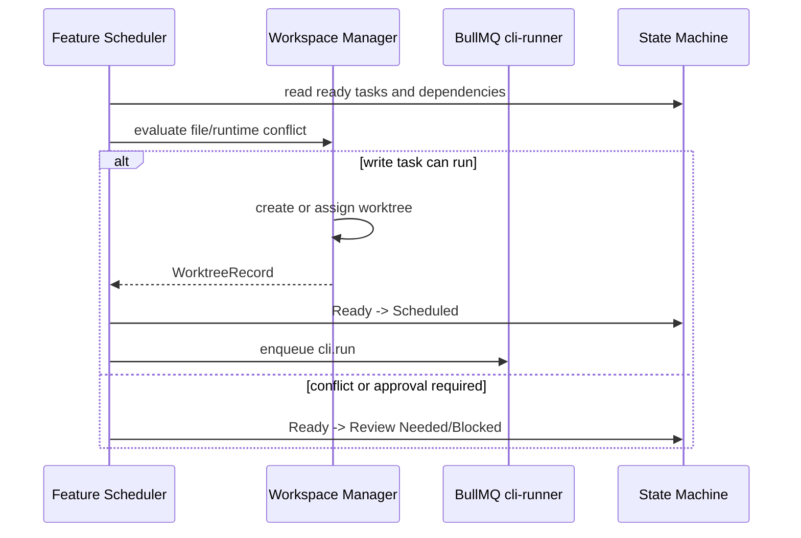

### 7.5 Codex Run Execution

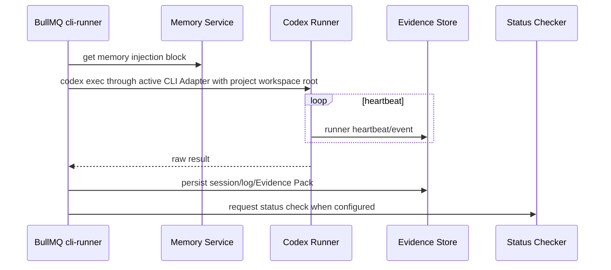

### 7.6 Status Check, Merge, and Memory Update

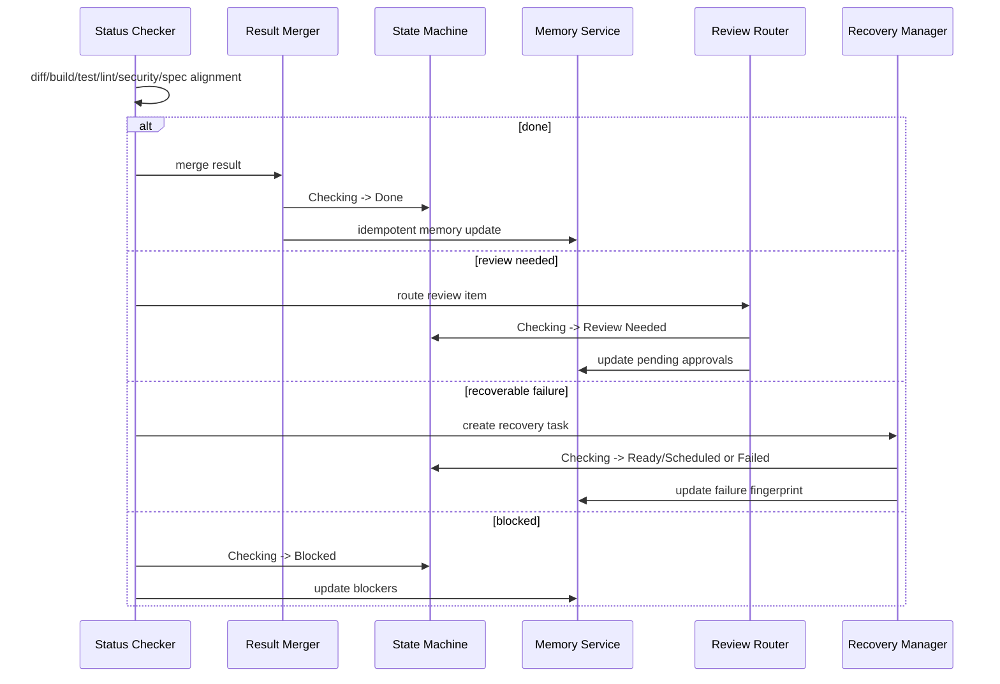

### 7.7 Task and Feature State Aggregation

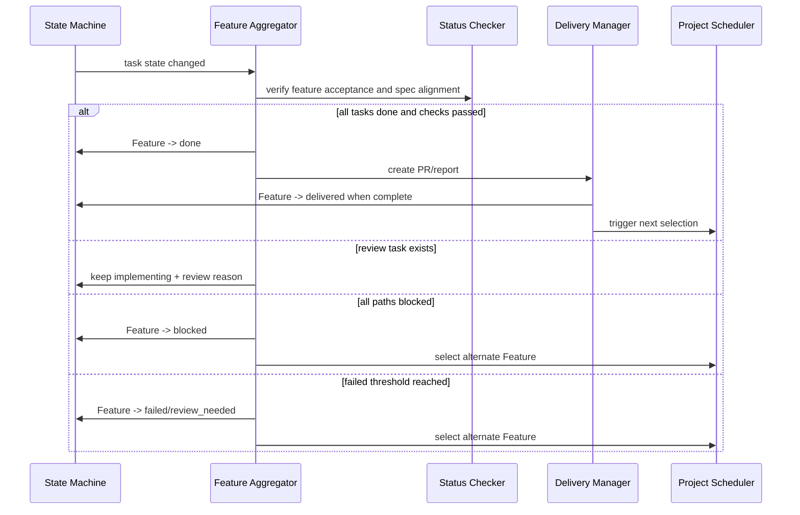

### 7.8 Failure Recovery

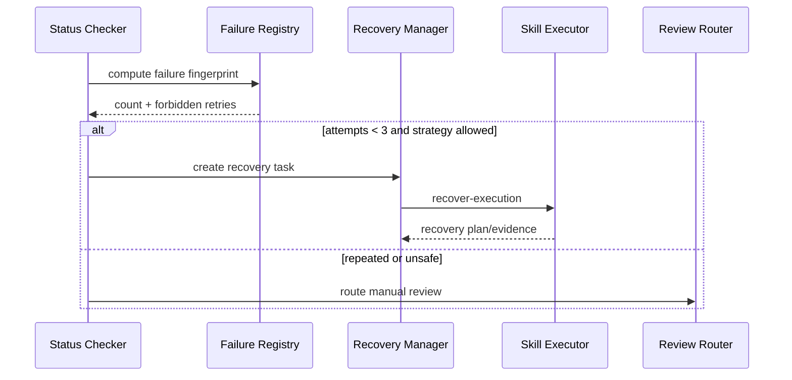

### 7.9 Review Needed Resolution

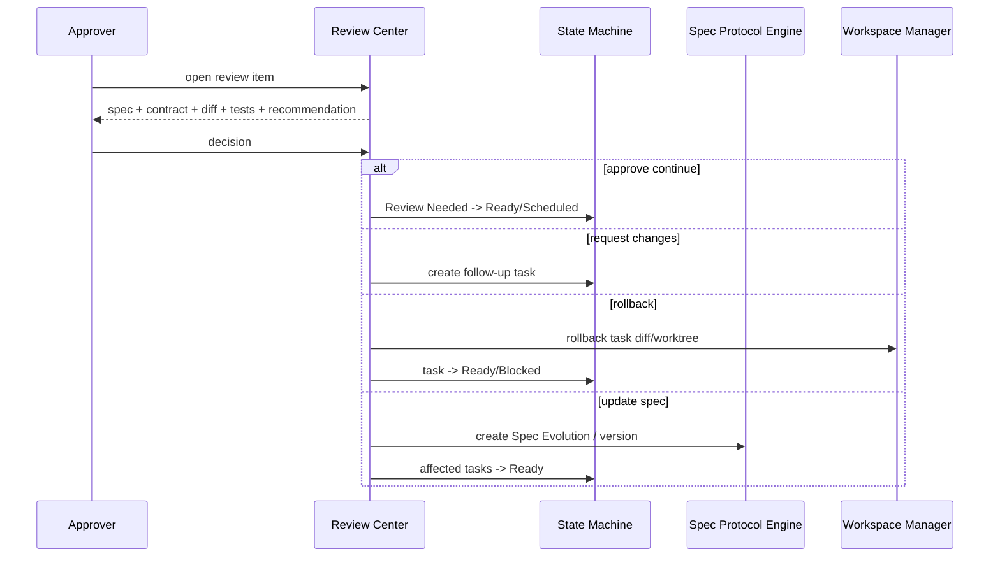

### 7.10 Delivery and Spec Evolution

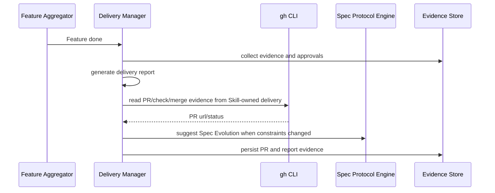

## 8. State Management

### 8.1 Feature State Machine

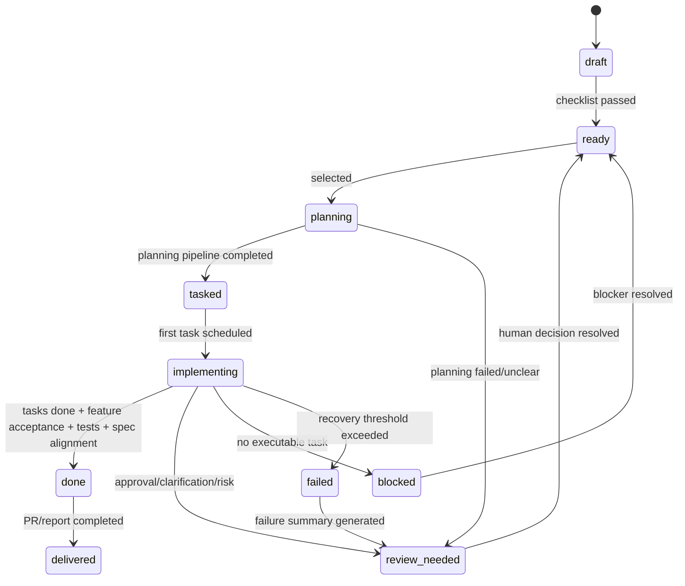

Feature state rules:

- `ready` 只能由 Requirement Checklist 通过后进入。
- `planning` 只能由 Feature Selector 驱动。
- `done` 不能只依赖任务状态，必须同时满足 Feature 验收、Spec Alignment Check 和必要测试。
- `review_needed` 必须带 `review_needed_reason`。
- Project Memory 记录最近 Feature 选择原因，但 Scheduler 每次以 Feature Spec Pool 动态读取为准。

### 8.2 Task State Machine

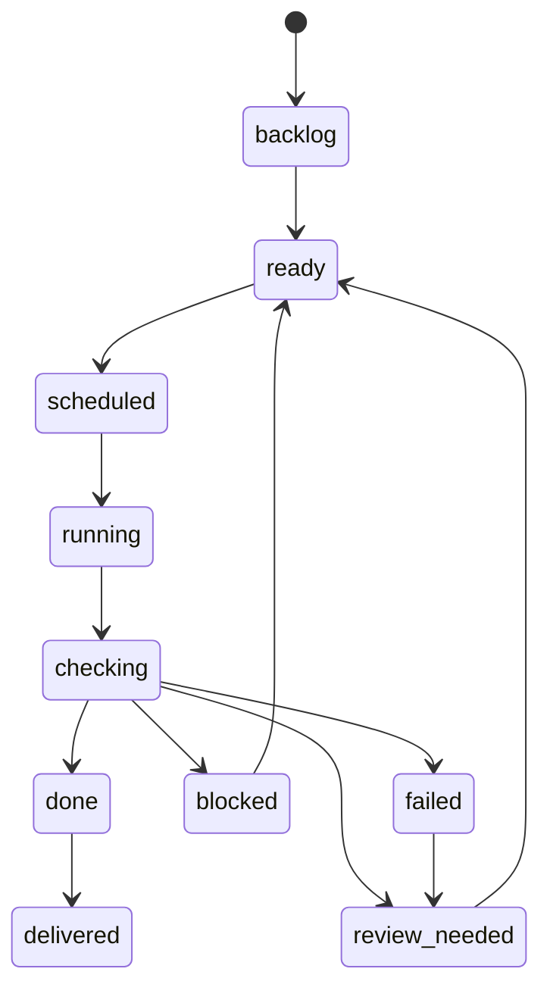

Task state rules:

- `scheduled` 必须绑定 Runner 队列项。
- `running` 必须绑定 Run 和心跳。
- `checking` 必须生成或引用 Evidence Pack。
- `done` 必须有 StatusCheckResult。
- `delivered` 只能在 Feature PR 和交付报告完成后进入。

### 8.3 Review Needed Reasons

| Reason | Trigger | Resolution |
|---|---|---|
| approval_needed | 权限、安全、预算、高风险操作、权限提升 | 审批人批准、拒绝或降级。 |
| clarification_needed | 需求、验收、技术边界或用户意图不清楚 | 更新 Clarification Log 和 Spec。 |
| risk_review_needed | diff 过大、影响范围异常、测试证据不足、架构风险 | 审查 diff、拆分任务、补测试或回滚。 |

### 8.4 Scheduler Truth and Recovery

- Project Scheduler 不读取 Project Memory 的静态候选队列作为调度真实来源。
- Redis/BullMQ 不保存业务事实；`scheduler_job_records`、ScheduleTrigger、FeatureSelectionDecision、Run、heartbeat、log 和 Evidence 都写入 SQLite。
- `schedule_run` 的同步响应只能证明 trigger/job 已登记；Feature selection decision 必须等 `feature.select` Worker 执行后出现。
- `feature.plan` 在 Codex Skill planning bridge 未实现或项目 workspace 不可用时进入 blocked；bridge 可用时只入队 planning CLI run，避免 fake planning 或 fake task graph。
- Feature Scheduler 不调度依赖未满足、文件边界冲突、Runner 不可用、成本预算超限或审批未完成的任务。
- 崩溃恢复时先从 Persistent Store 恢复 Run、任务和状态，再核查 Git/worktree 和 Project Memory，最后修正投影状态。
- 如果 Project Memory、Dashboard 和 Git 事实冲突，以仓库代码、Git 状态和文件系统检查为准。

## 9. Error Handling and Recovery

### 9.1 Error Categories

| Category | Examples | Handling |
|---|---|---|
| Input validation | 无效项目配置、无效 Skill schema、缺少必填字段 | 拒绝请求，写入 Evidence 或 validation error。 |
| Requirement ambiguity | 验收不可测、目标冲突、边界不清 | 创建 Clarification Log，Feature 保持 draft 或 review_needed。 |
| Repository unavailable | 非 Git 仓库、无法读取分支、`gh` 不可用 | Project blocked，提示修复仓库连接。 |
| Workspace unavailable | 项目 `repository.local_path` / `target_repo_path` 缺失、不可读或缺少所需 `.agents/skills` / `AGENTS.md` | Run blocked，Runner Console 和 Spec Workspace 展示 workspace/skill 阻塞原因。 |
| Workspace conflict | 同文件写入、锁文件、DB schema、公共配置冲突 | 串行执行或 Review Needed。 |
| Shared runtime pollution | 数据库、缓存、消息队列、外部 API 共享状态 | 要求 mock、命名空间、临时实例或串行。 |
| Runner failure | Codex CLI 失败、测试失败、心跳丢失 | Status Checker 分类，Recovery Manager 或 Review Center 处理。 |
| Evidence write failure | Evidence Pack 无法持久化 | 任务 blocked 或 failed，保留诊断错误。 |
| Spec drift | diff 无法映射到需求和验收 | 阻止 Done，进入 Spec Alignment 修复或 Review Needed。 |
| Approval missing | Review Needed 无审批决策 | 暂停受影响任务，阻止 Done 和 Delivered。 |

边界场景追踪：

| Edge ID | Design Handling |
|---|---|
| EDGE-001 | Repository unavailable 类错误阻止自动执行，并由 Project Health Checker 返回 blocked。 |
| EDGE-002 | Requirement ambiguity 类错误创建 Clarification Log，并进入 clarification_needed。 |
| EDGE-003 | Spec Protocol Engine 在创建 Feature 前执行重复目标和验收范围检测，发现重复时要求合并、覆盖或保留为独立 Feature。 |
| EDGE-004 | Workspace conflict 类错误禁止并行写入或要求独立 worktree，并在合并前执行冲突检测。 |
| EDGE-005 | Shared runtime pollution 类错误要求 mock、命名空间隔离、临时实例或串行执行。 |
| EDGE-006 | Project Memory 与仓库、Feature Spec Pool 或 Dashboard 冲突时，以 Git、文件系统和持久状态核查结果为准。 |
| EDGE-007 | Context Builder、Spec Slicer、Evidence 摘要和 Memory Compactor 共同控制上下文大小。 |
| EDGE-008 | Spec drift 类错误阻止 Done 判定，并进入 Spec Alignment 修复或人工审查。 |
| EDGE-009 | Evidence write failure 类错误将任务标记为 blocked 或 failed，并保留诊断信息。 |
| EDGE-010 | Approval missing 类错误暂停受影响任务，阻止自动 Done 或 Delivered。 |

### 9.2 Failure Fingerprint

失败模式指纹至少包含：

```text
task_id
+ failure_stage
+ failed_command_or_check
+ normalized_error_summary
+ related_files_hash
```

Retry policy:

- 同一失败模式最多自动重试 3 次。
- 等待时间依次为 2 分钟、4 分钟、8 分钟。
- 每次失败记录 attempted_fix、commands、file_scope 和 result。
- 禁止重复策略阻止再次自动执行已导致同一指纹失败的修复方案。
- 达到最大重试次数后进入人工 Review Needed。

### 9.3 Rollback Strategy

- 写任务默认在独立 worktree 和任务分支中执行，回滚优先丢弃任务分支或反向应用任务 diff。
- 合并前失败不影响目标分支。
- 合并后发现不可接受结果时，Delivery Report 必须包含回滚方案，后续由人工批准执行。
- Project Memory 和状态变更使用版本记录，可按 run_id 回滚投影状态，但不得伪造 Git 事实。

### 9.4 Crash Recovery

恢复顺序：

1. 加载 Persistent Store 中 `running`、`scheduled`、`checking` 状态任务和 Run。
2. 检查 Runner 心跳，超过阈值则标记 runner_lost。
3. 核查 worktree 路径、分支、base commit、未提交 diff 和目标分支。
4. 读取最近 Evidence Pack 和 Project Memory。
5. 对仍可恢复的 Run 进入 checking 或 recovery。
6. 对缺少证据或状态冲突的任务进入 blocked，并写明诊断原因。

## 10. Security and Privacy

### 10.1 Default Security Policy

- 开发阶段自动执行默认使用 `danger-full-access` 和 `approval=never`。
- 高风险任务在开发阶段不触发 Codex CLI 人工确认；敏感文件、危险命令和 forbidden files 仍由 Safety Gate 阻断。
- 危险任务不自动执行。
- `.env`、密钥、支付、认证配置、权限策略、迁移脚本和 forbidden files 受 Safety Gate 保护。
- Subagent 只能访问 Agent Run Contract 声明的上下文和文件范围。
- 默认不使用 bypass approvals；如需无确认执行，必须使用 `approval=never`。

### 10.2 Permission Model

MVP 不实现企业级复杂权限矩阵，但保留角色级操作边界：

| Role | Allowed Operations |
|---|---|
| 用户 | 创建项目、提交需求、查看状态。 |
| 产品经理 | 管理 Feature Spec、验收标准、优先级和澄清。 |
| 开发者 | 查看任务、Evidence、diff、测试和 PR。 |
| 团队负责人 | 查看健康度、审计日志、风险和交付状态。 |
| 审批人 | 批准、拒绝、要求修改、回滚、拆分任务、更新 Spec、标记完成。 |
| 系统调度器 | 根据状态机和策略推进 Feature 与任务。 |
| Subagent / Runner | 只能在 Run Contract 和 Runner Policy 内执行。 |

### 10.3 Sensitive Data Handling

- 仓库访问凭据不写入 Project Memory、Evidence Pack 或日志。
- 命令日志需要脱敏常见 token、password、secret、key 和 connection string。
- Evidence Pack 保存 diff 摘要和文件路径，完整 diff 可按项目策略保存到受控 artifact。
- Project Memory 压缩时不得删除当前任务、当前阻塞、禁止操作和待审批事项。

## 11. Observability and Auditability

### 11.1 Audit Timeline

以下事件必须写入审计时间线：

- Project 创建、配置变更和健康检查。
- Feature 创建、版本变更、Checklist 结果、状态变化。
- Skill 注册、版本变更、启停、执行和 schema 校验失败。
- Scheduler 选择 Feature、调度任务和跳过候选的原因。
- Agent Run Contract 创建。
- Runner 命令、sandbox、approval policy、session resume 和心跳。
- Evidence Pack 创建或写入失败。
- Status Checker 决策和 Spec Alignment 结果。
- Recovery 尝试、失败指纹、禁止重复策略和退避计划。
- Review Needed 触发、审批决策和处理结果。
- Worktree 创建、合并检测、合并和清理。
- PR 创建、交付报告和 Spec Evolution 建议。
- Project Memory 更新、压缩、版本和回滚。

### 11.2 Metrics

| Metric | Source | Purpose |
|---|---|---|
| feature_spec_generation_success_rate | SkillRun + Checklist | MVP 成功指标。 |
| pr_ears_decomposition_accuracy | Review feedback + acceptance | MVP 成功指标。 |
| clarification_effectiveness_rate | Clarification Log | MVP 成功指标。 |
| task_graph_executable_rate | TaskGraph + Status Checker | MVP 成功指标。 |
| low_risk_task_auto_completion_rate | Task + Run | MVP 成功指标。 |
| state_decision_accuracy | Status Checker + Review corrections | MVP 成功指标。 |
| failure_recovery_rate | Recovery attempts | MVP 成功指标。 |
| pr_delivery_report_generation_rate | Delivery Manager | MVP 成功指标。 |
| task_traceability_coverage | Requirement to Task mapping | MVP 成功指标。 |
| board_load_duration_ms | Dashboard Query Service | 性能基线，不作为 MVP 阻塞阈值。 |
| state_refresh_duration_ms | State Machine + Dashboard | 性能基线，不作为 MVP 阻塞阈值。 |
| evidence_write_duration_ms | Evidence Store | 性能基线，不作为 MVP 阻塞阈值。 |
| runner_heartbeat_age_seconds | Runner | Runner Console 在线判断。 |

### 11.3 Evidence Reuse

Evidence Pack 必须可被以下模块直接引用：

- Status Checker 判断任务状态。
- Review Center 展示审批证据。
- Recovery Manager 生成恢复上下文。
- Delivery Manager 生成 PR 和交付报告。
- Project Memory 保存最近 Evidence 摘要。
- Dashboard 展示风险、测试和最近运行结果。

## 12. Testing Strategy

### 12.1 Unit Tests

覆盖：

- EARS 需求拆解输出 schema 校验。
- Requirement Checklist 判定。
- Spec Version MAJOR、MINOR、PATCH 规则。
- Skill input/output schema 校验。
- Feature Selector 排序规则。
- Task 和 Feature 状态机合法流转。
- Failure fingerprint 生成和 retry policy。
- Runner Policy Resolver 风险映射。
- Spec Alignment 的基本匹配规则。
- Project Memory 压缩保留规则。

### 12.2 Integration Tests

覆盖：

- 项目创建、项目列表、项目切换到健康检查和 Memory 初始化。
- 需求输入到 Feature ready。
- Feature 选择到 Planning Pipeline 和任务图生成。
- 任务调度到 Run Contract 创建。
- Codex Runner mock 执行到 Evidence Pack 和 Status Check。
- Review Needed 触发到审批后状态恢复。
- Recovery Manager 生成恢复任务并阻止重复失败循环。
- Worktree 创建、冲突检测和清理状态记录。
- Delivery Manager 使用 mock `gh` CLI 生成 PR 请求和报告。

### 12.3 System Tests

覆盖 MVP 端到端路径：

1. 创建项目、连接本地 Git 仓库、健康检查 ready。
2. 阶段 1 自动完成 Spec Protocol、项目宪章、Project Memory 和当前项目上下文初始化。
3. 阶段 2 在同一个 Spec 来源录入步骤中提供“扫描”和“上传”两个动作；扫描动作读取 PRD、EARS、requirements、HLD、design、Feature Spec、tasks 和 README / 索引等 Spec Sources，上传动作接收用户提供的 Spec 文件。
4. 提交或复用 PRD 片段，生成 Feature Spec、EARS 需求、Checklist 和 ready 状态。
5. Scheduler 自动选择 Feature 并完成 planning。
6. 生成任务图，看板显示 Ready 任务。
7. 调度低风险编码任务，Runner mock 或真实 Codex CLI 生成 Evidence。
8. Status Checker 判定 Done 并更新 Project Memory。
9. 制造测试失败，验证 Recovery 和最大重试。
10. 制造高风险 diff，验证 Review Needed 和审批操作。
11. Feature 验收通过后生成 PR body 和 Delivery Report。

### 12.4 Acceptance Tests

每个 `REQ-*` 应至少映射到一个验收用例：

- Project and repository: REQ-001 至 REQ-003、REQ-063。
- Spec Protocol and Skill: REQ-004 至 REQ-013、REQ-064。
- Subagent and Memory: REQ-014 至 REQ-023。
- Planning, task graph, board, scheduler: REQ-024 至 REQ-036。
- Runner, status, recovery, review, delivery: REQ-037 至 REQ-051。
- Console and persistence: REQ-052 至 REQ-058、REQ-062 至 REQ-064。

每个 `NFR-*` 应至少映射到策略或监控验证：

- 安全默认值检查 NFR-001。
- 回滚和幂等重放 NFR-002、NFR-003。
- 崩溃恢复演练 NFR-004。
- 审计事件完整性 NFR-005。
- 成本、成功率和性能基线 NFR-006 至 NFR-012。

## 13. Rollout and Migration

### 13.1 MVP Milestones

| Milestone | Design Scope | Exit Criteria |
|---|---|---|
| M1 Spec Protocol + Skill 基础 | Project、Spec、Requirement、Checklist、Skill Registry、Skill schema | 可创建项目和 Feature Spec，Checklist 能阻止不合格需求。 |
| M2 Plan + Task Graph + Feature 选择器 | Project Scheduler、Planning Pipeline、Task Graph、看板状态 | ready Feature 可自动进入 planning 并生成任务图。 |
| M3 Subagent Runtime + Project Memory | Run Contract、Subagent、Evidence、Memory 初始化/注入/更新 | Run 可获得最小上下文，Memory 支持恢复当前任务。 |
| M4 Codex Runner | Codex exec、Runner Policy、worktree、diff/test 采集 | 低风险任务可执行并生成 Evidence。 |
| M5 状态检测与恢复 | Status Checker、Spec Alignment、Recovery、失败指纹 | Run 后可自动判断状态并处理可恢复失败。 |
| M6 审批与交付 | Review Center、PR、Delivery Report、Spec Evolution | 高风险任务可人工处理，Feature 完成后生成 PR 和报告。 |

### 13.2 Data Migration

MVP 初始没有旧数据迁移要求。后续版本需要迁移时遵循：

- schema 变更必须生成迁移记录和回滚说明。
- Project Memory 文件格式变更必须保留旧版本读取能力或提供转换脚本。
- Skill schema 变更必须声明向后兼容策略。
- SpecVersion 记录不可覆盖历史，只追加新版本。

### 13.3 Operational Rollout

- 先支持单项目、单仓库、默认单 Feature 串行。
- 再启用 Feature 内只读 Subagent 并发。
- 写任务并行必须等 worktree 生命周期、冲突检测和共享运行时隔离验证通过后启用。
- 项目级多 Feature 并行默认关闭，只在明确开启且文件和依赖互不影响时使用。

## 14. Risks, Tradeoffs, and Open Questions

### 14.1 Risks

| Risk | Impact | Mitigation |
|---|---|---|
| Project Memory 与真实状态漂移 | CLI 恢复错误任务或状态 | Scheduler 以 Feature Spec Pool 和 Git 事实为准，Memory 仅作恢复投影。 |
| Skill 输出不稳定 | 后续阶段消费失败 | 强制 input/output schema 校验，失败生成 Evidence 并进入 Review Needed。 |
| Codex Runner 权限过高 | 自动修改敏感区域 | 默认安全策略、Safety Gate、Run Contract 和审批路由。 |
| 并行写入冲突 | diff 难合并或状态污染 | 默认串行，写并行必须 worktree 隔离并合并前检测。 |
| 共享运行时污染 | 测试结果不可信 | mock、命名空间、临时实例或串行执行。 |
| Evidence 不完整 | 状态判断和审批缺证据 | Evidence schema 必填字段、写入失败时 blocked/failed。 |
| 自动恢复循环 | 浪费成本并扩大风险 | 失败指纹、禁止重复策略和最多 3 次重试。 |
| Dashboard 被误认为真实来源 | 状态漂移 | Dashboard 只读控制面查询，不直接作为调度依据。 |

### 14.2 Tradeoffs

- MVP 选择本地 `gh` CLI 而不是直接集成 GitHub API，降低权限建模和实现复杂度，但依赖本机 CLI 可用性。
- MVP 默认单 Feature 串行，牺牲吞吐换取可预测的 Git/worktree 和测试环境安全。
- Project Memory 使用 Markdown 便于 CLI 注入和人工阅读，但查询和版本索引仍需要结构化元数据。
- Evidence Pack 同时保存结构化摘要和必要 artifact 引用，避免日志过大，也保留审计和恢复能力。
- Dashboard 通过查询投影展示状态，不拥有调度状态，减少前端状态与控制面状态冲突。

### 14.3 Rejected Alternatives

| Alternative | Rejection Reason |
|---|---|
| 用 Project Memory 作为 Feature 调度候选真实来源 | Memory 可能滞后，需求明确要求动态读取 Feature Spec Pool。 |
| 所有写任务共享同一工作区并行 | 与并行隔离、安全和恢复要求冲突。 |
| MVP 自建完整 GitHub/GitLab 权限矩阵 | 非目标，MVP 只需要本机 `gh` CLI 和仓库状态读取。 |
| 高风险任务自动提升权限执行 | 违反默认沙箱优先和 Review Needed 要求。 |
| Evidence 仅保存自然语言摘要 | 无法支撑 Status Checker、Recovery、审计和交付报告复用。 |

### 14.4 Open Questions

- Review Center 中“大 diff”的 MVP 默认阈值需要产品确认。
- 高风险文件、forbidden files 和危险命令的内置规则清单需要单独沉淀。
- 成本统计需要接入 Codex CLI 的哪些 token 或 usage 字段，需要随实际 CLI 输出确认。
- Dashboard 是否允许拖拽改变任务状态，还是 MVP 仅允许通过调度和审批动作改变状态。
- Project Memory 版本回滚是否允许自动触发状态修正，还是只能作为人工恢复输入。
# 2026-05-01 Historical Note: Scheduler Queue Refactor

本文是历史设计记录。当前调度模型以 `Feature Pool Queue -> <executor>.run Job -> Execution Record -> Evidence` 为准：`feature-pool-queue.json` 已经完成 Feature 队列规划，平台不再创建 `feature.select`、`feature.plan` 或 `feature_planning` 阶段，也不维护平台 TaskGraph 表。Job 与 Feature 解耦，Feature/Task/Project 只作为 payload context。真实执行实例统一称为 Execution Record / 执行记录，Evidence、heartbeat、logs 和 session 均关联执行记录。
